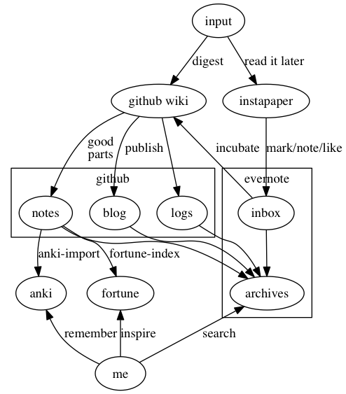

# Roy.log

A collection of my personal knowledge, and tools to manage it.

# The doc flow

## Tools

* [instapaper](https://www.instapaper.com/)
    + RSS
        - [newsbeuter](https://www.newsbeuter.org/) with [scripts](https://github.com/cf020031308/dotfiles/newsbeuter)
    + Web pages.
        - [lynx](https://lynx.invisible-island.net/) with [scripts](https://github.com/cf020031308/dotfiles/lynx)
        - Chrome with instapaper plugin
    + Wechat articles
        - [QPython](http://www.qpython.com/) with [a script](./bin/instapaper.py)
    + Mails
        - [ ] mutt
* [evernote](https://evernote.com/)
    + [web clipper](https://evernote.com/products/webclipper)
* [github wiki](https://github.com/cf020031308/roy.log/wiki)
    + [agentDoc](https://github.com/cf020031308/agentDoc)
* [blog](https://cf020031308.github.io)
    + [ ] [feedBlog](https://github.com/cf020031308/feedBlog)
* [anki](https://apps.ankiweb.net/)
    + [anki-import](./bin/anki-import)
* [fortune](https://en.wikipedia.org/wiki/Fortune_%28Unix%29)
    + [fortune-index](./bin/fortune-index)
