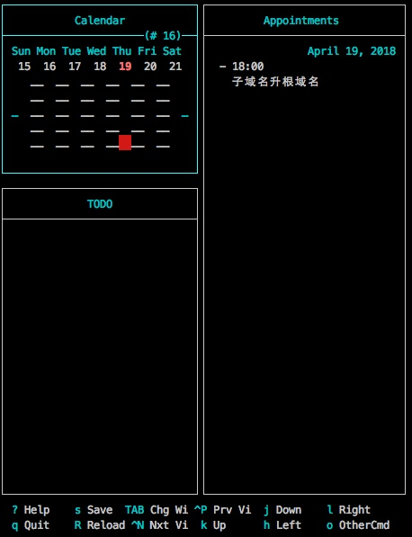

# Calcurse

试用了 calcurse，命令行下管理行程的工具。

起因是工作任务已在用 `taskwarrior` 管理，且自定义了报表输出。  
现在想管理一些不用输出到报表的琐碎任务，因此调研了 calcurse。

Features:

- 日历可按周展示，适合工作；
- 日程（Appointment）和 TODO 分别管理，都可以链接个 note 写；
- Appointment 设置时间后近了会提示；
- 可以有 S/L 时的 hooks 调脚本。
- 数据结构很简单，无法取代 taskwarrior。

实践后发现增加行程或 TODO 只有打开界面手动添加一条途径，没有办法用脚本，即使脚本直接改数据文件，已打开的软件也不会主动加载，退出时还会报冲突。很难通过命令或脚本与已有工具集成，不符合 Unix 哲学。

因此弃坑。改了改 taskwarrior 的过滤规则达到目的。
