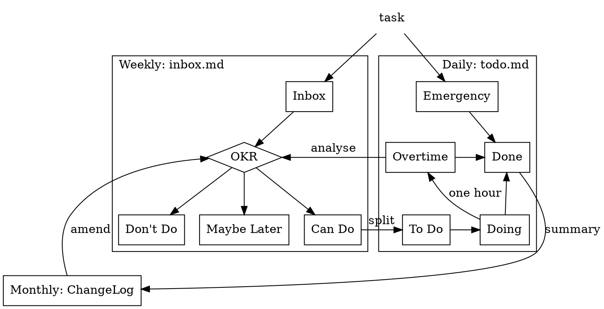

# A Brief History of my Task Management

## Terminal

Once I used a task management software in terminal called [Taskwarrior](https://taskwarrior.org/) and then developed my own [Pomodoro-Warriors](https://github.com/cf020031308/pomodoro-warriors)。


But they were platform-dependent thus useless once I was away from keyboard.
So I only used them to manage my tasks at work.

## Web


After that, I tried to make all of my things as data or document published at Github as possible if they were OK to be public, in line with the idea of opening source myself.


So [Github Projects](https://github.com/cf020031308/cf020031308.github.io/projects/1?fullscreen=true)  was used as a Kanban to manage my part-time developing tasks.


In the meantime, [Github Milestones](https://github.com/cf020031308/cf020031308.github.io/milestones?state=closed) was used to practising OKR。


Since all the work was placed at cloud, they became platform-independent.
But actually Github was sometimes slow, plusing that I am a heavy keyboard user and always awkward with mouses and browsers.
All these reduced my willingness.

## Plaintext

Long ago when I was keen on task management tools I noticed [todo.txt][todo.txt].
Not long ago I read an article [*My productivity app for the past 12 years has been a single .txt file*](https://jeffhuang.com/productivity_text_file/).
Recently almost all my documents are written in Markdown.

So it's natural for me to manage my work tasks in Markdown files.
In fact nowadays when I am working on a project I always create a file named `worklog.md` in the project directory, recoding logs, tasks, and troubleshootings.
And earlier when I was studying I experienced to [manage tasks with Evernote](/blog/mobile-management/)。

Therefore, I believe plaintext competent to manage tasks of learning and R&D which are in a stable schedule and with light planning.


This is my Markdown Kanban populated with tasks migrated from my Github Kanban.


It can be convenient to manage markdown files with [agentDoc](https://github.com/cf020031308/agentDoc) that I develped earlier (Optional).


With Nustore files are synced to cloud and become accessible with phones.


Because of plaintext, it's easy to do the following archives, summaries and automation.

### Task Format

To manage tasks with plaintext, you need to design a unified task format which makes searching, reading and writing easy.

Most importantly, it should be suitable for your own work.


This is my example:

```markdown
## @20200622月15:59 an example!! @20200622月15:59 !20200626金17:04

descriptions and notes
```


* the beginning `@20200622月15:59` stands for Scheduled Date (can be quickly inputted via [snippets](https://github.com/cf020031308/cf020031308.github.io/blob/master/dotfiles/vim/vim-snippets/markdown.snippets)). After the task is started, Scheduled Date can be removed or remained as a record.
* the following exclamation mark (`!`) stands for Priority. The more `!`, the higher priority.
* the following `!20200626金17:04` stands for Due.
* the following `@20200622月15:59` stands for Completion Date. If you complete a task in time, place it before Due. Otherwise, place it after Due.


#### Compared with [todo.txt](todo.txt)


- **Completion**. In Markdown you can divide sections with headings to simulate Kanban. And in Kanban a task is regarded as completed not by marks but placing it into a specific lane.
- **Priority**. I seldom use it. So I choose a brief `!` as part of the text to represent the importance.
- **Completion Date and Creation Date**.  I think these two dates are more like records and not so often used by the human that they should not be kept at this 'good location'.
- **Tag**. `@` at Github may refer to other users. So I use `#` as a leading letter of tags, leaving `@` to dates.
  - **Project Tag**. A task flowing through Kanban can have a `#project.subproject` to briefly point out what project it belongs to. After it is done, the Project Tag can be deleted, because project hierarchy can be implemented with headings.
  - **Context Tag**. I never use it. I don't need to change my context at work.
- **Due**. May be often used. An exclamation mark (`!`) can be much easier.


P.S. Tasks with `!` are either dued or with high priority (we are managing tasks, not writing diaries). So highlight `!` and you will see all the important tasks.


### Files and Sections

I have two markdown files to manage my tasks.
The design of sections references GTD.

And again, most importantly, it should be suitable for your own work.


* `todo.md`
  1. Emergency
  2. Overtime
  3. Doing
  5. Done
  6. To Do


* `inbox.md`
  1. Inbox
  2. OKR
  3. Don't Do
  4. Maybe Later
  5. Can Do


### Workflow



* usually
  1. put emergency tasks into todo/Emergency
  2. put other tasks into inbox/Inbox


* daily: working on `todo.md`
  1. work on Doing (maybe with Pomodoro). Every task is assigned an hour at most.
  2. put tasks not done in an hour into Overtime
  3. put tasks done into Done


* weekly: planning on `inbox.md`
  1. following OKR, move tasks from Inbox into Don't Do, Maybe Later and Can do
  2. analyse why tasks in todo/Overtime are suspended. Then following OKR
     1. split the task into parts that can be worked on, move them to Can Do
     2. tagged #abort with reason, move the task into Don't Do
     3. tagged #suspend with restart condition, move the task into Maybe Later
  3. move tasks in Can Do which can be worked on in the following week to todo/To Do


* monthly: reviewing on ChangeLogs
  1. organize todo/Done
  2. review ChangeLog of the same month in last year
  3. amend inbox/OKR
  4. publish ChangeLog of last month


[todo.txt]: <https://github.com/todotxt/todo.txt> "todo.txt"
