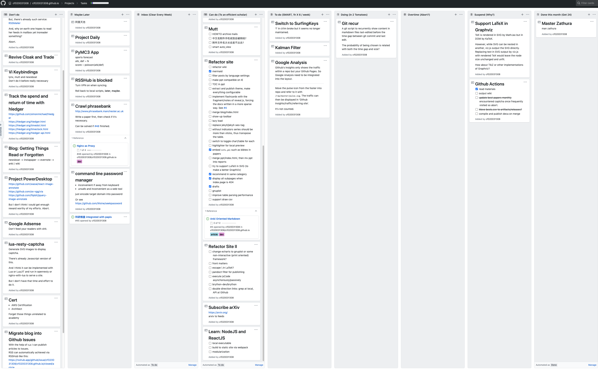
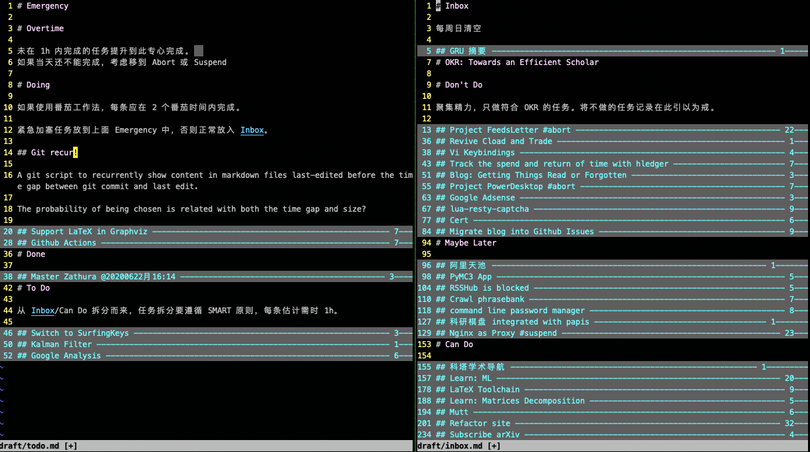
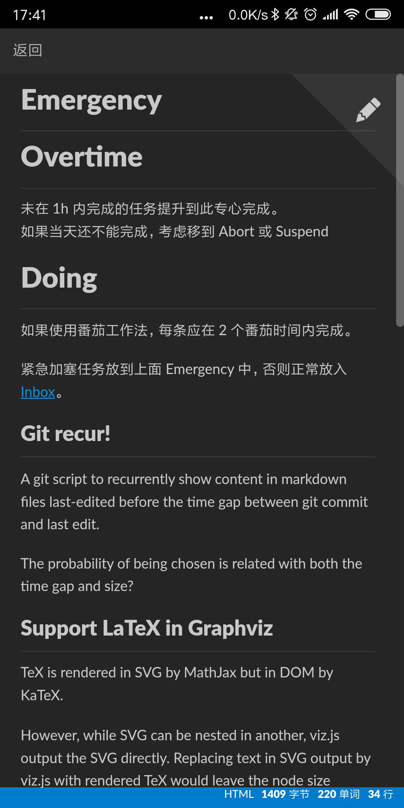
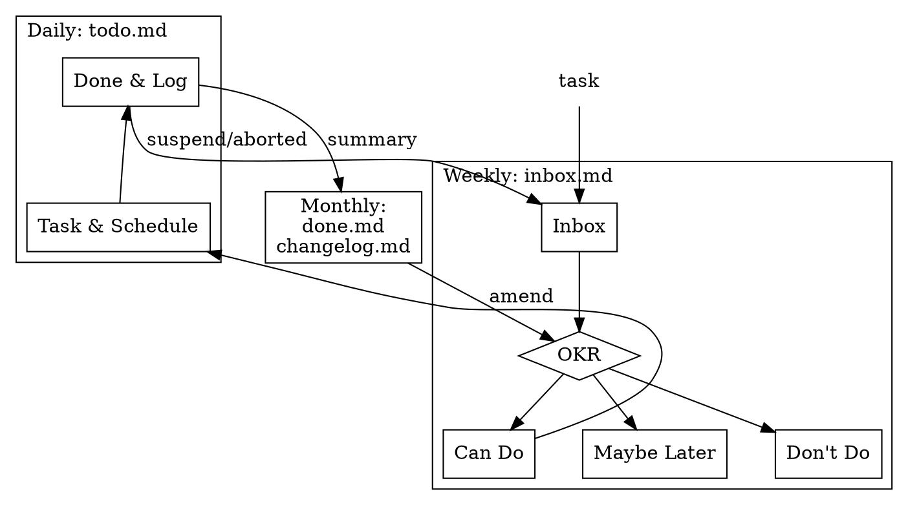

# A Brief History of my Task Management

## Terminal

Once I used a task management software in terminal called [Taskwarrior](https://taskwarrior.org/) and then developed my own [Pomodoro-Warriors](https://github.com/cf020031308/pomodoro-warriors)。


But they were platform-dependent thus useless once I was away from keyboard.  
So I only used them to manage my tasks at work.

## Web


After that, I tried to make all of my things as data or document published at Github as possible if they were OK to be public, in line with the idea of opening source myself.


So [Github Projects](https://github.com/cf020031308/cf020031308.github.io/projects/1?fullscreen=true)  was used as a Kanban to manage my part-time developing tasks.




In the meantime, [Github Milestones](https://github.com/cf020031308/cf020031308.github.io/milestones?state=closed) was used to practising OKR。


Since all the work was placed at cloud, they became platform-independent.  
But actually Github was sometimes slow, plusing that I am a heavy keyboard user and always awkward with mouses and browsers.  
All these reduced my willingness.

## Plaintext

Long ago when I was keen on task management tools I noticed [todo.txt][todo.txt].  
Not long ago I read an article [*My productivity app for the past 12 years has been a single .txt file*](https://jeffhuang.com/productivity_text_file/).  
Recently almost all my documents are written in Markdown.

So it's natural for me to manage my work tasks in Markdown files.  
In fact nowadays when I am working on a project I always create a file named `worklog.md` in the project directory, recoding logs, tasks, and troubleshootings.  
And earlier when I was studying I experienced to [manage tasks with Evernote](/blog/mobile-management/)。

Therefore, I believe plaintext competent to manage tasks of learning and R&D which are in a stable schedule and with light planning.


This is my Markdown Kanban populated with tasks migrated from my Github Kanban.




It can be convenient to manage markdown files with [agentDoc](https://github.com/cf020031308/agentDoc) that I develped earlier (Optional).


With [Nutstore](https://www.jianguoyun.com) files are synced to cloud and become accessible with phones.  
Below is a snapshot of Nutstore Markdown Editor, a tool to sync and edit markdown files stored remotely in Nutstore.




Because of plaintext, it's easy to do the following archives, summaries and automation.

### Task Format

To manage tasks with plaintext, you need to design a unified task format which makes searching, reading and writing easy.

Most importantly, it should be suitable for your own work.


This is my example:

```markdown
## @20200622月 ~~ an example!! ~~ @20200622月15:59 !20200626金17:04

descriptions and notes
```


* the beginning `@20200622月` stands for Scheduled Date (can be quickly inputted via [snippets](https://github.com/cf020031308/cf020031308.github.io/blob/master/dotfiles/vim/vim-snippets/markdown.snippets)). After the task is started, Scheduled Date can be removed or remained as a record. After the `@` there can also be a condition for the suspended task to restart such as `@sometool @someone`.
* task surrounded by `~~` is aborted. when previewing some editors would render the text with a stroke line.
* the following exclamation mark (`!`) stands for Priority. The more `!`, the higher priority.
* the following `!20200626金17:04` stands for Due.
* the following `@20200622月15:59` stands for Completion Date. If you complete a task in time, place it before Due. Otherwise, place it after Due.


#### Compared with [todo.txt](todo.txt)


- **Completion**. In Markdown you can divide sections with headings to simulate Kanban. And in Kanban a task is regarded as completed not by marks but placing it into a specific lane.
- **Priority**. I seldom use it. So I choose a brief `!` as part of the text to represent the importance.
- **Completion Date and Creation Date**.  I think these two dates are more like records and not so often used by the human that they should not be kept at this 'good location'.
- **Tag**. `@` at Github may refer to other users. So I use `#` as a leading letter of tags, leaving `@` to dates.
  - **Project Tag**. A task flowing through Kanban can have a `#project.subproject` to briefly point out what project it belongs to. After it is done, the Project Tag can be deleted, because project hierarchy can be implemented with headings.
  - **Context Tag**. I never use it. I don't need to change my context at work.
- **Due**. May be often used. An exclamation mark (`!`) can be much easier.


P.S. Tasks with `!` are either dued or with high priority (we are managing tasks, not writing diaries). So highlight `!` and you will see all the important tasks.


### Files and Sections

I have four markdown files to manage my tasks.

But again, most importantly, it should be suitable for your own work.

* `inbox.md`
  1. **Inbox**. Collect whatever stuff.
  2. **OKR**. The Objective Keys and Results. Monthly ammended. With all its history.
  3. **Don't Do**. Anything not meet the current OKR. You may repeatedly come up with the same idea once in a long period, with the same time-wasting procedures to deal with it. So the best solution is just to write it down as a notice.
  4. **Maybe Later**. Tasks that are not to be started immediately.
  5. **Can do**. Tasks that can be started by the end of next week. Every week I will check this section and move some tasks into `todo.md`.

* `todo.md`
  1. **List**. Lists are good. For example before I call it a work day, I alway have a long check list with some basic principles covering communication, habbits, projects and so on, to help me improve myself and avoid mistakes.
  2. **Log**. Everyday I start my work with a line `### @20200904金10:08` and append a tick `### @20200904金10:08 @20200904金19:09` when finish. Anything about work that day can be write down in the section below this log.
  3. **Schedule**. Tasks with specific starting date.
  4. **Task**. Most tasks are here.
  5. **Done**. Move aborted, suspended or completed Schedule & Task here temporarily. Every month move aborted ones to `inbox.md/Don't do`, suspended ones to `inbox.md/Maybe Later`, and completed ones to `done.md/Task`.

* `done.md`
  1. **Log**. Every month move `todo.md/Log` here.
  2. **Task**. Every month move `todo.md/Done` here.

* [changelog.md](../../changelog.md). Summarize and publish the achievements of the last month.

### Workflow





[todo.txt]: <https://github.com/todotxt/todo.txt> "todo.txt"

## [Comment](https://github.com/cf020031308/cf020031308.github.io/issues/53)
