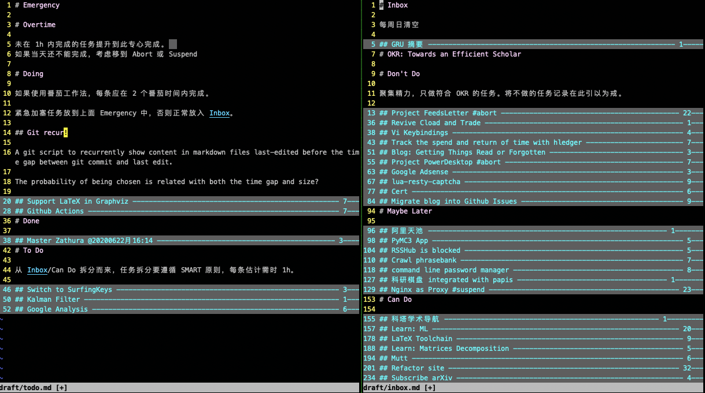
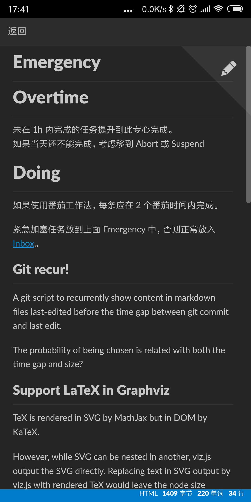

# 从终端到纯文本：我的任务管理简史

## 终端

之前我用一个命令行的任务管理软件 [Taskwarrior](https://taskwarrior.org/) 还基于此开发了 [番茄武士](https://github.com/cf020031308/pomodoro-warriors)。


但这套东西离开电脑就用不了，所以我只拿来管理工作上的任务。

## 网页


之后，抱着“开源自己”的想法，我尝试把所有可公开的数据和文档都放上 Github。


因此这段时间我就使用 [Github Projects](https://github.com/cf020031308/cf020031308.github.io/projects/1?fullscreen=true) 作为看板，管理我的业余开发工作。


同时呢, [Github Milestones](https://github.com/cf020031308/cf020031308.github.io/milestones?state=closed) 也被我拿来践行 OKR 了。


这样所有东西都在云端，也就实现了跨平台。
但实际上呢，Github 经常卡，加上我又是个键盘流，拿鼠标在网页上点点点实在折磨。久而久之也就不想用了。

## 纯文本

很久前我还热衷于捣鼓任务管理工具时我就注意到了 [todo.txt][todo.txt].  
不久前我还读过一篇文章 [*My productivity app for the past 12 years has been a single .txt file*](https://jeffhuang.com/productivity_text_file/).  
而最近，我几乎所有文档都是 Markdown 格式。

所以很自然地，我想用 Markdown 文件来管理任务。
实际上，近来每次新建一个什么开发项目，我都习惯了在目录里创建一个 `worklog.md`，用来记录开发日志、需求、任务和经验。
更早前，我在考研时也确实实践过[用 Evernote 管理任务](/blog/mobile-management/)。

所以我相信对于有稳定日程、无需频繁规划的学习和研发来说，纯文本是能够胜任任务管理的。


以下就是我把 Github Kanban 里的任务迁移到 Markdown 文件后的样子（编辑器：vim）。




Markdown 文件还可以用我之前开发的 [agentDoc](https://github.com/cf020031308/agentDoc) 来管理（注：不过我现在自己都不用 agentDoc 了，原因见项目文档）。


通过 [坚果云](https://www.jianguoyun.com) 可以用手机同步编辑 Markdown.  
如图是坚果云 Markdown 编辑器。




因为是纯文本，所以归档、总结、自动化都还方便。

### 任务格式

要用纯文本管理任务，首先需要设计一种统一的任务格式，这种格式要便于搜索、好写、不影响读。

最重要的，是要适合你自己的工作。


比如这是我的例子：

```markdown
## @20200622月 ~~ 一个例子!! ~~ @20200622月15:59 !20200626金17:04

任务描述、笔记等。
```


* 开头的 `@20200622月` 是计划开始日期（通过 vim 插件 [snippets](https://github.com/cf020031308/cf020031308.github.io/blob/master/dotfiles/vim/vim-snippets/markdown.snippets) 可以快速输入）。任务开始后这个日期删除或保留都可以。`@` 后面除了是日期也可以是任务开始需要的条件比如 `@梯子 @对象`.
* 两边有 `~~` 的任务是中止不再做了。有些预览工具会把这种标记渲染为一条删除线。
* 跟着的感叹号 `!` 表示优先级，越多越高。
* `!20200626金17:04` 这种感叹号加日期的格式表示截止日期。
* 最后的 `@20200622月15:59` 表示完成日期。及时完成的任务可以把这个日期放在截止日期的前面，超期才完成就放在截止日期后面。


#### 对比 [todo.txt](todo.txt)


- **完成标记**。在 Markdown 里我是用 headings （开头有 `#` 的行）来模拟看板的泳道的，在看板里通常是有个专门的泳道放完成的任务，不需要给任务做什么特殊的标记。
- **优先级**。我很少用到优先级。所以选了本身是文本一部分的感叹号表示优先级。
- **完成日期与创建日期**。我认为通常人不会关注这两个日期，所以不应该放在首部“好位置”。
- **标签**. 在 Github 上 `@` 是用来点别人名的，万一你的标签跟人重名就尴尬了，所以我打算用 `#` 作为标签的开头（但我至今没用过），`@` 只用来跟日期。标签分两种：
  - **项目**。可以暂时用 `#项目.子项目`，但完成后就可以删掉了。因为完成的任务可以按项目层级（headings）进行整理（纯文本的好处）。
  - **环境**。我从来没用过，至少管理工作上的任务从来没用过。
- **截止日期**。感叹号更好写一点。


注：这样带感叹号的任务要么是有截止日期的，要么是高优先级的，没有其它情况了（又不是写日记），所以搜索 `!` 就可以定位重要的任务。


### 文件与内容分区

我用了四个 Markdown 文件来管理任务（其实是三个）。

介绍前再强调一下，最重要的是适合自己的工作。


* `inbox.md`
  1. **Inbox**. 收集所有材料。
  2. **OKR**. 就是 The Objective Keys and Results。每月修订，并保留历史记录。
  3. **Don't Do**. 不符合 OKR 的。这些不该做的事如果不记下来的话，每隔一段时间就可能又被你重新想到，然后再经历一遍收集、分析、放弃的浪费时间精力的过程。
  4. **Maybe Later**. 不能立即开始的任务。
  5. **Can do**. 这周或下周就可以做的任务。每周我会检查这里（和 Maybe Later），把合适的任务移到 `todo.md`。

* `todo.md`
  1. **List**. 清单是非常有用的。比如我结束工作前就会检查这里的一个反省与回顾的清单，涉及了项目、沟通、习惯等方面，以改进自己、防范失误。
  2. **Log**. 每天开工我就在这写一行 `### @20200904金10:08`，收工就再一个时间变成 `### @20200904金10:08 @20200904金19:09`，当天的任务工作的事都可以记录在这下面。
  3. **Schedule**. 有明确日期安排的任务（日程）。
  4. **Task**. 大部分任务在这。
  5. **Done**. 中止、等待、完成的日程或任务会临时放这。每个月做一次整理：中止的放 `inbox.md/Don't do`，等待的放 `inbox.md/Maybe Later`，完成的放 `done.md/Task`。

* `done.md`
  1. **Log**. 每月归档 `todo.md/Log`。
  2. **Task**. 每月归档 `todo.md/Done`。

* [changelog.md](../../changelog.md)。总结与发布上月成果。

### 流程


[todo.txt]: <https://github.com/todotxt/todo.txt> "todo.txt"

## [Comment](https://github.com/cf020031308/cf020031308.github.io/issues/53)
