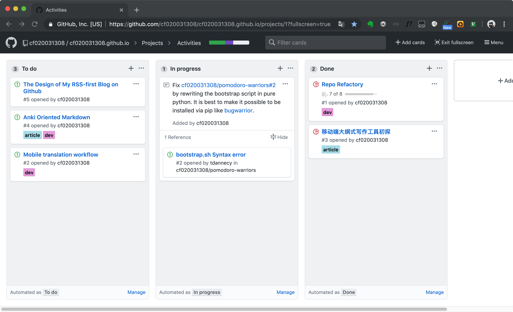

# Code Less, Talk More: The Design and Implementation of my RSS-first Blog on Github

Recently I have done the construction of [my blog](https://cf020031308.github.io/blog/) hosted on [Github](https://github.com). While it is specially designed to fit my own needs, I tried to write as less code as possible to make it a full-featured blog by practising my comprehension of [the Unix philosophy](https://en.wikipedia.org/wiki/Unix_philosophy).

## Three common ways to host a blog on Github

It is popular for programmers to have their blogs on the famous Github. Commonly there are three ways to achieve this:

1. Mostly [Github Pages](https://pages.github.com). It usually leverages some full-featured frontend frameworks like [Jekyll](https://github.com/jekyll/jekyll), which is for me, a backend developer, too hard to understand every detail of them (though actually, one doesn't have to). What's more, I hate to commit all the generated HTML code, as what most of the frameworks force me to do, after I finish a neat-and-tidy markdown file.
2. Awesomely [Github Issues](https://help.github.com/en/articles/about-issues). This is the simplest way for one to publish his work while it is amazingly elegant and functional. Your markdown is well rendered. You have various ways to interact with the community, such as quoting, reference and notification. What I care is that all your articles are kept on Github Issues and it's far less easy than Git to back them up to your local machine or to migrate them to somewhere else. Anyway, you cannot prevent spam since it is a paradox that people who hope to subscribe to your blog can only watch the repo while in the meantime anyone can create an issue to bother them because Github Issues is designed to do so.
3. Geeky Github Code/Wiki. I think it's admirable because after all the content is greater than form. But there's no place for the readers to express their ideas. And while most of the bloggers surely hope their articles displayed in a timeline, the articles are actually organized in trees in alphabet orders like a wiki more than a blog.

And the most important thing is that I am an old-fashioned backend developer fond of most of the old-fashioned stacks so I love RSS very much that I hope my own blog can have a feed for others to subscribe.

## My requirements for the blog

To sum up, I have to find my own way to blog my posts with these following features as mentioned above.

1. RSS enabled.
2. Version controlled by Git.
3. As less code as possible committed.
4. Comments supported.

## Features provided by Github

It is said that programmers are always enthusiastic to reinvent a new wheel, but that is not true. The thing they are really enthusiastic to reinvent is but a whole vehicle. So we see lots of frameworks are trying to implement a full-featured blog.

But my idea is that since Github has already provided lots of useful features, you don't really have to reinvent yet another vehicle but to find your own missing wheels. So let's have a look at what Github has already provided.

1. [Markdown](https://guides.github.com/features/mastering-markdown/). Github loves Markdown. You can almost write any documents of yours in markdown on any place at Github and they'd be prettily rendered. Luckily, I love Markdown, too.
2. [Github Pages](https://pages.github.com). With Github Pages, you can serve your static pages on Github. Here it is a small tip which I will use later: when page such as `foo` is visited but there's no file `foo` found in the repo, `foo.md` would be rendered and used as the page. What's more, `readme.md` would be used when the missing `index.html` is visited.
3. [Github Issues](https://help.github.com/en/articles/about-issues) & [Github Projects](https://help.github.com/en/articles/about-project-boards). You can track your tasks with Github Issues and arrange them in kanban through Github Projects. And Github Issues is also the best way for developers to communicate at Github.
4. [Github Wiki](https://help.github.com/en/articles/about-wikis). Every repo can have a wiki, which in fact is a special git repo. All the document files (such as markdown) will be rendered and displayed on the Wiki page. The good thing is that without being mentioned, no one will watch it, and no one will even notice it.
5. Traffic. In the Insights, there's a section called 'Traffic' where you can see PV, UV and the hottest pages of the repo.

## The implementation of my blog

By making full use of features above, my blog runs like this:

### Manually maintained feed

Because [RSS](https://cyber.harvard.edu/rss/rss.html)/[Atom](https://tools.ietf.org/html/rfc4287) is always expected to be a static XML file, there's no roundabout to avoid dealing with it if I insist to have one. So I just write the [atom.xml](https://github.com/cf020031308/cf020031308.github.io/blob/master/blog/atom.xml) manually with vim so you can then subscribe to my blog by feeding [this](https://cf020031308.github.io/blog/atom.xml) to your RSS Apps.

I know it sounds terrible with the adverb 'manually' but with a plugin [vim-snipmate](https://github.com/garbas/vim-snipmate) and [this snippet](https://github.com/cf020031308/cf020031308.github.io/blob/master/dotfiles/vim/vim-snippets/xml.snippets), I can insert an entry into the feed with a stroke and then all I have to do is just to input some metadata of my posting article. You can view [this commit](https://github.com/cf020031308/cf020031308.github.io/commit/6f226723e3f0bcca9de4722f5b2564d3f619cf0f) to see what happened when I recently published a post.

The benefit of editing the feed manually is huge. It gives me an independent way to publish anything besides articles. For example, I can share some links by simply adding a feed entry without publishing a new article.

### Non-HTML index page

I'm not going to put my blog directly at the root of my page, because the blog is just one part of it. So I have to write an index page. But as the former tip goes, I didn't write it in HTML because when it is omited Github Pages will render the [readme.me](https://github.com/cf020031308/cf020031308.github.io/blob/master/README.md) to be [the index page](https://cf020031308.github.io/index.html). So it's OK to make use of this feature to simplify the maintenance of the home page and to keep the repo and the page in accordance with each other.

### Static blog page with dynamic content

As for the blog, I developed [an HTML page](https://github.com/cf020031308/cf020031308.github.io/blob/master/blog/index.html) equipped with [a JS script](https://github.com/cf020031308/cf020031308.github.io/blob/master/blog/index.js) to retrieve the Atom feed and render the article list in HTML. So once the feed is updated, blog viewers will then get the newest posts.

### Built-in comment system and task manager

As I said, Github Issues is the best place for communicating. So every time I tried to write something, I would first open an issue for it and then assign it as a task into Github Projects.

When I finally finished the article, I would put a link to the issue but text it as 'Comment Here' into the article before publishing it, indicating visitors to comment at the issue page.

### Drafts also on Github

With the handy [agentDoc](https://github.com/cf020031308/agentDoc), Github Wiki is used by me as drafts. Most of the articles are kept here before publish.

### Trend of popularity

You can visit [Insights/Traffic](https://github.com/cf020031308/cf020031308.github.io/graphs/traffic) to get the PV, UV and hottest pages in the repo.

### Wait. What about SEO?

It is indeed not friendly to the search engines to dynamically generate the blog content by rendering the Atom feed with JS. But to cope with it is not hard. After I publish something I always contribute it to some forums or communities where people are interested in the topic of my post. And they are SEOed.

## [Comment](https://github.com/cf020031308/cf020031308.github.io/issues/5)
