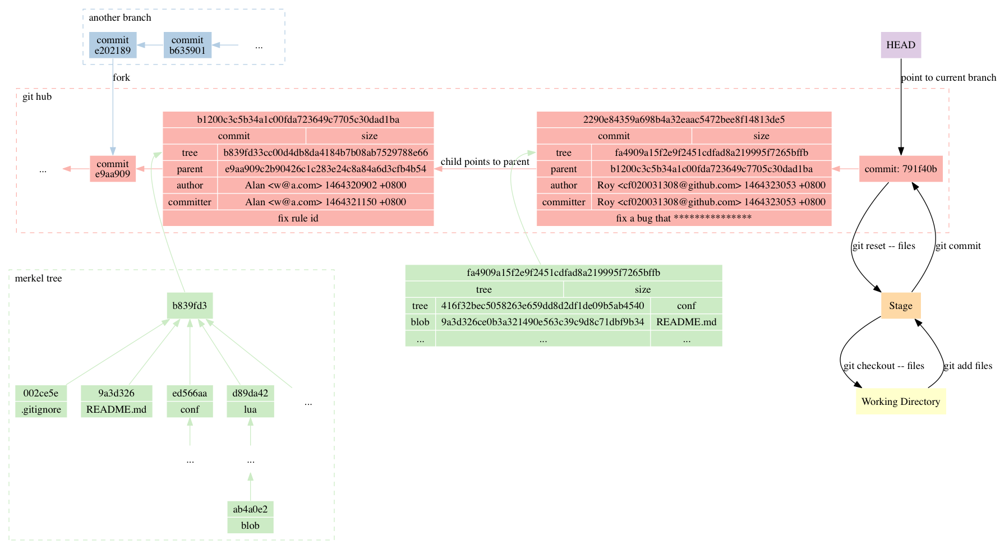

# That's Why I Say Git is an App on Block Chain

> [Comment Here](/../../issues/11)

I find understanding blockchain technology from `git` a good way for progammers.

1. Programmers commit commits to the projects' networks via `git` just as the miners of blockchains (such as BitCoin or Ethereum) accounting blocks on the chains.
2. As well as blocks, commits are immutable with the protection of chained hash values (actually in `git` they are mutable if one executes `git rebase -f` or something, but it's impossible to complete it without others' notice).
3. `git` organizes every files of a commit in the form of Merkle tree, the same as the form transactions or states organized in a block.

Of course, there implements no consensus michanism and decentralized accounting/committing rights in `git`.
