# 脱产求学后，我用手机做完个人管理 | 2018 与我的重构

编注：本文是 **「我的 2018 年度关键词」年度征文活动** 的第 14 篇入围文章，本文仅代表作者本人观点，少数派对标题和排版略作调整。

---

## 背景

重构（Refactoring）就是通过调整程序代码改善软件的质量、性能，使程序的设计模式和架构更趋合理，提高软件的扩展性和维护性，使系统对于需求的变更始终具有较强的适应能力。

从 2017 年元旦起，我决定认认真真地开始学习任务管理，随后又进行了时间记录，改良了阅读与学习流程，积极探索个人管理。这一年成为我的效率之年。  
2018 年则是我的重构之年。八月，我辞去了近四年的服务端中间件研发工程师工作，投身考研大军。生活的主要内容因而发生剧变，在不到半年的短暂时间里，我对自我的诸多管理系统都进行了重构。

适逢少数派年终征文，于是尝试总结这个过程中发生的碰壁、探索，以及感悟。

## 主力环境的破而后立

对我的岗位来说，电脑是必需的，又由于技术栈原因，操作基本不会出终端。因此我曾将几乎所有事情都放到了终端里，并通过编写脚本进行自动化，包括但不限于管理任务、记录工时、订阅 RSS、浏览网页、写作与编码（感兴趣的 UNIX 系程序员可以在我这个杂乱无章的 [仓库](https://github.com/cf020031308/cf020031308.github.io) 中看到代码和配置）。

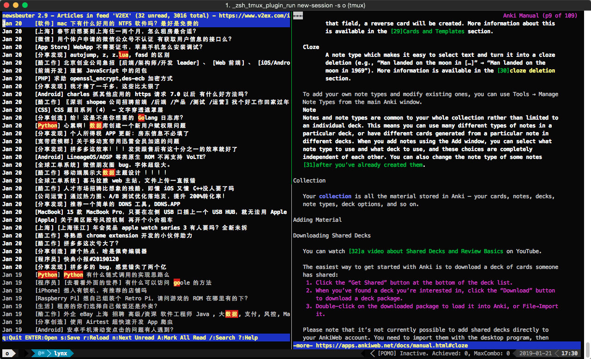

好处在于

* 减少了终端与其它环境（网页、客户端）的切换，有利于保持专注；
* 脚本与键盘控制一切，高效；
* 数据皆文本，便于协同，便于理解、分析和归档。

缺点也不是没有

* 高度依赖电脑，否则也不会有这篇文章
* 过于硬核，以致于连在同事中都推广不开

考研复习期间，每天泡在自习室，电脑放在家里几乎不开机，多年打磨的终端神技沦为屠龙之技。除了成堆的参考书，可利用的工具只有手机（没有 iPad，这次保佑我获一个）。于是最终摸索出了手机端的个人管理系统（具体我将在后面分部详述），其特点在于：

* 仅使用手机；
* 大部分操作都只用到 Evernote，且可以替换成其它笔记应用；
* 没有什么高端操作，更不需要会编程；
* 可以管理项目、资料、任务、时间、精力、笔记，且数据高度集中。

## 任务管理的重要性降低

2017 年刚开始做任务管理时，我选择了同事推荐的滴答清单。这款软件于我最大的意义在于，帮助我在弃用它之前的一个多月里践行了任务管理理论。

推荐阅读：[10分钟学会使用GTD做任务管理](https://sspai.com/post/40172)

后来因为三端（指通常的客户端、网页端、移动端）不符，我开发了 [番茄武士](https://github.com/cf020031308/pomodoro-warriors)，用以支撑我在终端下频繁地管理任务、记录工时并生成报表。

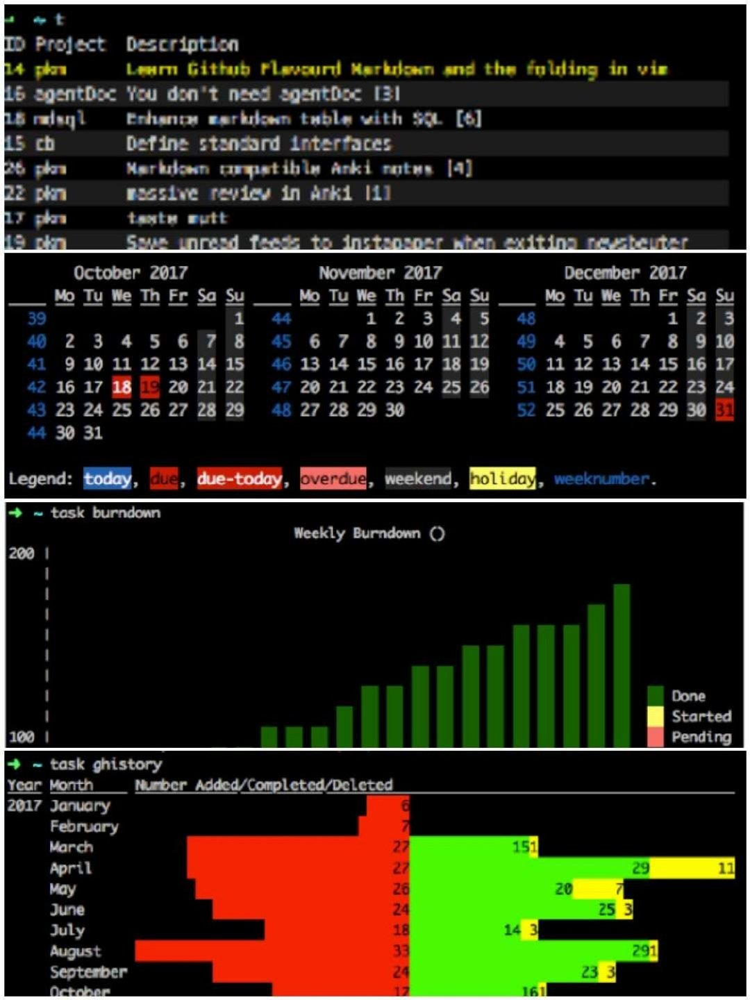

而作为移动端的补充，我平常使用手机自带的日历将想法简单地记录下来，以提醒我在坐回电脑时将某些事项安排进番茄武士。

到了应试学习中，每天的日程几乎不变，只需要少量的任务管理工作。并且，在很多领域我都认为，从无到有的实践所能带来的收益远高于对已有系统的进一步优化。具体到任务管理，假设不做的效果是零，而做到极致是一百，那哪怕仅只是使用纸笔列一个清单，效果也可以达到七八十。因此做任务管理，不妨退而求其次，以获得更高的自由度和健壮性。因此我选择了一个看起来不那么「专业」的工具：Evernote。

众所周知，Evernote 非常强大，但行高于人，也常受非议，比如

* 笔记可设置提醒，但不灵活；
* 笔记里有 checkbox，但不强大；
* 可以链接其它笔记，但不常用。

但把这些短板拼到一起做任务管理时，竟！然！意！外！地！好！用！（注：全文仅在此用到了惊叹号。）

### 三类清单

我的 Evernote 首页是这个样子：

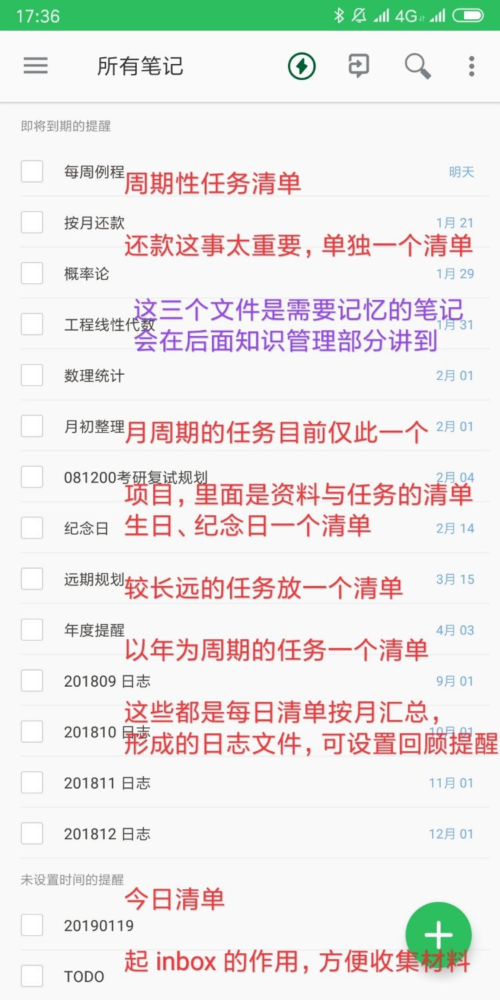

可能看起来容易「劝退」人，但这些提醒之间有很清晰的条理：除了三篇数学相关的笔记以外（后面知识管理部分详说），其它提醒都属于任务管理系统，且主要分为以下三类：

#### 长期清单

* 每周例程：按周循环的任务。比如每周四要与早教学校确认该周末的排课情况；
* 按月还款：提醒还信用卡与贷款。其实这些每月都会从理财产品中出金自动还，但是征信太重要了，所以专门设置了这个清单，提醒自己去确认是否正常；
* 月初整理：除了还款，我目前按月循环的任务只有这一个，所以没有每月任务清单；
* 年度提醒：按年循环的任务。比如驾照清分；
* 远期规划：比较遥远的任务。比如 PMP 资质每三年要续一次；
* 纪念日：大部分是亲戚的生日。为啥不放在「年度提醒」清单里？因为这不是任务，放一起不好管理。

以「按月还款」为例：16 号这天，「按月还款」出现在提醒中，我打开笔记看 checkbox 停留在 16 号房贷处，于是登录手机银行，确认资金已到位，于是给这个 checkbox 打勾，并将提醒更新为下一个日期：22 号。如图：

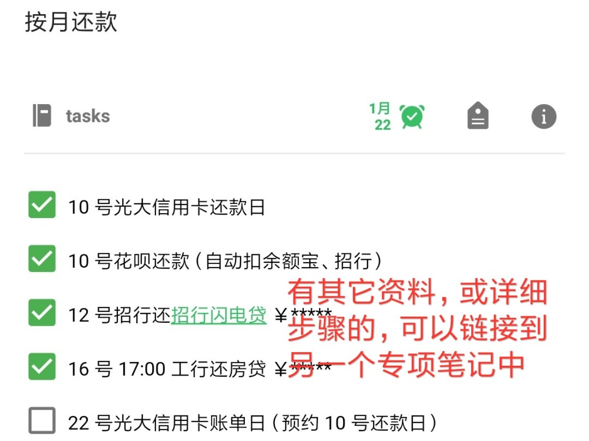

清单中的任务如果另有详细资料，可以专门为此建立一篇笔记，然后链接到这个清单里。例如图中可以看到，“招行闪电贷”是一个链接，点击可以打开另一篇笔记，里面记录了贷款详情。

这里有一个问题，假如清单很长，每次都来打勾、改提醒就太麻烦了，比如我的“纪念日”清单就很长。这没有办法，这个系统无法像日历那样方便，只需一次设置就年年提醒。但这其实也并不成为一个问题，因为一来像“生日提醒”是很低频的需求，二来“打勾、改提醒”的操作并不耗时。好处却是资料高度集中、心智负担小、迁移成本低。我认为是划算的，推荐先试一试。

#### 专项清单

可以为任何正在进行的项目建立一个清单并添加提醒（可以不设置具体日期），例如准备考研复试。

#### 当日清单

先建立好一篇笔记作为模板，里面是每日日程的基本框架。前一天晚上复制这个模板，然后结合到期的长期清单略做改动，即得当日清单。例如图 3 总览中的 20190119，内容如下：

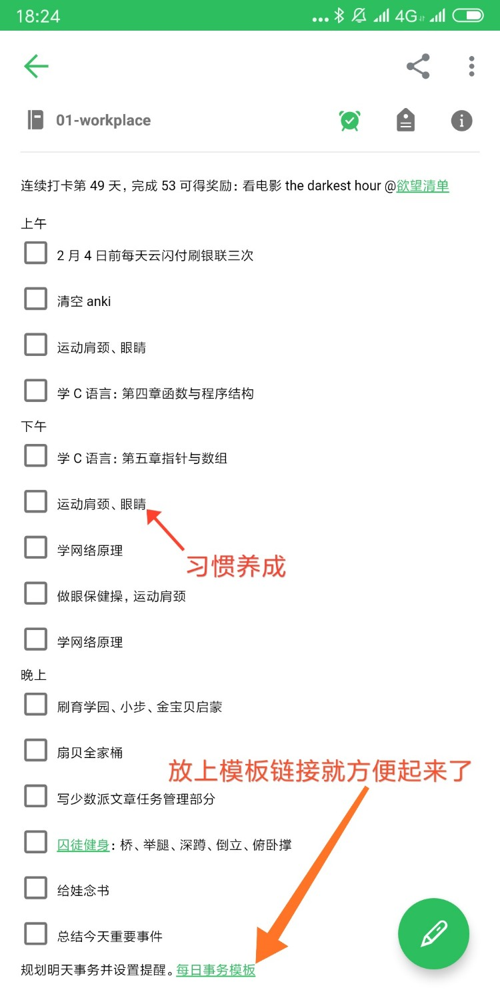

要点：

* 模板中加入自身链接，可以在结束一天的清单后点击链接进入模板，方便不少；
* 「上午」「下午」「晚上」是进度的参照物，可以按需换成其它时间点（里程碑）；
* 要将清单视为一项郑重的承诺，这意味着第二天执行这个清单时尽量不要改动（真没那么多火烧眉毛的事情）。这既是精力管理的基础（后面详说），又使得当日清单成为培养新习惯的有力工具。当你想养成一个新习惯时，只需要将其排进模板。如果你每天都在坚持执行清单，这个新加上的行为就能很容易地得到执行，最终会成为习惯；
* 清单首先还是一篇笔记，因此也有日志的功能，当天的任何事情感想都可以往里记。

### 月度日志

每月结束后，使用 merge 功能将当月每天的清单合并、回顾、归档（这个过程作为任务被放在了“月初整理”中）。这里这些日志之所以出现在了图 3 总览的提醒中，是因为我为这些月度日志设置了一年后的提醒，我觉得若能看到自己在去年同期做过的事情也许会很有意思。

### 其它要点

平时可以去掉勾选「显示即将到期的提醒」，只专注于当天的清单。

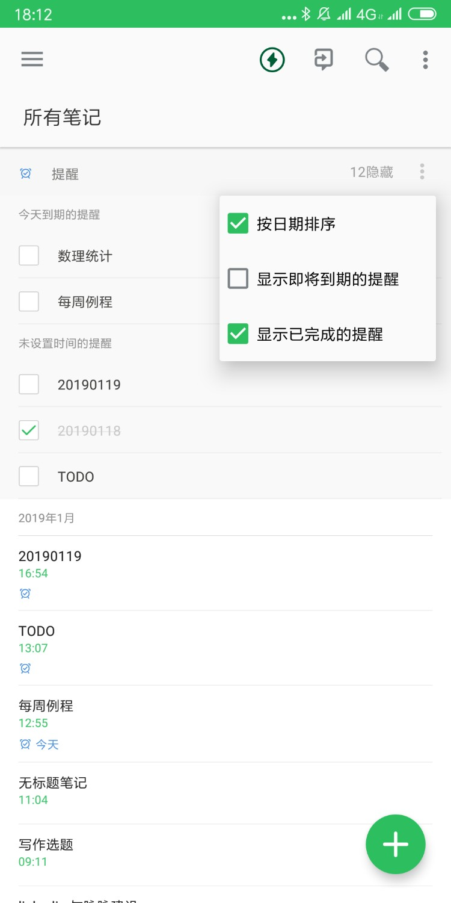

由于用到的功能都很简单，Evernote 可以轻易地被其它工具替代。例如 [适用于笔记本的「明天做」任务管理系统：《不抱怨时间》读书笔记》](https://sspai.com/post/46132) 的作者使用的是另一个笔记应用 Bear。

## 精力管理的要求更加严苛

如果你学过番茄工作法一类的理论，应该清楚我们每天工作中真正全神贯注的时间通常只有四个小时左右，甚至更少。但对于考研党来说，学习任务不分轻重，都需要精力高度集中，学习时间中真正有效果的就是专注时间。

### 规划与执行分开

为了削减学习之外的精力开销，首先是要将想和做分开，因为决策是要消耗意志力的。这就是为什么在前面任务管理部分，我要提前制定当日清单，并将其视为重要的承诺尽量不去更改。当已经预先承诺了要在这一天完成这些任务，事到临头时就不需要做决策，只需要执行，也就避免了意志力耗尽的问题。

### 时机管理

比起之前的编码工作，学习时的互动较少且缺乏监督。通常来说，早上进入状态前与下午精力较低时尤其容易分心。

为了让日程安排迎合精力的节律。我一般将学习 Anki 里当天的新卡片作为一天的开始，以这种互动较多、反馈较快的方式尽早进入状态。然后以习题结束下午的学习。晚上回家精力少许回复后做一些总结性的学习、添加新的卡片，最后复习一定量的旧卡片。

### Don't break the chain.

为了让坚持学习不那么困难，仪式感与激励也是有用的。回顾图 5 中的当日清单，第一行加入了打卡机制，每天的 checkbox 点满则视为成功打卡，连续打卡一定数量后给自己一个奖励（可以为此维护一个欲望清单）。当打卡数量累积得够多时，光是为了维护这个数字不归零，就很有成就感了，这本身也是一种奖励。

### 及时安放杂念

我学习时比较容易分神东想西想，常常刹不住脚浪费大把时间。后来发现，每当思路放飞了就立刻将杂念记在纸上，再拉回来就不那么难了。想必大脑是很重视自己的灵感的，当你试图强行拉回思路时便会报以顽强的抵抗，而将其写下来就等于做出了“稍后处理”的承诺。因此只要写下来，就可以有效避免正在进行的任务被中断。

### 精力核查

当前任务结束后，将任务期间的分神、打断等精力不集中行为从纸上总结到笔记中该任务后面。一天结束后分析当天的精力不集中行为，至少对出现最多的行为要做出具体的应对措施。

### 纯时间法

以前我使用番茄工作法，但在考研期间沿用这一方法时有些不适，最后采用了纯时间法。即在每个任务结束后，统计该任务进行的纯时间，一天结束时可以对纯时间做个汇总，用以评估当天的效率。

推荐阅读：[把一生过成两辈子：颠覆你时间观的两个概念](https://mp.weixin.qq.com/s/CvrbpDE55upLgjjujI7KMA)

毕竟番茄工作法的精髓从来不是 25 + 5 或者 52 + 17 这种死板的时间划分，而是强制休息、估算与评估。只有被当作估算和评估工作的工具使用时，它才能发挥真正威力。因此番茄工作法与纯时间法是相通的。

### 打卡成功

这样一天下来，图 5 所示的当日清单被完成时，内容大致如下：

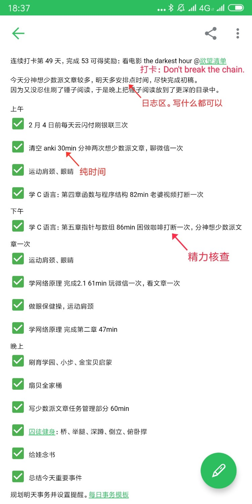

推荐阅读：[精力记录与科学休息法](https://sspai.com/post/44540)

## 知识管理的调整迫在眉睫

### 泛阅读

2017 年初，因为少数派年终征文的一篇获奖文章 [信息的输入到内容的产出 | 2016 与我的数字生活](https://sspai.com/post/37279) 的启蒙（时间过得真快），我建立起了类似的阅读流程。

相对较特殊之处除了通过脚本与 Instapaper API 扩大了材料来源以外，Instapaper 内文章的组织也遵循了 GTD 模式，即

* 收集：新添加的文章会被自动放在首页，这就是 inbox；
* 组织：每隔一段时间将首页中的文章按内容整理到多个主题文件夹，文件夹按主题的重要性排列；
* 行动：按文件夹顺序阅读。

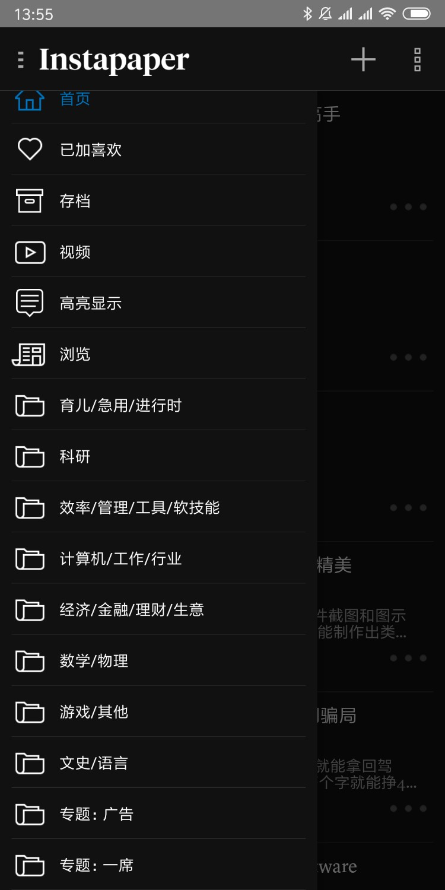

这样能保证重要的内容总是可以被及时阅读到，而不重要的内容即使积压起来，也没有心理负担。

当然，考研期间这个流程被束之高阁了。

### 笔记

学习有两个要点，一是用思维导图强化对整体联系的理解。

虽然这篇文章采用「思维导图」这一说法，但我是不爱用思维导图的。因为究其本质就是大纲，那我不如直接用大纲：

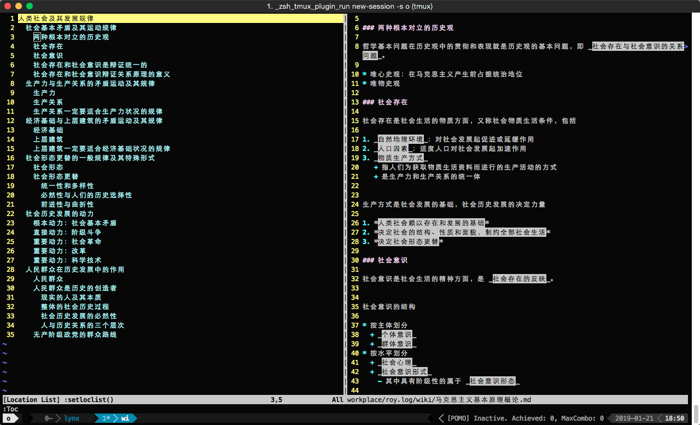

vim 作为「编辑器之神」，无论什么编辑需求都不过是几个快捷键或一行命令的事情，高亮功能一开甚至也不再需要什么额外的阅读工具了。

后来完全不开电脑，用手机记笔记我仍然希望层次清楚并且可以按块调整文字，一般的编辑器是做不到的，需要用的思维导图软件如 xmind，或者是 [幕布](https://mubu.com/inv/2337342)。

用手写再拍照那就更自由了：

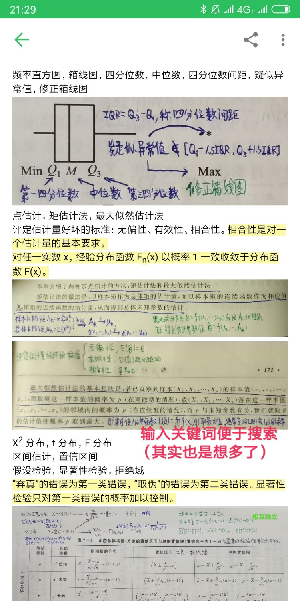

### 记忆（Anki 版）

学习的另一个要点是用抽认卡强化对局部知识的记忆。

这部分内容我推荐用 Anki。

推荐阅读：[培养大脑记忆力的第二次机会：「记忆神器」Anki 使用详解](https://sspai.com/post/39951)

看书时遇到的一些重要的知识点，或者做错了的题，可以立即拍下来（或打字，或用讯飞语音输入法），做成 Anki 卡片：

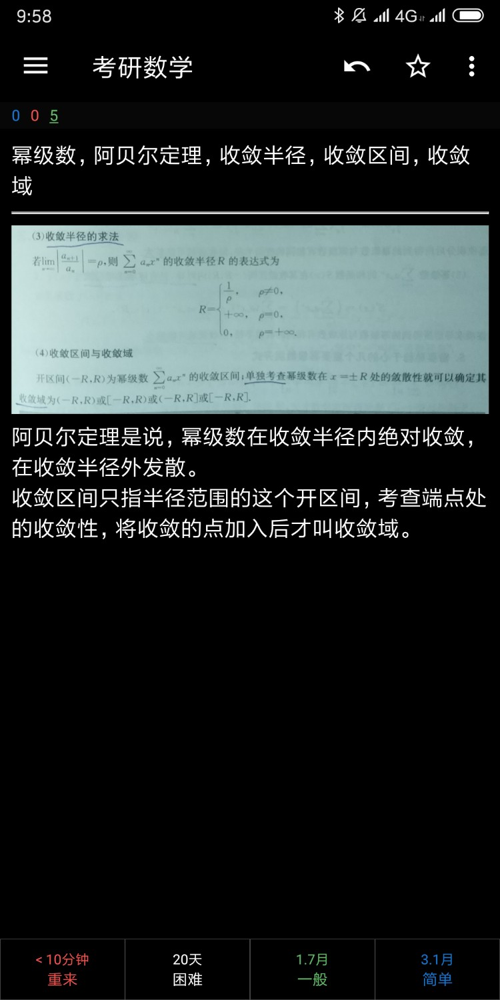

不管做出来的卡片可能多简陋，一定要当场就做。只有 Anki 每天的出卡量排满了，你的记忆带宽才能满载运行。

还有要注意 Anki 中只放较短的内容，如果内容长，一定要再拆小。否则每天清空 Anki 需要的时间极不稳定，将难以做计划。

### 记忆（Evernote 版）

如果你熟悉 Anki 的原理，就知道 Anki 概括起来就是“扩大增量提醒”，于是我们完全可以在 Evernote 中模拟出这个功能：

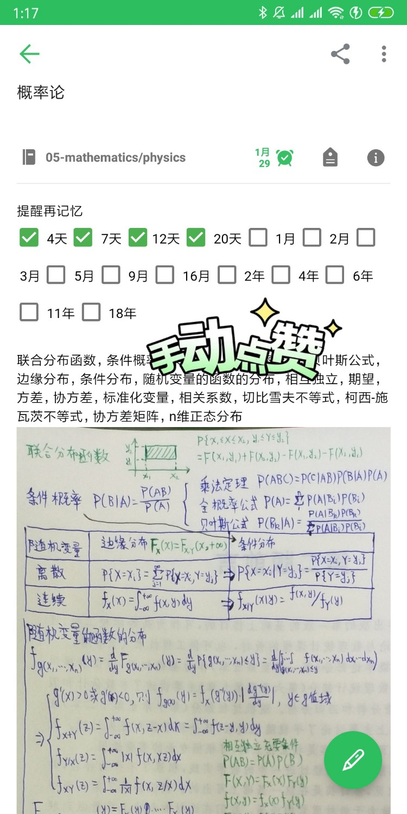

开头「提醒再记忆」的一堆 checkbox 可以存为模板。当某一篇笔记需要记忆（或回顾）时就将「提醒再记忆」模板内容拷贝到笔记开头，每次记忆（或回顾）后，给过去时间间隔对应的 checkbox 打勾，然后按照下一个时间间隔设置提醒。

笔记内容可以为空。比如说政治这门课，会有专门用于背诵的小册，就可以复制「提醒再记忆」模板，将标题改为如《马克思基本原理分析题考点》，设置提醒。此时笔记只起扩大增量的提醒作用，并不承载具体内容。每有提醒到期，便拿出小册背诵相应章节，然后在 Evernote 中打勾，并设置下次提醒。

甚至如果这篇笔记的内容没有较强的记忆要求，只需要时常回顾理解，那还可以宽松到根据笔记的创建日期跟今天日期的间隔来设置下次提醒日期。不过这太飘了，我没有实践。

这个方法被我用来提醒回顾较长的笔记（比如上面说的「思维导图」），这样笔记数量会较少，不至于觉得繁琐，而且任务到期前容易发现，便于我提前规划（因为内容较长，需要专门安排时间完成）。

## 合理方可存在

正如在《小强升职记》中，作者为三种不同角色分别介绍了相应的任务管理方式，如今我通过自身从生产者到学习者的角色变换，更加切身地体会到了个人管理是因人而异的。不但对于不同的人，甚至对于同一个人在不同的时期，管理方案都当与时俱进，因此不论这次考试结果如何，我想未来仍需重构。

## [点此评论](https://github.com/cf020031308/cf020031308.github.io/issues/10)
