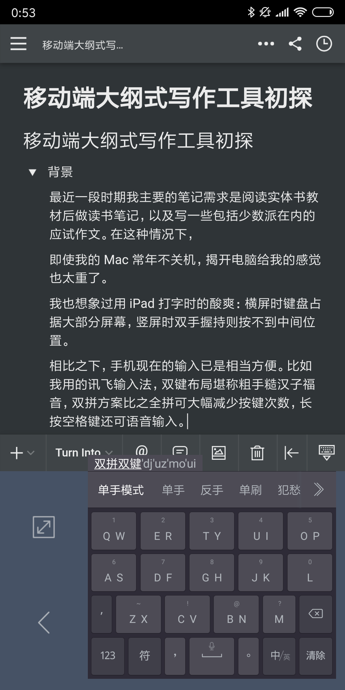
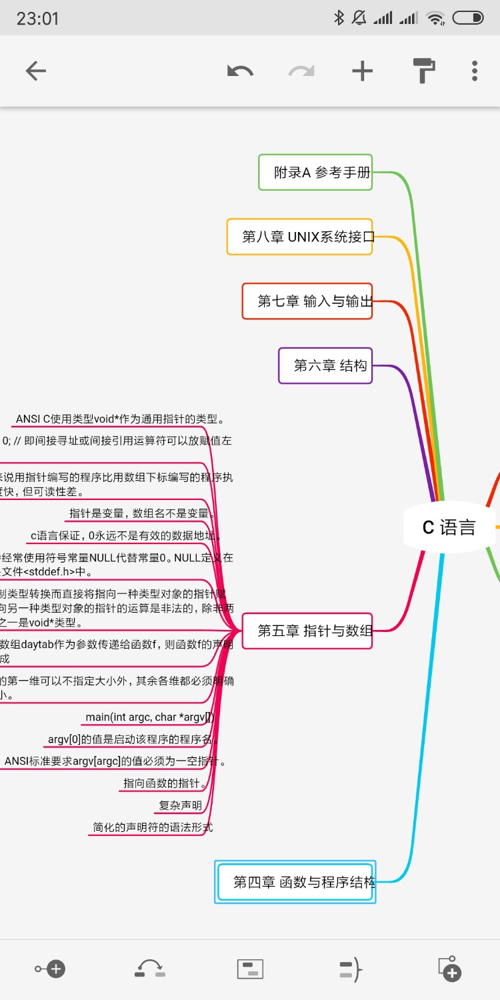
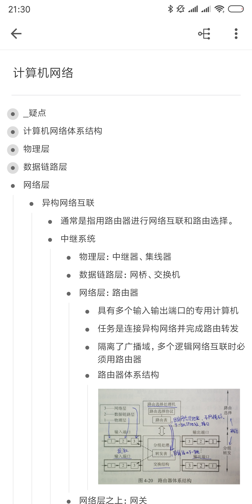
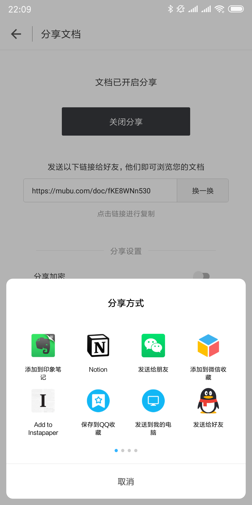
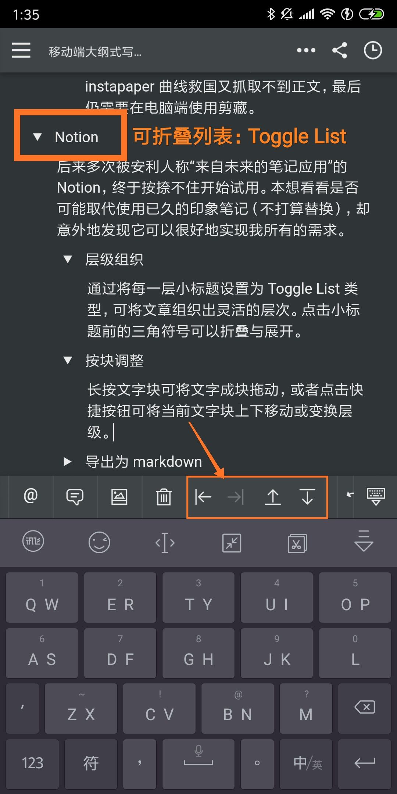
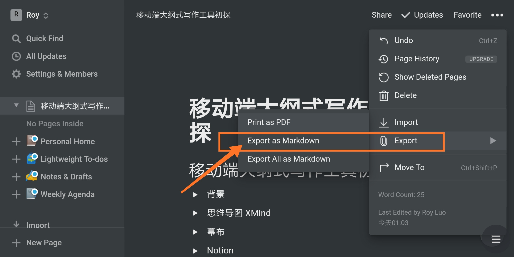
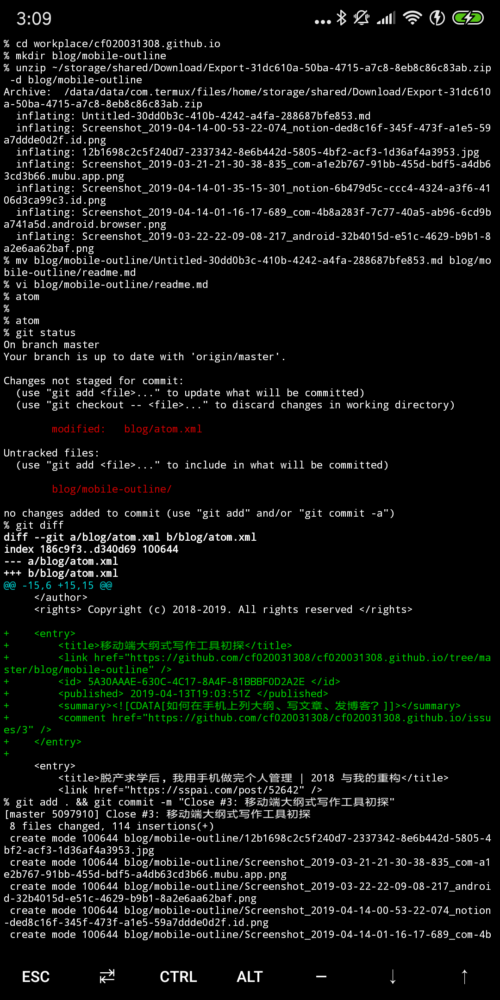

# 移动端大纲式写作工具初探

## 背景

最近一段时期我主要的笔记需求是阅读实体书教材后做读书笔记，以及写一些包括少数派在内的应试作文。

在这种情况下，即使我的 Mac 常年不关机，揭开电脑给我的感觉也太重了。

我也想象过用 iPad 打字时的酸爽：横屏时键盘占据大部分屏幕，竖屏时双手握持则按不到中间位置。

相比之下，手机现在的输入已是相当方便。比如我用的讯飞输入法，双键布局堪称粗手糙汉子福音，双拼方案比之全拼可大幅减少按键次数，长按空格键还可语音输入。

并且我发现手机便携性太强，一方面记录成本无限降低，随手能捕捉更多灵感，还能随时随地斟酌措辞；另一方面也增加了碎片时间回顾笔记的机会。

因此我开始探索手机上的写作工具。

这里要先提一下我惯用的作文与笔记步骤

1. 列出大纲
2. 扩充要点
3. 调整顺序与润色细节

因此对我来说理想的编辑器应该可以

- 按层级组织文章结构
- 灵活地按块调整段落

只要大小标题与缩进用得好，层级通常不是问题；且使用电脑时有鼠标加持，划取调整也很方便。但在手机上尽管笔记应用相当的多，能满足这两点的却寥寥。

除此之外我还有 markdown 和备份方面的需求。

因此如果您跟我一样有移动端写作需求，以及相似的写作步骤，这篇文章会适合您。

## 思维导图 XMind

层级组织、按块调整，我首先想到的就是思维导图。在思维导图中，每个结点都是一个文字块，可以方便地拖动调整，组织起层级。于是我试用了手机上的思维导图应用 XMind。

的确可以完成预想的操作。但强行作为写作工具，缺点太多：

- 结点较多时渲染费时，响应太慢；
- 编辑功能通常较弱，文字排版难以优化，内容一多便成灾难；
- XMind 安卓版不能插入图片；
- 导出不便，通常只能导出为思维导图文件或缩进的纯文本文件。

## 幕布

后来我意识到这种写作方式的核心是“大纲”，按这关键词搜索发现了[幕布](https://mubu.com/inv/2337342)。

其开屏文案便是“极简大纲笔记”，所有功能围绕“大纲”而来，既简洁又易用。

- 层次分明，各层列表可以折叠/展开、聚焦；
- 每一块文字都可以通过按住开头的小圆点拖动到任意位置；
- 可以一键生成思维导图，便于展示；
- 分享非常方便

我认为思维导图不过是大纲的另一种形式，因此直击本质的幕布在较长一段时间里都是我常用的思维整理和写作工具。

对于我刚提到的两个编辑方面的需求 —— 层级组织和按块调整，幕布的支持对绝大多数人来说都是完美的。

但以下两个导出方面的操作仍须在电脑端才能完成，对我来说还是不算方便：

- 一方面我惯用 markdown，希望最终的文件是 markdown 格式，这需要在电脑端先将笔记导出为 html，再用脚本转换为 markdown，最后手动将里面较高层的列表项改为相应级别的标题；
- 另一方面，我在完成一篇笔记后会备份到印象笔记，但在笔记较大时分享给安卓端印象笔记只能获取到部分内容，而尝试用 instapaper 曲线救国又抓取不到正文，最后仍需要在电脑端使用剪藏。

## Notion

后来多次被安利人称“来自未来的笔记应用”的 Notion，终于按捺不住开始试用。本想看看是否可能取代使用已久的印象笔记（最终不打算替换），却意外地发现它可以很好地实现我的写作需求。

### 层级组织

通过将每一层小标题设置为 Toggle List 类型，可利用列表将文章组织出灵活的层次。点击小标题前的三角符号可以折叠与展开该列表，方便聚焦。

如果想在最终导出为 markdown 时将较高层的列表项转换为小标题，只需在导出前使用 Turn into 将其重新设置为相应等级的 headings 即可。

### 按块调整

长按可将文字成块拖动。

点击下方快捷按钮可成块上下移动当前文字块，或变换其层级。

这两种操作都比幕布方便。

### 导出为 markdown

手机应用中没有导出选项，但可以将浏览器设置为访问电脑端网页，横屏打开网页版的 Notion，就可以看到导出为 markdown 的相关选项了。

点击后就会开始下载一个压缩包，解压后是 markdown 格式的笔记及其资源。我是用 Github 当作[博客](https://cf020031308.github.io/blog/)，因此稍加修改后即可整个文件夹推送发布。之后再用 [agentDoc](https://github.com/cf020031308/agentDoc) 可将其中图片地址转换为绝对路径，便可粘贴到少数派等处发布。

## 总结

以上是我在移动端大纲式写作工具上的一点探索，在这个过程中我还考虑过 workflowy 和 omnioutliner，因为已有典型而没赘述。

如果您对此话题有其它看法，欢迎留言给我。

## [评论](https://github.com/cf020031308/cf020031308.github.io/issues/3)
