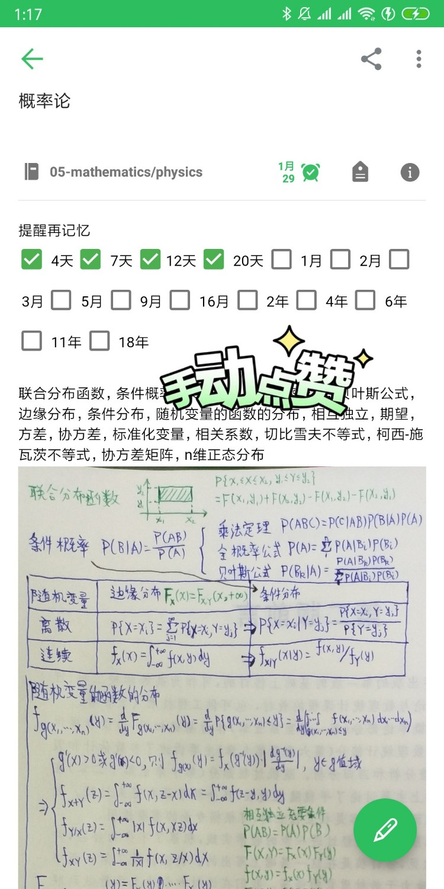
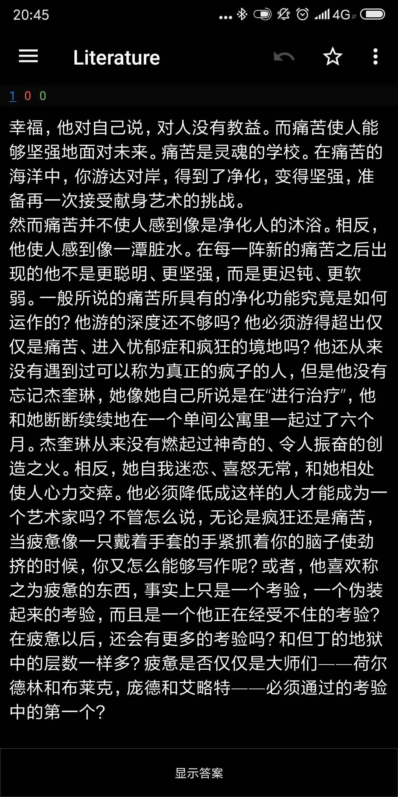
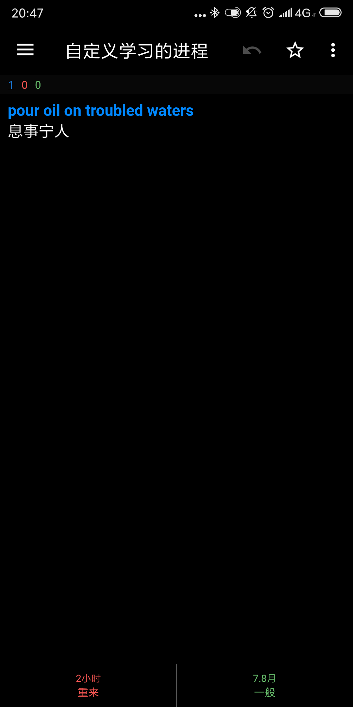
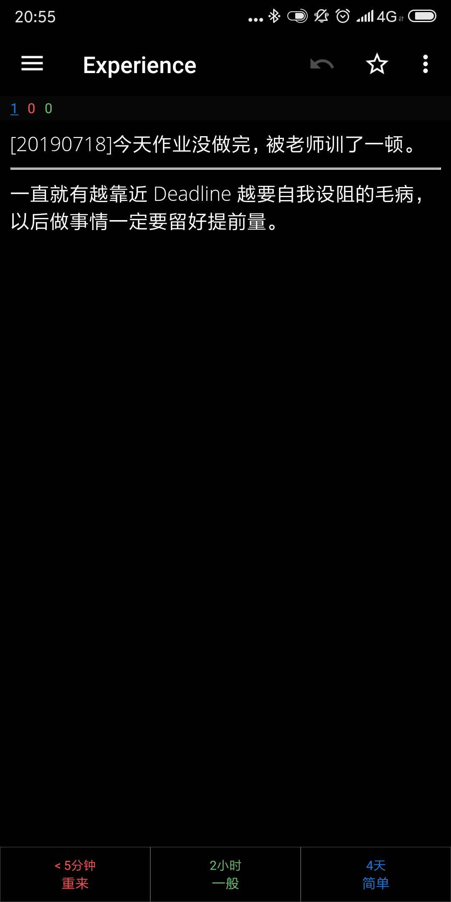
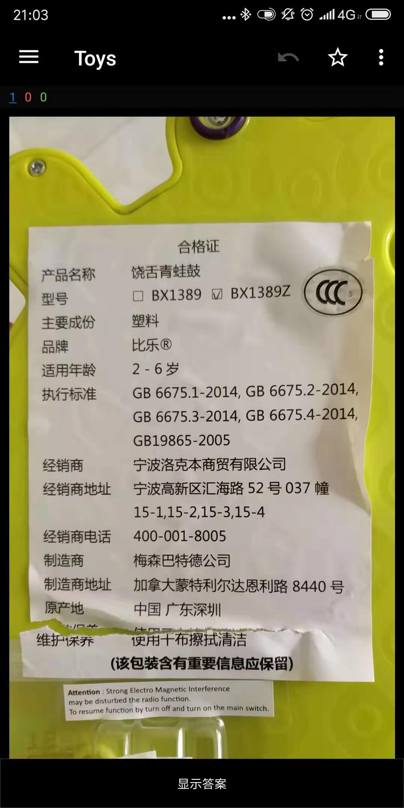
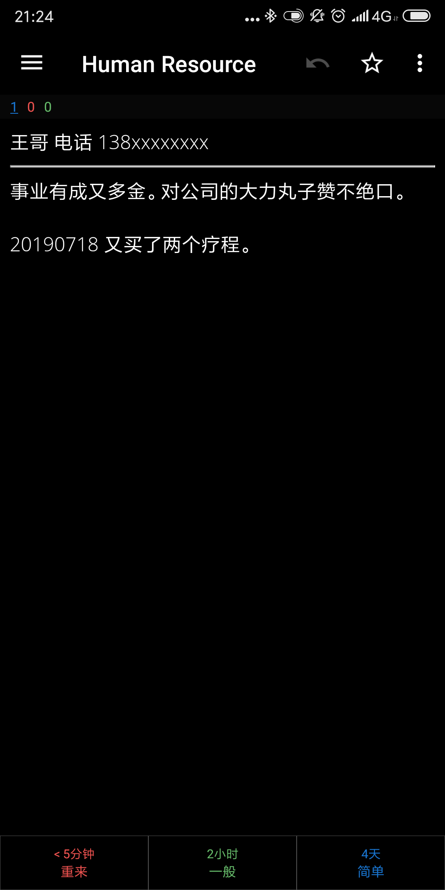

# Anki 的他用

> 如果不了解 Anki 的话我推荐先阅读：《[培养大脑记忆力的第二次机会：「记忆神器」Anki 使用详解](https://sspai.com/post/39951)》

## Anki

正如我在拙作《[脱产求学后，我用手机做完个人管理 | 2018 与我的重构](https://beta.sspai.com/post/52642)》中提到，Anki 的核心在于“*扩大增量提醒*”：即不断重复提醒某个内容，但提醒的间隔会越来越久。  
因此你甚至可以在印象笔记中模拟出抽认卡。

Anki 的另一个稍不重要的核心在于“*遮罩模板*”：即将内容中特定标记的部分隐藏起来，作为答案暂不揭晓。  
一个常用的模拟方法是在 Word 或其它笔记应用中将答案字色设为白色以进行隐藏，要看时 Ctrl + A 全选即可见答案（手机上操作会麻烦些）。

Anki 的这两个功能在其它地方没有直接的替代，但这并非什么黑科技，主要还是在于这两个功能只在抽认卡的机制中会被用到，而这类软件少之又少。

本文提到的场景大多都是对扩大增量提醒的活用。

## 他用

在我使用 Anki 的这段时间里，除了正常地用来记忆零碎知识，还开发了以下明显跑偏的使用场景。个人觉得甚至有些好玩，因此总结了此文，希望有抛砖引玉的机会。

### 名言警句本

从中学开始我就听老师的话有遇到好句子要记录下来的习惯，句子本身足够零碎却似乎足够“无用”，以至于很难让人郑重其事地安排时间专门去复习。因此每看完一本书，或每月整理笔记时，这些句子会被我存入 Anki，不期而遇。

### 英语成语本

同样的，英语我遇到有意思的成语也会收集起来。

但我强烈反对用 Anki 背英语单词。尽管这是可以办到的，但 Anki 毕竟面向的是更通用的场景，而背英语单词的更好用的应用实在太多了。

### 经验教训

有次发现自己又犯了一个刚总结过的错误，于是发现只会总结还没完，还要时常回顾、时常反省，所以就创建了一个名为“经验教训”的 Deck。

卡片正面描述事情，背面总结教训。看到一张“经验教训”的卡片出现时，就按卡片内容反省近况，总结表现进行打分。例如最近表现好没再犯这些错，就选“简单”。

### 玩具刷新

现在小孩的玩具实在太多了。为了保护孩子的注意力，大多数玩具我都收了起来，每周会更换一批（这个 Deck 的初始时间间隔要调久点）。如果比较喜欢某个玩具，更换时就点“困难”让冷却期短一些。我想在她长大到能使用 Anki 之前，大概会有很多场景需要我代劳吧。

### 人脉管理

这是我开脑洞臆想的场景。

回访客户后“编辑笔记”更新内容作为日志，按效果点“困难”、“一般”、“简单”。  
下次这卡片出现就是又该回访了。

其实质就是帮客户用抽认卡，让他们记得你。

## 砖没了，玉呢？

欢迎讨论。

## [评论](https://github.com/cf020031308/cf020031308.github.io/issues/41)
