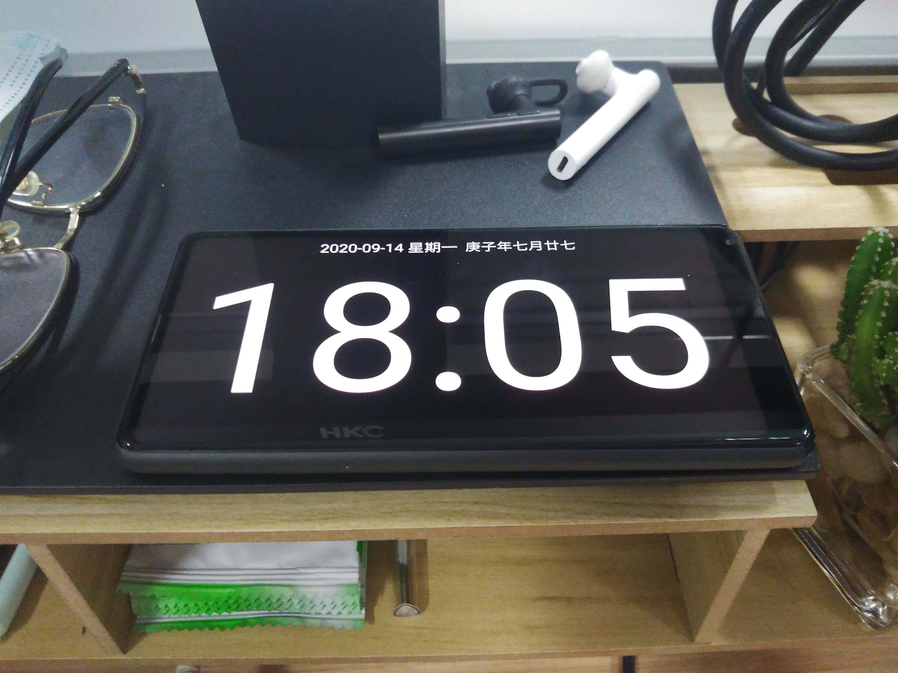

# [桌面作为容器装的是什么？](https://sspai.com/post/62646)

本文参与[「无限桌面」征文活动](https://sspai.com/post/62346)。

## 外设是软件的延伸

刚入行程序员时，我就弄了台显示器竖起来看代码，因为那时我跟很多外行人一样，觉得厉害的黑客就是在多个排开的显示器前用键盘娴熟地操作黑底白字的命令行。所以多年以后，我学会了用 Vim 编辑文档、通过 tmux 分割窗口，把所有工作放在命令行，用命令行填满左手这台已老却弥坚的显示器。

但浏览器终究扔不掉，却又是查资料看文档的刚需。我于是装上 SurfingKeys 插件，用键盘控制 Chrome，然后让它独占中间的另一台显示器。

至于微信这些低频或无关工作的软件，便一律移到了右手角落里 Mac 电脑的巴掌大屏幕上，甚至在需要专注时将其关掉。

说到底我认为效率的方式就是集成的环境、平铺的窗口与全键盘。但当你大部分时间都花在阅读理解一篇文章，或者编写代码时，少有的几次切换界面或寻找鼠标会浪费多少时间，值得花费巨大的代价去优化掉吗？

我理解这对于时间的节省只能算附带，它真正的价值在于减少打断与精力耗散，使你更容易以及更长久地处于心流状态。  
而且当我终于攻克这座难关，满足我幼稚的想象与心目中的极客有了同样的交互方式之后，我便可以坚信这是终极的方案，从而再不会浪费时间不断在此起彼伏的应用如 Typora、Roam Research 之间转移，而是心无旁骛产出内容。

当然这对于程序员的我来说还有更多的现实意义。比如命令行中“一切皆文本”的思想强迫我对数据的格式与流动有更细致的掌控，因此能轻易将一些软件进行组合与自动化、开启无限可能。

虽说追求全键盘，鼠标却终归有备无患。数年前从罗技 M570 开始我就酷爱轨迹球鼠标：不用被键盘挡到、不会打翻水杯，只需要一个能刚好放下的小空间，甚至不用再为其添置鼠标垫。

由于桌面上只剩下左手处尚算空余，年初便从日本代购回一个左手鼠标。改变惯用手当然痛苦，但强行替换别无选择人其实很快就能适应。做个不恰当的引用：“人可以变成任何东西”。

就好像更早几年我发现自己忘字，当天就将输入法卸载只留五笔，每天对着一张备忘纸磕磕绊绊打字，一个多星期通讯也就重回正轨。随后一不做二不休把手机输入法也换为双拼，如今出于学习需要又被逼着重新上手 Windows 系统。

## 老问题或新麻烦

正面的空间在填充了三块屏幕后只留下右上角一个缺口，便放置了桌面上唯一的支架。但这个支架却不是常见的用于显示器的，而是用于阅读的。更确切地说，被我专用于站立时的阅读。

我从来没有想过要尝试站立办公，不论升降桌还是双悬臂，专心工作时哪会那么容易想起要突然站起来，等待桌面调整高度或伸手移动显示器？之后键盘怎么适应，水杯如何习惯？这真的不会引入另一个新的打断源吗？

在解答这些疑惑之前，我宁愿将环境固定住：保持固定的坐姿，看固定方向的屏幕，手机位置一成不变，书笔纸张都有世袭般的角度与距离。

只有阅读，在我一年前开始读研时成为一道可以独立开展的新工序。有时候我一整个上午不开电脑，站在桌前看支架上电纸书里的论文或教材，直到下午觉得疲倦了才坐下开始写代码或文档。

买 Boox Note 花的钱当然足够你将所有想看的论文资料打印出来，达到一样甚至更好的效果。所以我说不好买它是不是因为 Kindle 给我种下的好感影响至今。

但 iPad 肯定是不愿买的，至少不会奢求它能作为学习利器极大提升我的生产力。尽管我很眼热其上一干高效的笔记软件，但心知肚明自己薄弱的意志面对 iPad 丰富的功能无异于引狼入室。毕竟活到三十出头，对于个性缺点再不敢夸口“战胜”或“克服”一类的字眼，只能接受它的长期存在，管束条件敬而远之。

不过用了电纸书并不意味着不需要实体书，实际上 Boox Note 可能只适合用来看短小的论文。如果对象是一本长篇累牍的教材，需要根据第二章证明的定理、应用第五章推导的公式、参考附录 A 里总结的例子，电子设备哪比得上一本书在手里翻来覆去的畅快？

成体系的理论大部头并不能被任何电子设备取代，其它却可以。这一点我在之前做程序员时就已经确定：写代码无非将业务的逻辑用工具的接口组装出来。你并不需要买来一本关于工具的手册从头看到尾，只要在收藏夹里保存官方文档的地址，需要时查阅即可。

所以在桌面上我曾经不放书，现在放的也不多，甚至全是数学而没有一本关于我在读的计算机的。书被阅读支架剩下的边角料挡住，立在一张不知道买什么东西赠送的低劣鼠标垫的粗糙背面上，便自以为高大上地起了个名字叫“手作工业风防滑书立”。

Boox Note 的局限还不仅如此，虽然阅读体验尚可，书写却实在不敢恭维。我通常只在上面简单勾画几笔，更多的草稿是在一块给小孩设计的液晶手写板上进行，之后用四色圆珠笔在 A4 纸上记下详细的知识、整理它们的联系，稳定后拍照也好、输出到个人的 wiki 也好，总要电子化才方便查阅复习。

从电纸书、液晶板到纸笔、wiki，笔记工具频繁转换当然割裂不便，但这个过程的瓶颈似乎仍在于我迟钝的理解能力，我因此需要追求流程的丝滑无感吗？格非在《博尔赫斯的面孔》中谈及文本时说不通顺的语言才会让你思索。我直到现在读书遇到好的句子，也要一字一句输入到电脑里，总觉得这比 OCR 得到的结果更属于自己。知识在这几个工具之间从标记变成草稿，从草稿变成脑图，最后从脑图变成文章，每一个关卡都必须打破前一幕的形态，耕织出新的成果。

## 工具，人

iPad 可以不买了，手机却不能不用，而比手机更魅惑的可能就是工作中的手机。

如果你想着手一件并不想做的事情，就要不断降低它开始的成本、减少它完成后的不利影响。而当你想戒断某些习惯，就应该反过来，让它变得麻烦。小米系统最近出了个很好的“专注模式”可将手机暂时变砖。但我只想屏蔽琐事的干扰，并不愿错失要事的来访，打开这个功能所将承受的压力可想而知。

所以此前我曾使用滴答清单的番茄钟，设定严格一旦离开应用番茄便告失败。但其实人时常只是出于拖延不愿开始哪怕是迫在眉睫的任务，但只要坚持过最初的五分钟，就很容易进入状态。于是我发现番茄工作法于我最重要的不是 25+5 或 52+17 的节奏，而是给自己一个郑重的仪式去度过这个难熬的开始。至于这之后你是马力全开两个小时还是三十分钟半路熄火，似乎都是很随机的事情，所以番茄钟的结束提醒反倒成为我新的打断源。

在那之后我找出以前用过的考试小挂表放在桌上，在开始专注前计算出 25 分钟后的时间写在液晶板一角。小挂表走时不准，每天都会少掉十来分钟，但我并不需要精准的时间。

疫情回来小挂表彻底退役。工作时把手机调到超级省电模式并打开简黑时钟，也算把这万恶之源关进了笼子。

番茄工作法的另一点要义在于结束专注后必须休息，而且是不浏览网页、不发送消息的真正休息。有时我在等待这五分钟休息时间的结束时，想起我还有很多播客已经过时需要开车时打开倍速快点听完，还有很多文章需要读完可以用讯飞转成语音在走路时听。

工作最伤害人的一点就是让你意识到是在出卖自己的时间。刨去自然夺走的和卖给社会的，二十四小时剩下不到四小时，当然想抓住一切空闲去做能慰藉自己的事，包括为了缓解焦虑去努力接受世界一股脑推过来的所有碎片。

当无聊开始成为一种古老的感受，我质疑自己什么时候应该回到低效？牛奶抽纸一次囤够减少外出；储备矿泉水用于实验室偶尔的供应不及；咖啡只需提神，喝了多年不会品尝产地是日晒还是水洗。桌面所有物品的取舍乃至陈列的顺序都是为了更高效。

所以周末跟家人在外逛街，我心中一动带回一小杯绿植，这成为近年我桌面上唯一的无用之物。桌面是人妥协工作的产物，工作需要人对自我不断物化。我在其中加入一点截然不同的生气，只希望可以提醒自己不放弃对更高主题的思索。

