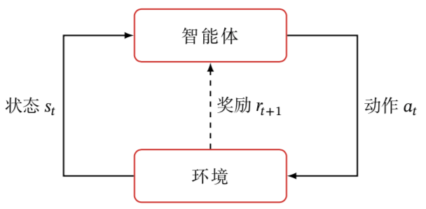
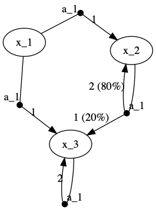

% 强化学习
% Roy
% 2020-02-03

# 强化学习



* 强化学习（Reinforcement Learning）：智能体（Agent）按策略 $\pi$ 与环境 E = (S, A, P, R) 不断交互并更新策略，使得累计回报 G 的期望 $ E_{\tau}(G) $ 最大。
* 步（Step）与轨迹（Trajectory）：根据当前状态 $ s \in S $ 执行动作 $ a \in A $ 后，获得由函数 R 决定的回报 r 并以概率 P 转移到下一个状态 $ s' \in S $，此为一步 (s, a, r, s')。连续的若干步 $<s_0, a_0, r_1, s_1, a_1, r_2, \cdots, s_{T-1}, a_{T-1}, r_T, s_T>$ 称为轨迹，记为 $\tau$。
* E: 环境（Environment）。通常以马尔可夫决策过程表示。
  * S: 状态空间（State）
    * 回合式任务（Episodic Task）：存在终止状态（Terminal State）的任务。从开始到终止的一轮交互称为一个回合（Episode）。如下棋。
    * 持续式任务（Continuing Task）：如无人驾驶。
  * A: 动作空间（Action）
  * P: 转移概率（Probability） $ S \times A \times S \rightarrow [0, 1] $
  * R: 回报函数（Reward） $ S \times A \times S \rightarrow [R_{\min}, R_{\max}] $
* $\pi$: 动作的策略（Policy）
  1. 确定性策略（Deterministic Policy） $ S \rightarrow A $
  2. 随机性策略（Stochastic Policy） $ S \times A \rightarrow [R_{\min}, R_{\max}] $
* G: 累计回报（Gain）。本文采用$ \gamma $-折扣累计回报
  1. 回合总回报 $ G = \sum r_t $，仅适用于回合式任务
  2. T 步累计回报 $ G_T(t_0) = \frac{1}{T} \sum\limits_{t=t_0}^{T+t_0} r_t = \frac{1}{T} r_{t_0} + \frac{T-1}{T} G_{T-1}(t_0+1) $
  3. $ \gamma $-折扣累计回报 $ G_{\gamma}(t_0) = \sum\limits_{t=0}^{+\infty} \gamma^t r_{t_0+t} = r_{t_0} + \gamma G_{\gamma}(t_0 + 1) $，$\gamma$ 称为折扣率

# 马尔可夫决策过程

强化学习的环境通常以马尔可夫决策过程（Markov Decision Process, MDP。将动作和回报考虑在内的马尔科夫过程）表示。如：

| (state, action) \ (P, R) \ next_state | x_1 | x_2      | x_3      |
|---------------------------------------|-----|----------|----------|
| (x_1, a_1)                            |     | (1, 1)   |          |
| (x_1, a_2)                            |     |          | (1, 1)   |
| (x_2, a_3)                            |     | (0.8, 2) | (0.2, 1) |
| (x_3, a_1)                            |     |          | (1, 2)   |



## 马尔可夫决策过程工具包: pymdptoolbox[^TODO: 需要细化]

离散时间 MDP 的工程实现 [pymdptoolbox][pymdptoolbox]，包括三个数据样例：

1. forest
2. random
3. small

实现了八种算法：

1. MDP: Base Markov decision process class
2. FiniteHorizon: Backwards induction finite horizon MDP
3. PolicyIteration: Policy iteration MDP
4. PolicyIterationModified: Modified policy iteration MDP
5. QLearning: Q-learning MDP
6. RelativeValueIteration: Relative value iteration MDP
7. ValueIteration: Value iteration MDP
8. ValueIterationGS: Gauss-Seidel value iteration MDP

# 值函数及其性质

**定义：**

* 状态-动作值变量：$ Z(s, a) = \{ G | s, a \} $
* 状态值函数（state value function）：$ V(s) = E_{\tau}(G | s) $
* 状态-动作值函数（state-action value function）：$ Q(s, a) = E_{\tau}(G | s, a) = E_{\tau}(Z) $
* 优势函数（advance value function）：$ A(s, a) = Q(s, a) - V(s) $

**性质：**

* $ V(s) = E_{a \sim \pi(s)}[E_{\tau}(G | s) | a] = E_{a \sim \pi(s)}[E_{\tau}(G | s, a)] = E_{a \sim \pi(s)}[Q(s, a)] $
* $ Q(s, a)
= E_{s', r | s, a}[r + \gamma E_{\tau}(G | s')]
= E_{r | s, a}(r) + \gamma E_{s' | s, a}[V(s')]
= E_{r \sim R(s, a)}(r) + \gamma E_{s' \sim P(s, a)}[V(s')] $
* $ E_{\tau}(G) = E_s(V) $
* $ E(A) = 0, E(A^2) = D(Q) $ [^TODO: 需要细化]

# 有模型的强化学习

P, R 已知时称为有模型（Model-based）的学习，此时 **无需交互** 通过动态规划就可以算出最佳策略。所以其实有模型时不算机器学习，而属于最优化的范畴。[^TODO: P, R 可变就是博弈了？]

## 策略迭代算法

### 递推式

Bellman Equation

1. $ Z(s, a) = \{r | s, a\} + \gamma Z(s', a') $
2. $ Q(s, a)
= E_{r \sim R(s, a)}(r) + \gamma E_{s' \sim P(s, a)}[V(s')]
= E_{r \sim R(s, a)}(r) + \gamma E_{s' \sim P(s, a)}[E_{a' \sim \pi(s')}[Q(s', a')]] $
3. $ V(s)
= E_{a \sim \pi(s)}[Q(s, a)]
= E_{a \sim \pi(s)}[E_{r \sim R(s, a)}(r) + \gamma E_{s' \sim P(s, a)}[V(s')]] $

### 策略迭代算法

复杂度比后面的值迭代算法高多了，感觉没有了解的必要。

* **策略评估（Policy Evaluation）：** 对于已知策略，由 3 迭代至收敛可得 V(s)。
* **策略改进（Policy Improvement）：** 对于已知的 V(s)，由 2 通过 V(s) 可得 Q(s, a)，又由 $ \pi'(s) = \mathop{\arg\max}\limits_{a \in A} Q_{\pi}(s, a) $ 有 $ V_{\pi'}(s) \le V_{\pi}(s) $ 可得到一个更优的确定性策略 $ \pi'$。

由此有 **策略迭代算法（Policy Iteration）：**

```
初始化策略 pi
repeat
    V = 策略评估(pi)
    pi = 策略改进(V)
until pi稳定
```

因为策略评估中求 V(s) 的时间复杂度高，策略改进时又只依赖于 Q(s, a) 的相对大小而无需精确的 V(s)，所以策略评估时可以只迭代一定次数，得到 **截断策略迭代算法（Truncated Policy Iteration）：**

```
初始化策略 pi
repeat
    V = 限制了迭代次数的策略评估(pi)
    pi = 策略改进(V)
until V收敛
```

## 值迭代算法

### 最优策略及其性质

1. 最优的确定性策略：$ \pi^*(s) = (\mathop{\arg\max}\limits_{\pi} V_{\pi}(s))(s) = \mathop{\arg\max}\limits_{a \in A} Q^*(s, a) $
2. 最优状态-动作值函数：$ Q^*(s, a) = \max\limits_{\pi} Q_{\pi}(s, a) $
3. 最优状态值函数：$ V^*(s) = V_{\pi^*}(s) = \max\limits_{\pi} V_{\pi}(s) = Q^*(s, \pi^*(s)) = \max\limits_{a \in A} Q^*(s, a) $

### 最优递推式

Bellman Optimality Equation

1. $ Q^*(s, a)
= E_{r \sim R(s, a)}(r) + \gamma E_{s' \sim P(s, a)}[V^*(s')]
= E_{r \sim R(s, a)}(r) + \gamma E_{s' \sim P(s, a)}[\max\limits_{a' \in A} Q^*(s', a')] $
2. $ V^*(s)
= \max\limits_{a \in A} Q^*(s, a)
= \max\limits_{a \in A} \{E_{r \sim R(s, a)}(r) + \gamma E_{s' \sim P(s, a)}[V^*(s')]\} $

### 值迭代算法

Value Iteration: 用以下两个方法之一求出最优 Q 函数后得到最优的确定性策略 $ \pi^*(s) = \mathop{\arg\max}\limits_{a \in A} Q(s, a) $

```
初始化矩阵 Q
按 1 迭代 Q 至收敛
```

或

```
初始化数组 V
按 2 迭代 V 至收敛
按 1 由 V 求 Q
```

算法复杂度是一样的，但显然直接迭代 Q 更简洁，不知道为啥所有教材都是先迭代 V。

# 无模型的强化学习

P, R 未知时称为无模型（Model-free）的学习，需要智能体通过不断与环境进行交互以获取信息并更新策略。

1. 通过 R-max 等方法重建出模型，再当有模型进行学习；
2. 通过采样估算值函数，再进行策略的改进；
3. 通过采样估算策略梯度，沿上升方向修正策略。

## 重建模型的方法

## 估算值函数的方法

### 蒙特卡罗方法

蒙特卡罗（Monte Carlo）方法：采样若干条轨迹 $\tau$，按定义 $ Q(s, a) = E_{\tau}(G | s, a) $ 对每一对状态-动作 (s, a) [^1] 计算其在轨迹中累计回报 G 的均值作为 Q(s, a) 的估算，之后得到改进策略 $ \mathop{\arg\max}\limits_{a \in A} Q(s, a) $。

```
repeat
    采样
    估算 Q
    改进策略
until 策略稳定
```

[^1]: <http://www-anw.cs.umass.edu/legacy/pubs/1995_96/singh_s_ML96.pdf> 指出同一轨迹中的状态-动作对只考虑首次经验就足够了

#### 增量式计算

上面的 MC 方法对每对状态-动作，汇总累计回报与出现次数后相除：$ Q(s, a) \approx \frac{\sum\limits_{s_0=s, t_0=t} G(s, a)}{N(s, a)} $，其中 G(s, a) 为每一次 (s, a) 所获得的累计回报，N(s, a) 为 (s, a) 总共出现的次数。

可改为增量式计算，每一步都更新 Q：$ Q(s, a) \mathrel{+}= \frac{1}{N(s, a)} [G(s, a) - Q(s, a)] $，其中 N(s, a) 为当前 (s, a) 累计出现的次数。

```
repeat
    采样
    增量式更新 Q
    改进策略
until 策略稳定
```

可以给 $\frac{1}{N(s, a)}$ 设置一个下限 $\alpha$ 以避免久了后学不到东西，或将其固定为常数 $\alpha$ 以保证较新经验的权重：$ Q(s, a) \mathrel{+}= \alpha \cdot [G(s, a) - Q(s, a)] $。

* $\alpha$ 称为学习率，与之相同的思想还有 Prioritized Memory。
* G - Q 代表 **真实回报** 与 **预期回报** 之间的误差，增量更新过程就是预期回报逼近真实回报的过程。[^TODO: 基于值函数的方法都是在使预期回报逼近真实回报上做文章]

#### 探索

无模型时，智能体的决策需要折衷考虑对已知信息的利用（Exploitation）和对未知信息的探索（Exploration），采样时会在策略之外进行探索。常见以下策略：

##### $ \epsilon $-贪心

以概率 $ \epsilon $ 进行探索（Exploration，执行随机动作），以概率 $ 1 - \epsilon $ 进行利用（Exploitation，执行已知最优的动作）。

这样选到 $\pi(s)$ 的概率是 $ 1 - \epsilon + \frac{\epsilon}{|A|} $，选到其它动作的概率为 $\frac{\epsilon}{|A|}$。

因为探索的重要性会越来越低，可令 $ \epsilon $ 随时间衰减。

##### softmax

以概率 $ P(a) = softmax(\frac{Q(a)}{\sigma}) $ 选择动作，Q(a) 为动作 a 当前的平均回报（令其初始值大于 0）。即回报越高的动作越容易被选到。

##### NoisyNet

#### 异策略与重要性采样

采样时加入探索通常会影响到动作的分布，因此采样策略不同于目标策略。

* 同策略（On-Policy）：直接对采样策略进行评估与改进；
* 异策略（Off-Policy）：通过重要性采样方法使用采样策略产生的数据对目标策略进行评估与改进。

显然应该尽量追求异策略方法，去除探索对于策略评估产生的影响。

:::
**重要性采样（Importance Sampling）：**

$$ E_{X \sim p}[f(x)]
= \int_x p(x) f(x) dx
= \int_x q(x) \cdot \frac{p(x)}{q(x)} \cdot f(x) dx
= E_{X \sim q}(\frac{p(x)}{q(x)} f(x)) $$

因此通过在分布 q 上进行采样，计算 $ \frac{p(x)}{q(x)} f(x) $ 的均值可估算 f(X) 在分布 p 上的期望。
:::

那么设采样策略为 $\pi'$，则有
$$ Q(s, a)
= E_{\tau}(G | s, a)
= E_{\tau}[\frac{Pr\{\tau | \pi\}}{Pr\{\tau | \pi'\}} \cdot G | s, a]
= E_{\tau}[\frac{\prod\limits_{t=0}^{T-1} \pi(s_t, a_t) P(s_{t+1} | s_t, a_t)}{\prod\limits_{t=0}^{T-1} \pi'(s_t, a_t) P(s_{t+1} | s_t, a_t)} \cdot G | s_0=s, a_0=a]
= E_{\tau}[\prod\limits_{t=0}^{T-1} \frac{\pi(s_t, a_t)}{\pi'(s_t, a_t)} | s_0=s, a_0=a] $$

这样通过采样策略便可以估算目标策略。

具体来说，若目标策略为确定性的，且使用 $\epsilon$-贪心策略进行探索，则按 $ Q(s, a)
= E_{\tau}[\prod\limits_{t=0}^{T-1} \frac{1}{1 - \epsilon + \frac{\epsilon}{|A|} or \frac{\epsilon}{|A|}} \cdot G | s, a] $，可对每一对状态-动作 (s, a) 计算其在轨迹中（重要性采样系数 * 累计回报 G）的均值，作为 Q(s, a) 的估算。

### 时序差分方法

因为折扣累计回报 G 可以分解为第一步折扣回报与剩余折扣回报两部分之和：$ G_{\gamma}(t_0) = r_{t_0} + \gamma G_{\gamma}(t_0 + 1) $，所以 $ Q(s, a) = E_{\tau}(G | s, a) = E_{\tau}[r + \gamma G'| s, a, s', a'] $

用与增量式 MC 方法的思路可得到 Q 函数的增量更新式：$ Q(s, a) \mathrel{+}= \alpha [r + \gamma G(s', a') - Q(s, a)] $

再用一个已知的 Q'(s', a') 或 V'(s') 去近似剩余回报 G(s', a')，就可以只依赖单步经验进行策略的更新，而不需要走到足够算出 G(s', a') 的地步。

这就是时序差分（Temporal Difference）方法：每一步交互（s, a, r, s') 后，用 $ Q(s, a) \mathrel{+}= \alpha [r + \gamma V'(s') - Q(s, a)] $ 或 $ Q(s, a) \mathrel{+}= \alpha [r + \gamma Q'(s', a') - Q(s, a)] $（后者需要先由采样策略决定下一步动作 a'） 更新 Q 函数和策略。

因为下一步动作 a' 由采样策略决定，故使用 Q'(s', a') 近似剩余回报时得到的 Q 函数是对采样策略的评估，因而该方法是同策略的。[^参考异策略]  
而使用 V'(s') 近似剩余回报时，Q 函数的评估与下一步采样无关，因而是异策略的。

#### n 步时序差分方法

更一般地，折扣累计回报 G 可以分解为前 n 步折扣回报与剩余折扣回报两部分之和：$ G_{\gamma}(t_0) = \sum\limits_{t=0}^{n-1} \gamma^t r_{t_0+t} + \gamma^n G_{\gamma}(t_0 + n) $

对应的 n 步增量更新式：$ Q(s, a) \mathrel{+}= \alpha [\sum\limits_{i=1}^n \gamma^{i-1} r_i + \gamma^n G(s_n, a_n) - Q(s, a)] $

对应地得到 n 步（n-step）时序差分方法：每 n 步交互后，用带近似 G 的上式更新 Q 函数和策略。

显然，MC 方法就是 T 步 TD。

#### SARSA、Q-Learning 和 Expected SARSA

| 算法              | 近似剩余回报                                                                   | 增量更新式                                                                                                                            |
|-------------------|--------------------------------------------------------------------------------|---------------------------------------------------------------------------------------------------------------------------------------|
| SARSA             | $ Q'(s', a') = Q(s', a') $                                                     | $ Q(s, a) \mathrel{+}= \alpha [r + \gamma Q(s', a') - Q(s, a)] $                                                                      |
| Q-Learning        | $ V'(s') = V^*(s') = \max\limits_{a \in A} Q^*(s', a) $                        | $ Q(s, a) \mathrel{+}= \alpha [r + \gamma \max\limits_{a \in A} Q(s', a) - Q(s, a)] $                                                 |
| Expected SARSA    | $ V'(s') = E_{a' \sim \pi'(s')}[Q(s', a')] $                                   | $ Q(s, a) \mathrel{+}= \alpha [r + \gamma E_{a' \sim \pi'(s')}[Q(s', a')] - Q(s, a)] $                                                |
| Double Q-Learning | $ Q_{1-i}(s', \mathop{\arg\max}\limits_{a \in A} Q_i(s', a)), i \in \{0, 1\} $ | $ Q_i(s, a) \mathrel{+}= \alpha [r + \gamma Q_{1-i}(s', \mathop{\arg\max}\limits_{a \in A} Q_i(s', a)) - Q_i(s, a)], i \in \{0, 1\} $ |

* SARSA 和 Q-Learning 是 Expected SARSA 的特例（$\pi'$ 的选择不同）
* Q-Learning 中评估的是目标策略，学习的 Q 就是最优值函数 $Q^*$。但 r 没经过重要性采样系数修正[^TODO]
* Double Q-Learning 是因为其它三者的近似回报中都含有 max 操作，存在 Maximization Bias。因此为 determine 和 estimate 采用不同的 Q，使得其中之一的 argmax 不一定是另一个的 argmax。

### DQN

Freeze target
experience replay

distributional DQN
noisy DQN
double DQN
prioritized DDQN
dueling DDQN

## 策略搜索

### 无梯度

### 策略梯度

#### Reinforcement

#### Based Reinforcement

#### Actor-Critic

# 模仿学习

Imitation Learning: 有人类专家的决策过程作为示范。

## 直接模仿学习

奖励反馈慢时，从示范中抽取 (s, a) 对，拟合为一个初始策略，再加以改进。

## 逆强化学习

无明确奖励函数时，求出按示范决策能获得最多奖赏的奖赏函数。类似最大似然法了。

# 总结

# 资源

* 名校教程
  * 2015年David Silver的 [Teaching](http://www0.cs.ucl.ac.uk/staff/D.Silver/web/Teaching.html)
  * 2017年UC Berkerly的 Levine, Finn, Schulman的 [CS 294 Deep Reinforcement Learning](http://rll.berkeley.edu/deeprlcourse/)
  * 2017年CMU的[Deep RL and Control](https://katefvision.github.io/)。

# 引用

[pymdptoolbox]: <https://github.com/sawcordwell/pymdptoolbox> "Markov Decision Process (MDP) Toolbox for Python"
