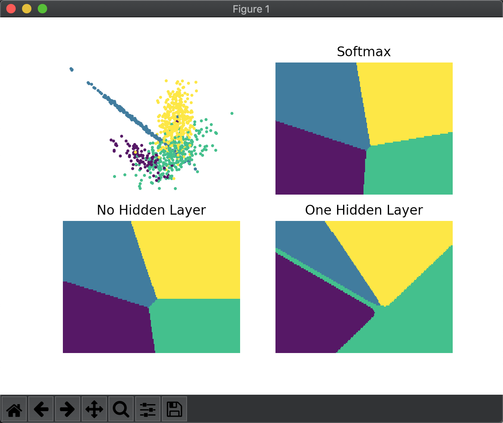

## 教程进展

### 算法：BP 神经网络

按教材推导并实现了 BP 神经网络，发现无隐藏层时与 softmax 的实现很像，于是对同一份训练数据也作了 softmax 分类的效果图。

无隐藏层的神经网络和 softmax 的参数学习公式结构是相同的：

$$ \text{softmax: } W_{t+1} = W_t + \alpha ( \frac{1}{N} X^T (Y - \hat{Y})) $$
$$ \text{BP-NN: } W_{t+1} = W_t + \alpha ( X^T f^'(W^T_t X) (Y - \hat{Y})) $$

些微区别主要来自于：

1. 激活函数不同。神经网络的激活函数只是为了方便求导，但 softmax 中的激活函数还包含概率的假设，因此 softmax 的输出层值向量还要归一化，而神经网络同一层节点之间无关联。
2. softmax 的误差最小化过程可以看作一种累积 BP 算法，而不像这里 BP 神经网络的实现是用的标准的单次 BP 算法。
