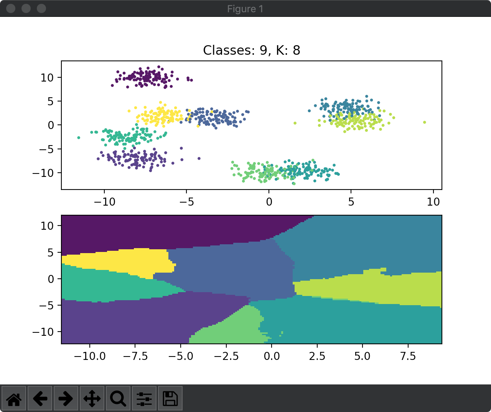
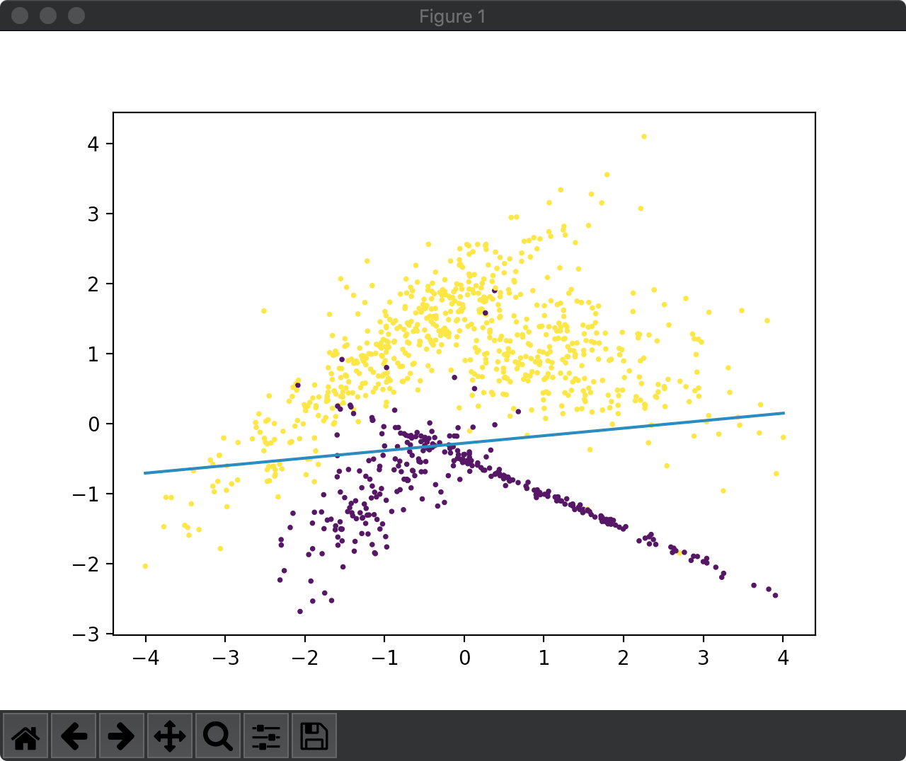
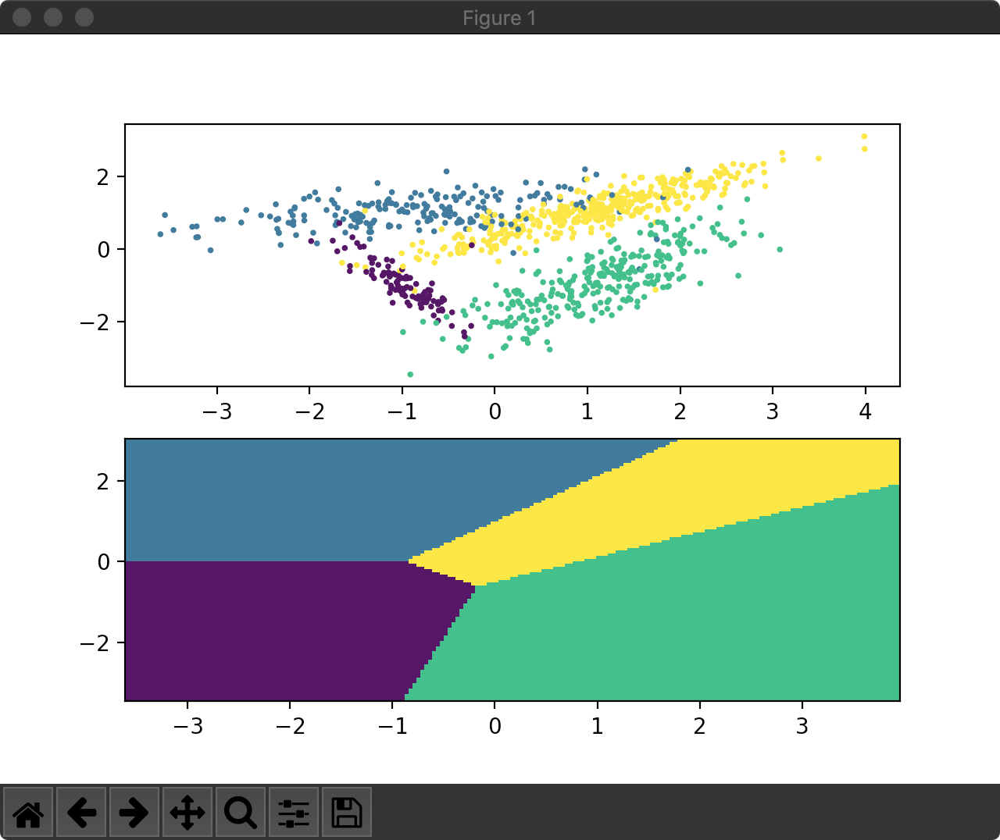

## 基础算法实现

### K-means

无监督分类。随机初始化 k 个点为 k 个类的中心，将全部点就近归类后计算出每个类的新的中心，循环至一定精度就结束。

### KNN

有监督分类。新的点计算与训练数据点的距离，最近的 k 个点的类别投票作为该点类别。

### Logistic Regression

因为 Logistic Regression 是 Softmax Regression 的类别数为 2 的特例，所以这里是调用的后面的 Softmax Regression，没有单独实现。

### Softmax Regression

将分类问题看作概率问题，并假设属于各个分类的概率的对数呈线性关系，按极大似然估算模型参数（或视交叉熵为损失函数令其最小化）。

