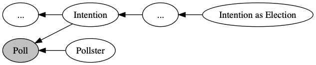

# 暑期总结

1. 跟许老师组做预测项目
2. 完成了部分新生教程

---

## 项目：选举预测

完成工作如下：

1. 调研开源项目与查找阅读论文
2. 实现 Demo，建立概率图模型，调用 PyMC3 估计参数
3. 综述合稿

---

### 调研的开源项目

1. 基于贝叶斯概率模型的美国选举预测模型
2. 基于贝叶斯概率模型的以色列选举预测模型
3. Facebook 开源的用于商业时序数据预测的先知模型

---

### 阅读的论文

1. 基于贝叶斯的美国总统选举动态预测
2. 利用机器学习和社交媒体预测稀有事件
3. 大规模预测
4. 社交媒体不会说谎：用多种在线信息预测2016台湾选举

---

### 模型原理

---

## 新生教程

完成了算法和 CNN 的实现，代码见 [Github](https://github.com/cf020031308/cf020031308.github.io/tree/master/exercise/postgraduate)

---

### 算法

1. [K-means](https://github.com/cf020031308/cf020031308.github.io/tree/master/exercise/postgraduate/algorithm/kmeans)
2. [KNN](https://github.com/cf020031308/cf020031308.github.io/tree/master/exercise/postgraduate/algorithm/knn)
3. [Logistic Regression & Softmax Regression](https://github.com/cf020031308/cf020031308.github.io/tree/master/exercise/postgraduate/algorithm/softmax)
5. [Back Propagation Neural Network](https://github.com/cf020031308/cf020031308.github.io/tree/master/exercise/postgraduate/algorithm/bpnn)
6. [CART Decision Tree](https://github.com/cf020031308/cf020031308.github.io/tree/master/exercise/postgraduate/algorithm/cart)
7. [Native Bayesian Classifier](https://github.com/cf020031308/cf020031308.github.io/tree/master/exercise/postgraduate/algorithm/bayes)
8. [Principal Component Analysis](https://github.com/cf020031308/cf020031308.github.io/tree/master/exercise/postgraduate/algorithm/pca)

---

### 平台

1. Docker 与 K8s 环境
2. Tensorflow

---

#### Docker & Kubernetes

* [x] 环境部署
  * docker & docker-compose
  * minikube & kubectrl
* [ ] ELK 镜像
* [x] Tensorflow on K8s

---

#### Tensorflow

1. [CNN](https://github.com/cf020031308/cf020031308.github.io/blob/master/exercise/postgraduate/app/cnn.py)
2. [AlexNet](https://github.com/cf020031308/cf020031308.github.io/blob/master/exercise/postgraduate/app/alexnet.py)
3. [VGGNet](https://github.com/cf020031308/cf020031308.github.io/blob/master/exercise/postgraduate/app/vgg.py)
4. [GoogleNet](https://github.com/cf020031308/cf020031308.github.io/blob/master/exercise/postgraduate/app/googlenet.py)
5. ResNet
6. LSTM

---

### 课程学习

* 邱锡鹏《神经网络与深度学习》（100%）
* 李航《统计学习方法》（50%）
* 周志华《机器学习》（50%）
* 黄文坚《TensorFlow 实战》（50%）
* 吴恩达《深度学习》（0%）
