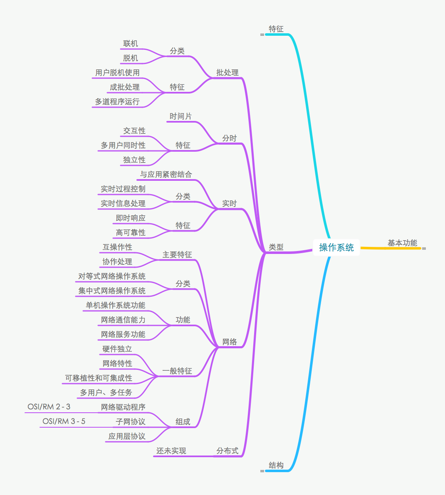
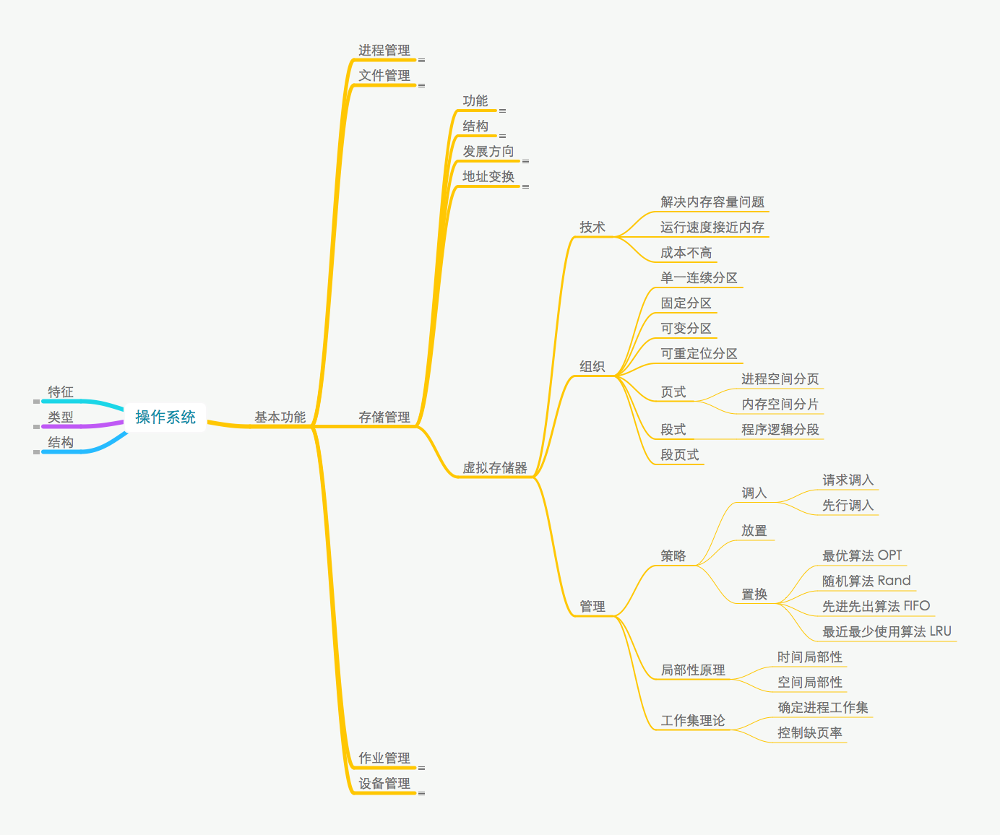
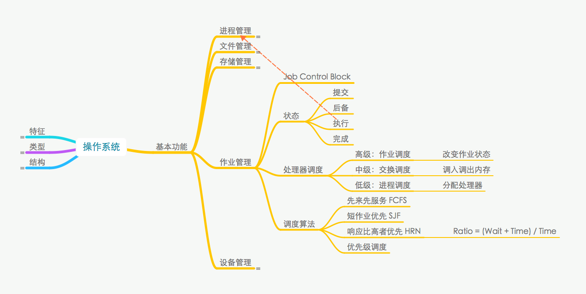
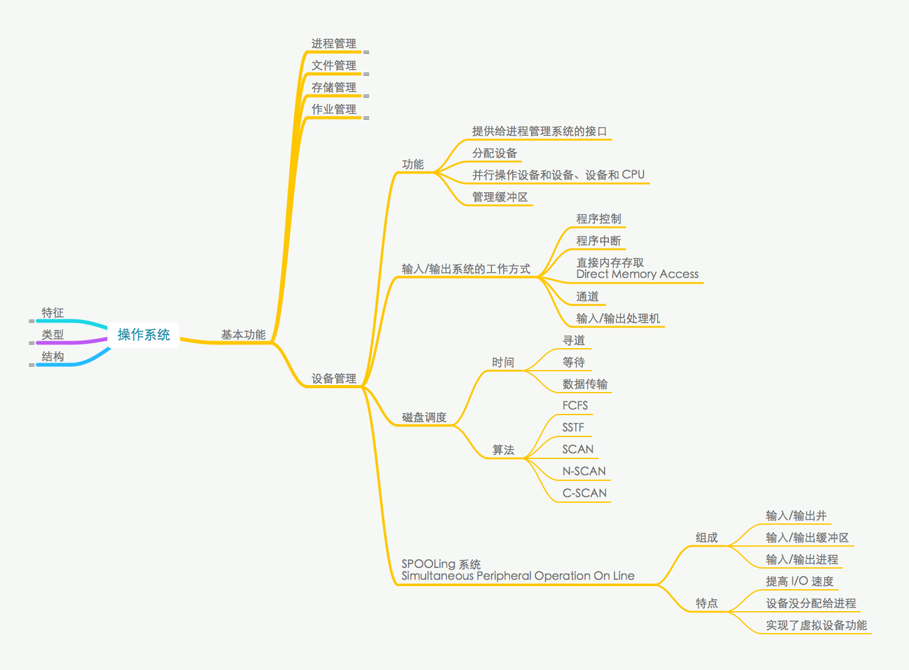

架构定义：{{c1::关于软件系统的结构、行为和属性的高级抽象}}
___
架构三要素：
1. {{c1::构件}}
2. {{c1::模式}}
3. {{c1::规划}}
___
系统架构  

___
操作系统的特征
1. {{c1::并发性 Concurrency}}
2. {{c1::共享性 Sharing}}
3. {{c1::虚拟性 Virtual}}
4. {{c1::不确定性 Non-Determinacy}}
___
操作系统的结构
1. {{c1::无序}}
2. {{c1::层次}}
3. {{c1::面向对象}}
4. {{c1::对称多处理}}
5. {{c1::微内核}}
___
操作系统的类型
1. {{c1::批处理}}
2. {{c1::分时}}
3. {{c1::实时}}
4. {{c1::网络}}
5. {{c1::分布式}}
___
操作系统的类型  

___
操作系统的基本功能
1. {{c1::进程管理}}
2. {{c1::文件管理}}
3. {{c1::存储管理}}
4. {{c1::作业管理}}
5. {{c1::设备管理}}
___
操作系统进程管理的三态模型
1. {{c1::运行}}
2. {{c1::就绪}}
3. {{c1::等待/阻塞}}
___
操作系统进程管理的五态模型
1. {{c1::运行}}
2. {{c1::活跃就绪}}
3. {{c1::活跃阻塞}}
4. {{c1::静止就绪}}
5. {{c1::静止阻塞}}
___
操作系统进程管理的调度算法
1. {{c1::先来先服务}}
2. {{c1::时间片轮转 Round Robin}}
3. {{c1::优先级调度}}
4. {{c1::多级反馈调度}}
___
进程死锁的必要条件
1. {{c1::互斥}}
2. {{c1::保持与等待}}
3. {{c1::不可抢占}}
4. {{c1::循环等待}}
___
进程死锁的应对策略
1. {{c1::鸵鸟}}
2. {{c1::预防}}
3. {{c1::避免}}
4. {{c1::检测与解除}}
{{c3::银行家算法}}属于其中第{{c2::2}}个策略。
___
操作系统进程管理  

___
文件结构
	{{c1::逻辑组织}}
		结构
			无结构的{{c2::字符流文件}}
			有结构的{{c2::记录文件/有格式文件}}
				{{c3::连续结构}}
				{{c3::多重结构}}
				{{c3::转置结构}}
				{{c3::顺序结构}}
		存取方法
			{{c4::顺序存取法}}
			{{c4::随机存取法}}
			{{c4::按键存取法}}
	{{c1::物理组织}}
		结构
			{{c5::连续文件/顺序文件}}
			{{c5::串联文件/链接文件}}
			{{c5::索引文件}}
				Unix 采用{{c6::三}}级索引结构
___
操作系统文件的存储空间管理方法
1. {{c1::空闲表法}}
2. {{c1::空闲链表法}}，包括{{c2::空闲盘块链}}和{{c2::空闲盘区链}}
3. {{c1::位图法}}
4. {{c1::成组链接法}}
___
操作系统文件管理  

___
操作系统存储管理  

___
虚拟存储器的组织
1. {{c1::单一连续分区}}
2. {{c2::固定分区}}
3. {{c1::可变分区}}
4. {{c2::可重定位分区}}
5. {{c1::页式：}}{{c3::进程空间分页、内存空间分片}}
6. {{c1::段式：}}{{c3::程序逻辑分段}}
7. {{c2::段页式}}
___
操作系统虚拟存储器  

___
操作系统作业管理的四个状态
1. {{c1::提交}}
2. {{c1::后备}}
3. {{c1::执行}}
4. {{c1::完成}}
___
操作系统作业管理的处理器调度
- 高级：{{c1::作业调度}}. {{c2::改变作业状态}}
- 中级：{{c1::交换调度}}. {{c2::调入调出内存}}
- 低级：{{c1::进程调度}}. {{c2::分配处理器}}
___
操作系统作业管理的调度算法
1. {{c1::先来先服务}}. {{c2::FCFS}}
2. {{c1::短作业优先}}. {{c2::SJF}}
3. {{c1::响应比高者优先}}. {{c2::HRN}}
	其中响应比定义为 {{c3:: (Wait + Time) / Time}}
4. {{c1::优先级调度}}
___
操作系统作业管理  

___
操作系统输入/输出系统的工作方式
1. {{c1::程序控制}}
2. {{c1::程序中断}}
3. {{c1::直接内存存取 Direct Memory Access}}
4. {{c1::通道}}
5. {{c1::输入/输出处理机}}
___
操作系统设备管理的磁盘调度时间包括{{c1::寻道}}、{{c1::等待}}、{{c1::数据传输}}。
___
SPOOLing 系统（{{c1::Simultaneous Peripheral Operation On Line}}）由{{c2::输入/输出井}}、{{c2::输入/输出缓冲区}}、{{c2::输入/输出进程}}组成。
___
操作系统的设备管理  

