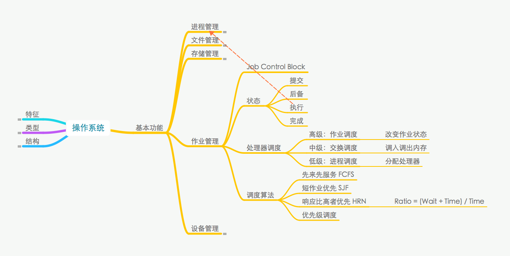
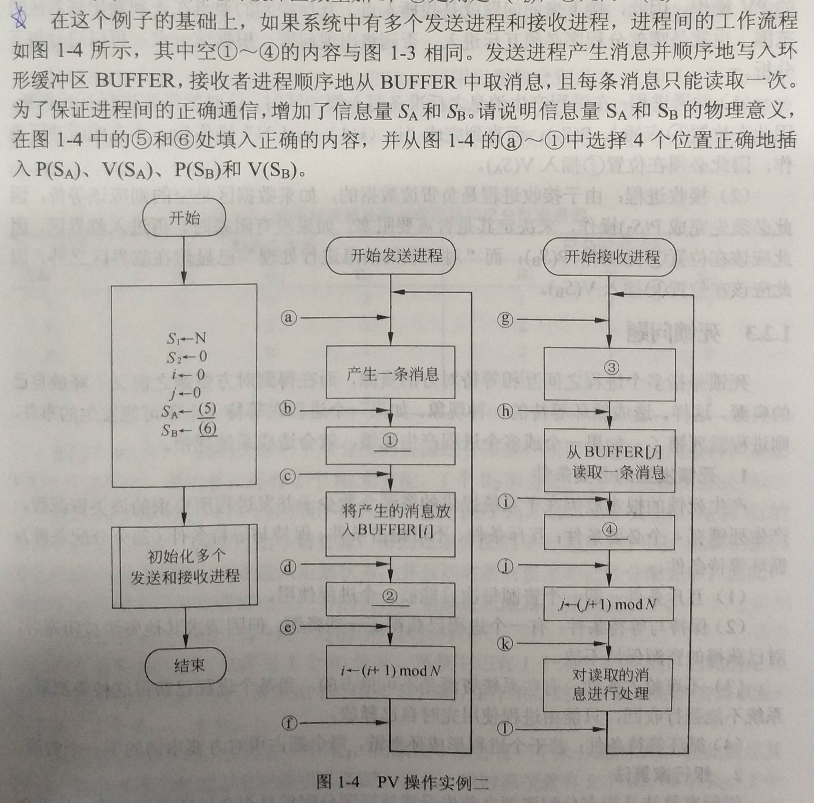

架构定义：<c1>关于软件系统的结构、行为和属性的高级抽象</c1>
___
架构三要素：
1. <c1>构件</c1>
2. <c1>模式</c1>
3. <c1>规划</c1>
___
系统架构  

___
操作系统的特征
1. <c1>并发性 Concurrency</c1>
2. <c1>共享性 Sharing</c1>
3. <c1>虚拟性 Virtual</c1>
4. <c1>不确定性 Non-Determinacy</c1>
___
操作系统的结构
1. <c1>无序</c1>
2. <c1>层次</c1>
3. <c1>面向对象</c1>
4. <c1>对称多处理</c1>
5. <c1>微内核</c1>
___
操作系统的类型
1. <c1>批处理</c1>
2. <c1>分时</c1>
3. <c1>实时</c1>
4. <c1>网络</c1>
5. <c1>分布式</c1>
___
操作系统的类型  

___
操作系统的基本功能
1. <c1>进程管理</c1>
2. <c1>文件管理</c1>
3. <c1>存储管理</c1>
4. <c1>作业管理</c1>
5. <c1>设备管理</c1>
___
操作系统进程管理的三态模型
1. <c1>运行</c1>
2. <c1>就绪</c1>
3. <c1>等待/阻塞</c1>
___
操作系统进程管理的五态模型
1. <c1>运行</c1>
2. <c1>活跃就绪</c1>
3. <c1>活跃阻塞</c1>
4. <c1>静止就绪</c1>
5. <c1>静止阻塞</c1>
___
操作系统进程管理的调度算法
1. <c1>先来先服务</c1>
2. <c1>时间片轮转 Round Robin</c1>
3. <c1>优先级调度</c1>
4. <c1>多级反馈调度</c1>
___
进程死锁的必要条件
1. <c1>互斥</c1>
2. <c1>保持与等待</c1>
3. <c1>不可抢占</c1>
4. <c1>循环等待</c1>
___
进程死锁的应对策略
1. <c1>鸵鸟</c1>
2. <c1>预防</c1>
3. <c1>避免</c1>
4. <c1>检测与解除</c1>
<c3>银行家算法</c3>属于其中第<c2>2</c2>个策略。
___
操作系统进程管理  

___
文件结构

+ <c1>逻辑组织</c1>
    + 结构
        - 无结构的<c2>字符流文件</c2>
        + 有结构的<c2>记录文件/有格式文件</c2>
            - <c3>连续结构</c3>
            - <c3>多重结构</c3>
            - <c3>转置结构</c3>
            - <c3>顺序结构</c3>
    + 存取方法
        - <c4>顺序存取法</c4>
        - <c4>随机存取法</c4>
        - <c4>按键存取法</c4>
+ <c1>物理组织</c1>
    + 结构
        - <c5>连续文件/顺序文件</c5>
        - <c5>串联文件/链接文件</c5>
        - <c5>索引文件</c5>  
            Unix 采用<c6>三</c6>级索引结构
___
操作系统文件的存储空间管理方法
1. <c1>空闲表法</c1>
2. <c1>空闲链表法</c1>，包括<c2>空闲盘块链</c2>和<c2>空闲盘区链</c2>
3. <c1>位图法</c1>
4. <c1>成组链接法</c1>
___
操作系统文件管理  

___
操作系统存储管理  

___
虚拟存储器的组织
1. <c1>单一连续分区</c1>
2. <c2>固定分区</c2>
3. <c1>可变分区</c1>
4. <c2>可重定位分区</c2>
5. <c1>页式：</c1><c3>进程空间分页、内存空间分片</c3>
6. <c1>段式：</c1><c3>程序逻辑分段</c3>
7. <c2>段页式</c2>
___
操作系统虚拟存储器  

___
操作系统作业管理的四个状态
1. <c1>提交</c1>
2. <c1>后备</c1>
3. <c1>执行</c1>
4. <c1>完成</c1>
___
操作系统作业管理的处理器调度
- 高级：<c1>作业调度</c1>. <c2>改变作业状态</c2>
- 中级：<c1>交换调度</c1>. <c2>调入调出内存</c2>
- 低级：<c1>进程调度</c1>. <c2>分配处理器</c2>
___
操作系统作业管理的调度算法
1. <c1>先来先服务</c1>. <c2>FCFS</c2>
2. <c1>短作业优先</c1>. <c2>SJF</c2>
3. <c1>响应比高者优先</c1>. <c2>HRN</c2>
	其中响应比定义为 <c3> (Wait + Time) / Time</c3>
4. <c1>优先级调度</c1>
___
操作系统作业管理  

___
操作系统输入/输出系统的工作方式
1. <c1>程序控制</c1>
2. <c1>程序中断</c1>
3. <c1>直接内存存取 Direct Memory Access</c1>
4. <c1>通道</c1>
5. <c1>输入/输出处理机</c1>
___
操作系统设备管理的磁盘调度时间包括<c1>寻道</c1>、<c1>等待</c1>、<c1>数据传输</c1>。
___
SPOOLing 系统（<c1>Simultaneous Peripheral Operation On Line</c1>）由<c2>输入/输出井</c2>、<c2>输入/输出缓冲区</c2>、<c2>输入/输出进程</c2>组成。
___
操作系统的设备管理  

___
<c1></c1>
<c2></c2>
___
<c1>

1. P(S1)
2. V(S2)
3. P(S2)
4. V(S1)

</c1>
<c2></c2>
___
<c1></c1>
<c2>现死锁现象。</c2>
___
<c1></c1>
<c2>答案 A。</c2>
___
<c1></c1>
<c2></c2>
