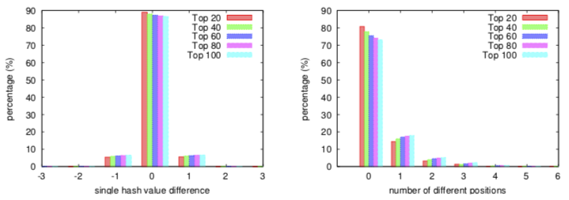
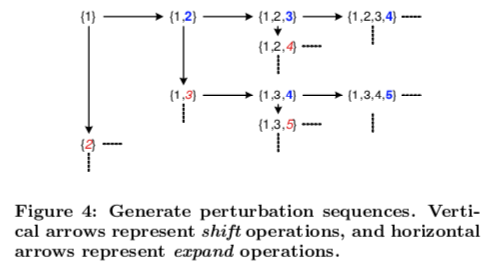

# 高维相似搜索中的多探头 LSH 索引

## 背景

精确的最近邻搜索算法（Nearest Neighbor Search, NN）在高维空间中很慢，所以发展出了近似最近邻搜索（Approximate Nearest Neighbor Search, ANN），其中一支就是局部敏感哈希算法（Locality Sensitive Hashing, LSH）。

### 1. LSH

LSH 跟通常意义上的哈希不同，也许叫“变换”更合适。常规的变换（如线性变换）就满足 LSH 的需求：变换后，相近的两点仍以较大的概率相近（哈希进了同一个桶，或者说碰撞），距离较远的两点变换后的碰撞概率则较小。

对不同的距离度量有不同的哈希算法，本文考虑的是欧式距离，所对应的哈希函数是
$$h_{a, b}(v) = \lfloor f_{a, b}(v) \rfloor = \lfloor \frac{a \cdot v + b}{W} \rfloor$$
其中 a 中元素服从 N(0, 1), b ~ U(0, W)。

LSH 的主要问题就在于离散化的分桶方式仍然有概率将邻居分到不同桶中，因此有各种方法被提出来改进召回率。

### 2. Basic LSH Indexing

常规的方法就是多试。

1. 先定下 M x L 个哈希函数。每 M 个哈希为一组，对应一张哈希表；哈希结果组成一个 M 维的坐标，对应该哈希表中的一个桶
2. 查询前，将已有数据哈希到 L 个表中对应位置的桶中
3. 查询 q 时，取出 q 哈希到的 L 个桶中的元素求并集，就是 q 可能的最近邻居了
4. 通常这之后会再精确计算下它们与 q 的距离进行过滤，因为集合已经很小了计算就可以很快

这方法的缺陷就是为了达到要求的召回率，需要很多个哈希表，而且越堆效果越不明显。

### 2. Entropy-Based LSH Indexing

Entropy-based 方法从概率的角度去看待分桶，邻近点是以高概率哈希到相同桶中，但也有一定概率哈希到其它桶，于是通过采样正比于分桶概率地探索各个桶。

具体来说就是索引方法不变，但在查询时不一定会查 q，而是生成一批 q 的邻近点 q' 进行查询。

这方法的问题也不少：

1. 高概率桶会被重复计算，浪费
2. 低概率桶也可能被探索到，没必要
3. q' 与 q 的距离不好定
   * 太小查不出足够的备选项，recall 低
   * 太大查出的备选项也多，计算慢

## 多探头 LSH 索引

因为邻近点分桶后即使不在一个桶，也应该在邻近的桶，所以定义偏移向量（hash perturbation vector）$\Delta = (\delta_1, \cdots, \delta_M)$，其中 $\delta_i \in \\{-1, 0, 1\\}$，将位置 h(v) + $\Delta$ 的桶都考虑进来。

实质就是提高哈希表的利用率。具体怎么用，作者提出了三种方式。

### 1. Step-Wise Probing

这方法比较直观，设 $n = \sum\limits_{i=1}^{M} |\delta_i|$，依次探索 0-步桶、1-步桶、2-步桶、……  
从实验来看，到 2-步就够了。

文章后面做了实验，不如下面这个用法。

### 2. Query-Directed Probing

通过高斯分布可以估算出 q 的邻居 p 落入最近三个槽的概率分布是
$$P[h_i(p) = h_i(q) + \delta] \approx e^{-C x_i(\delta)^2}$$
其中 x(0) = 0，x($\pm 1$) 等于 f(q) 与边界的距离

乘起来，得到落入 h(v) + $\Delta$ 的桶的概率。它取决于
$$\text{score}(\Delta) = \sum\limits_{i=1}^{M} x_i^2(\delta_i)$$
分值越小，概率越高。

所以现在的目标就是从 $2^M - 1$ 种可能的组合中找到分值最小的 T 个 $\Delta$。

作者首先将 x(q) = {$x_i(\delta_i) | i = 1, \cdots, M; \delta_i \in \\{-1, 1\\}$} 升序排列，得到 $\pi = [(i, \delta_i), \cdots]$，用下标集合 A 表示 $\pi$ 中相应位置的偏移被采用形成的偏移向量。

比如假设 $\pi$ = [$(3, -1), (5, 1), \cdots$]，A = {1, 2} 就表示 $\Delta = (0, 0, -1, 0, 1, \cdots)$。

下面是生成最小分值 $\Delta$（A） 的算法

简单来说就是维护一个最小堆，每次取出堆顶的 A 作为一个输出，然后将该 A 的 shift 结果和 expand 结果放入堆中排序。  
其中 shift 操作是把最后一项偏移换得更大，expand 操作则增加一项更大的偏移，如图：

这样的生成方式保证了以升序生成 A，而且堆中元素不超过 T + 1。

总结一下 Query-Directed Probing 算法，每次查询 q 需要

1. 根据 q 计算 x(q) = {$x_i(\delta_i) | i = 1, \cdots, M; \delta_i \in \{-1, 1\}$}
2. 排序得 $\pi = [(i, \delta_i), \cdots]$
3. 用前面的算法根据 $\pi$ 生成 T 个下标集合
4. 结合下标集合、$\pi$、x(q) 得到偏移向量

### 3. Optimized Query-Directed Probing

注意到前面 $\pi$ 的统计意义是“对一组均匀分布的样本进行排序”，得 x(q) 中第 j 小的 $z_j$ 的期望为
$$\begin{cases}
Ez_j = \frac{jW}{2(M + 1)}, &j \in \\{1, \cdots, M\\} \\\\
z_j = W - z_{2M + 1 -j}, &j \in \\{M+1, \cdots, 2M\\}
\end{cases}$$
于是可以在查询前就预先估计出 $\pi$ 的期望结果和对应的 T 个下标集合，进而省下 Query-Directed Probing 算法的中间两步。

不过文中没有这个方法的实验，我估计是效果不好。

## 实验

对比了文中涉及的三个 LSH Indexing 算法，在相同 recall 的前提下，multi-probe 对空间（hash tables）的优化率约 90%+ 且速度不降，Entropy-based 能优化掉 50% 的空间但速度也差不多降一半。
