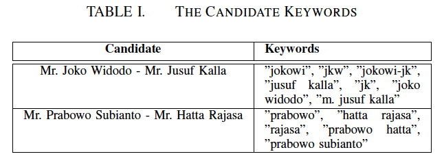
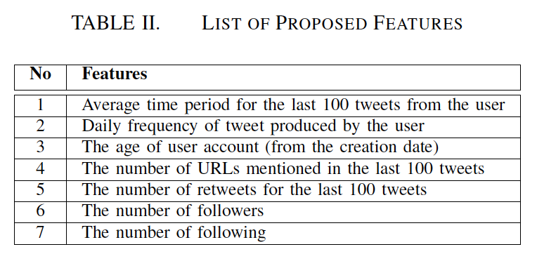
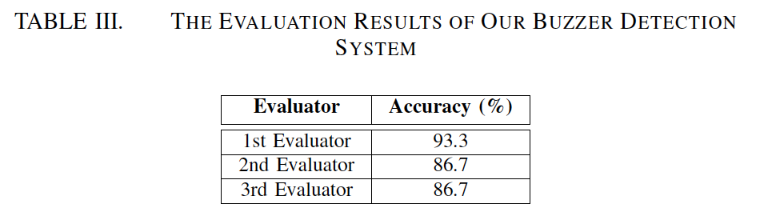
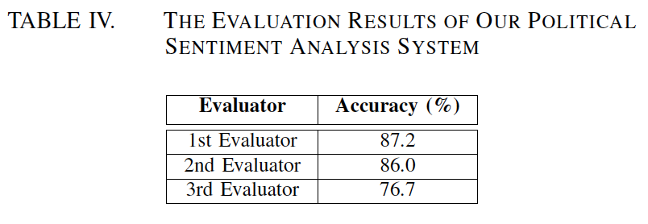
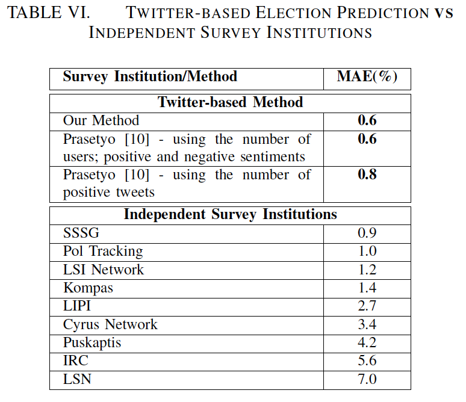

# 用于预测推特总统选举结果的蜂鸣器检测和情感分析

@songxn

* 应用
  - 选举预测
* 数据
  - 社交媒体
* 方法
  - 自动蜂鸣器检测
  - 文本情感分析

## 摘要

在本文中，我们介绍了使用Twitter预测印度尼西亚总统选举结果的方法。我们的主要资源。我们探索了将易于收集的Twitter数据用作调查支持工具以理解公众舆论的可能性。首先，我们在活动期间收集了Twitter数据。其次，我们对Twitter数据进行了自动蜂鸣器检测，以删除计算机机器人，付费用户和狂热用户生成的推文，这些推文通常会成为我们数据中的噪音。第三，我们进行了细致的政治情绪分析，将每条推文分成若干子推文，然后为每个子推文分配一个候选者及其情绪极性。最后，为了预测选举结果，我们利用每个候选人的积极子推文的数量。我们的实验表明，基于Twitter的预测的平均绝对误差（MAE）为0.61％，这比几个独立调查机构（民意调查）公布的预测结果要好得多。我们的研究表明，Twitter可以作为任何政治活动的重要资源，特别是用于预测选举本身的最终结果。

## 主要内容

Buzzer定义：将蜂鸣器定义为仅讨论其中一个候选人的帐户，同时诋毁其他候选人。第一类是计算机机器人，它本质上是一个基于某些触发器自动执行的计算机程序。例如，如果有推文提到一些关键词，如"pemilu"（"选举"），这种机器人将自动重新发布推文（即转发）。第二类蜂鸣器是付费用户或狂热用户。这类用户通常会以高频率发布推文，并快速响应一些相关的推文。

### 1、数据采集

我们使用Twitter Streaming API3在竞选期间（2014年5月1日-2014年7月6日）收集了大约1000万条政治推文。为了收集这些推文，我们使用了提及两个候选人的名字或昵称的关键字。例如，人们一直认为Joko Widodo先生是"Jokowi"而不是他的全名。表I显示了我们用于抓取有关两位候选人的政治推文的一些关键字。

https://dev.twitter.com/streaming/overview

### 2、识别蜂鸣器

判断方法：产生高频率的推文以及转推，具有短期创建日期的用户。  
定义为分类问题，采用机器学习方法来开发我们的计算模型。对给定的Twitter用户是否是蜂鸣器进行分类。

可以考虑，随机选择Twitter用户，然后手动将其标记为"蜂鸣器"或"非蜂鸣器"。但在文中对拥有最多频繁的推文数量的前1000名用户进行标记和训练。

建议的功能列表：

注释：

1. 用户过去100条推文的平均时间段
2. 用户每日推文频率
3. 用户创建用户的时间年龄
4. 过去发的100条推文的的链接数
5. 过去发的100条推文的转发数
6. 粉丝
7. 关注者

### 3、情绪分析的方法

（1）将每个Tweet分成几个子推文

使用分隔符，例如连词，逗号，点，问号和冒号分割推文  
本文考虑使用连词来分割推文，因为它们通常表现为两个子句之间的边界（即"子推文"）。

（2）为每个子推文分配候选人的姓名

检查预定义的候选人相关关键字的存在，若没有相关关键字，则从同一条推文中从其他子推文中推断出这些信息

（3）删除每个子推文的停用词和标点符号。

使用印尼语Sentiment Lexicon（应该是印尼那边的一个情感分析词典）计算每个子推文的情绪极性分数。（）  
采用情感聚合方法，计算每个子推文的情绪分数
$$ score(w, S) = \sum_{adj \in S} \frac{adj.so}{dist(adj, w)} $$
（说明：S是特定的子推文，w是子推文的候选人名称，adj.so表示包含在子推文中的形容词的情感方向，表示候选人相关关键词和形容词之间的距离）  
计算结果大于0，则为积极；小于0，则为消极。

最后只考虑利用针对候选人的积极子推文的数量，计算其比例，得到最终结果

### 4、结果

发现从选举前60天开始收集数据，能得到较好的预测结果。

Joko Widodo先生获得了1,501,945个正推送子推文（53.93％），Prabowo先生1,309,826个正推送子推文（46.07％）。选举结果 Joko成功当选，与预测结果相同。

### 5、评估

（1）蜂鸣器检测评估

随机选择了100个被分类器自动标记为"蜂鸣器"的用户。然后，要求三个独立的参与者识别用户并将其判断为3个预定类别："计算机机器人"，"付费/狂热用户"和"普通用户"，基于他们的专业知识和推文内容。此外，"计算机机器人"和"付费用户"标签对应于"蜂鸣器"类别，而"普通用户"标签对应于"非蜂鸣器"类别。三位注释者判断我们的蜂鸣器检测方法的准确率达到了86％以上。

（2）政治情绪分析评估

首先，随机为每位候选人选择了50条推文（两位候选人共有100条推文）。接下来，使用本文提出的方法来确定在其相应的子推文中对每个候选人的情绪。最后，简单地要求三位评估员判断我们的计算模型做出的决策。表IV总结了判断结果。

（3）选举预测的结果评估

使用平均绝对误差（MAE），测量选举预测的性能。
$$ MAE = \frac{\sum^N_{i=1} |e_i|}{N} $$
N是候选者的数量，并且$e_i$是关于第i个候选者的预测结果和实际结果之间的差。事实上，MAE在之前也被广泛用于评估政治预测。

表V所示为总统选举预测的结果。JOK+和PRA+分别代表JOKOWI和PRABOWO的正面亚文字数

表六为基于TWITTER的选举预测与独立调查机构的比较结果，显示基于Twitter的选举预测的表现令人惊讶地优于几个调查机构使用的任何方法。

