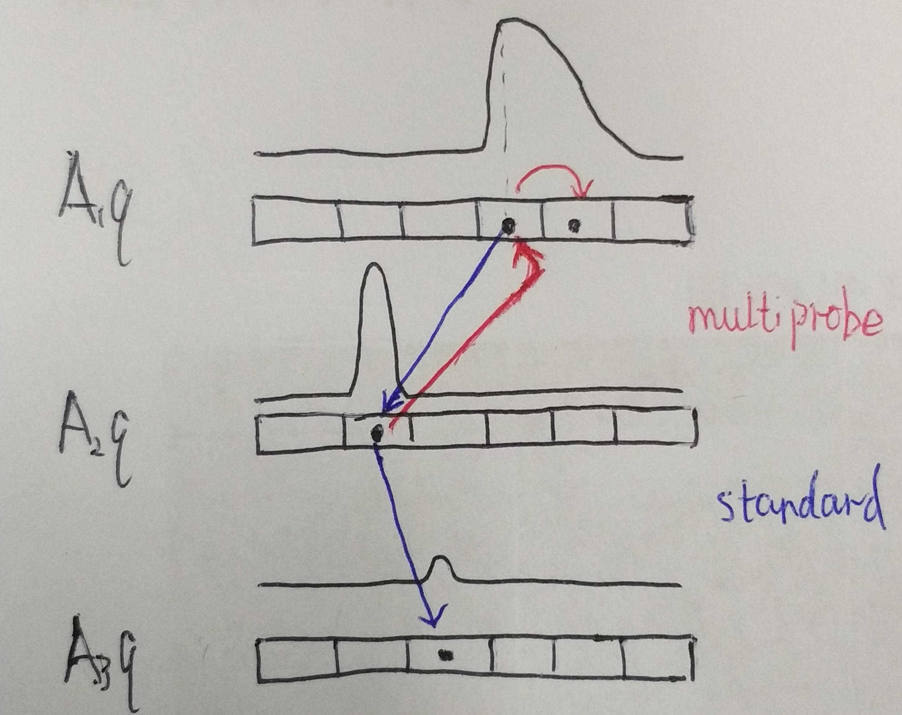

# 实用且最优的角距离局部敏感哈希算法

论文主要研究 Cross-polytope LSH 算法，包括理论分析（Optimal）和性能改进（Practical），我这里只关心后者。

## Cross-polytope LSH

Cross-polytope LSH 的距离度量是角距离（angular distance），等效于归一化到单位球面上之后的欧拉距离。  
算法定义为用 N(0, 1) 随机初始化一个矩阵 A，计算 y = Ax / ||Ax||（也就是随机旋转），之后取最近的一个正或负的单位向量为其哈希值（也就是 argmax[Ax, -Ax]）。

## 对 Cross-polytope LSH 的三个小改进

意义都不大：

1. 伪随机旋转：$A = HD_3HD_2HD_1$，其中 H 为 Hadamard 矩阵（$\pm 1$ 构成的正交方阵），三个 D 都是对角元素为随机 $\pm 1$ 的对角矩阵
   * 空间：H 是固定的，不算空间。D 是对角的。所以由 O($d^2$) 降为了 O(d)
   * 时间：用快速 Hadamard 变换（视频编码领域的经典算法，我不懂）可以由 O($d^2$) 降到 O($d \log d$)
   * 作者没有证明这种方法与原方法的等效性，只指出两个 H 不够，三个 H 可以
2. 特征哈希：如果是稀疏向量，先做一个随机的哈希（各列只有一个 $\pm 1$）使维度降下来
3. 部分 Cross-polytope LSH：最后只从部分单位向量中取最近，相当于把 [Ax, -Ax] 的部分维度给去掉了

## Multiprobe LSH

想法：

* 对 LSH 来说，如果 p, q 相近，那 h(p) 与 h(q) 即使不在同一个桶中，也应该在相近的桶中
* 对 Cross-polytope LSH 来说，h(p) 的分布按概率大小排列应该与 sort[Aq, -Aq] 相同，即最可能与 argmax[Aq, -Aq] 碰撞，其次可能与 [Aq, -Aq]（记为 z）中第二大的位置碰撞，...

以上是定性的分析，作者又定量地计算出，在 A 中元素满足高斯分布的前提下近似地有，
$$P\{h(p) = i\} \propto \exp{-|\max z - z_i|^2}$$

通常 LSH 都是要经过多轮哈希的，之前的方法是每一轮哈希只看最大值位置是否碰撞。  
但有了前面的定量结论就可以把多轮旋转结果合一起按概率排序，看概率最高的几个位置是否碰撞，就能更好地利用旋转运算的结果。如图：

上面方法之所以可行，是因为有时候 q 的旋转结果更接近“边界”，p 的哈希结果落到相邻区域的概率也不低，落到 q 的区域的概率相应地就不高了。

补充：因为原文说得不清楚，只说求出概率后用与《[高维相似搜索中的多探头 LSH 索引](../2007-multi-probe-lsh-efficient-indexing-for-high-dimensional-similarity-search/)》中的方法构造出序列。我猜着画了前面的图，但看完引用的文章后发现图画得不对，不改了。
