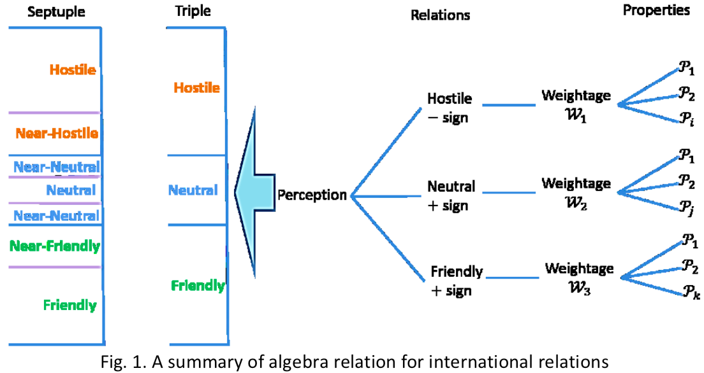

# 国际关系的计算与评估

## 计算框架

比如对国家关系分为三类：友好，中立和敌对，每个分类中，有事件与分值如下：

**友好**（权重 W = 0.45）

| 分值 P（合计 1） | 事件                                                                                             |
|------------------|--------------------------------------------------------------------------------------------------|
| 0.5              | 战时同盟关系和相互防卫协定                                                                       |
| 0.2              | 共享/交易核技术和核材料（例如铀），或用于战争的大规模毁灭性武器；军事武器研发合作； 战时经济援助 |
| 0.1              | 国家元首间的友好政治情感和关系                                                                   |
| 0.1              | 出借或共享战略技术和设备；民用核能的贸易和协议；和平时期有效的防御条约                           |
| 0.075            | 军事情报共享；大型联合军事演习                                                                   |
| 0.025            | 全球反恐战争（GWOT）                                                                             |

**中立**（权重 W = 0.1）

| 分值 P（合计 1） | 事件                                         |
|------------------|----------------------------------------------|
| 0.25             | 联合国会员国或联合国认可的民族国家           |
| 0.35             | 经济合作，如双边贸易、多边公开市场、自由贸易 |
| 0.40             | 外交使团（大使馆或代表）；灾害援助与维和     |

**敌对**（权重 W = 0.45）

| 分值 P（合计 1） | 事件                                                                                                               |
|------------------|--------------------------------------------------------------------------------------------------------------------|
| 0.5              | 战时敌对国                                                                                                         |
| 0.2              | 强烈谴责对方分享/交易/使用核技术和材料，或大规模毁灭性武器，如核试验、洲际弹道导弹（ICBM）的开发和试验以及军备竞赛 |
| 0.075            | 经济封锁或制裁；禁运或抵制（如大规模抵制对方产品、禁止签证）                                                       |
| 0.125            | 局部军事进攻或敌对行动，包括陆/海/空的侵入和恐怖主义，但不包括通过国际法引起的和平争端。                           |
| 0.05             | 敌对政治情绪；国家元首威胁                                                                                         |
| 0.05             | 杀死或逮捕他国外交官；间谍与黑客入侵                                                                               |

这是文中的计算示意图：

* Properties：指上面三个表中的事件与分值。对任一为真的事件，则取相应 P 值，否则取 0。
* Weightage：各分类的权重，取值 [0, 1]，和为 1。有两种设置方式
  1. 文中所用的设置方式：按该分类中 Properties 的种数等比例分配；
  2. 符合 Subjective Logic 的设置方式：按该分类的先验概率，如 (50%, 45%, 5%)。

简单来说，就是将为真的事件的 P 值按分类加起来，乘以分类权重得到友好分、中立分和敌对分，之后**总分 = 友好分 + 中立分 - 敌对分**。  
总分为负是敌对，不大于 0.1 是中立，大于 0.1 是友好。

文中还计算有另一个数据**混乱度 = 友好分 + 中立分 + 敌对分**。  
文中指出混乱度在 0.5 左右时是正常的。

如果混乱度接近 1，说明有很多相互矛盾的事件都取了真（既友好又敌对），根据 Dempster-Shafer 理论，这会导致结果以相当高的概率被判断为小可能的结果即中立（Zadeh 悖论）。  

文中分析，这是因为用于判断事件真伪的材料的时间窗口太长，容纳了太多对立事件。

## 总结

1. 实际上与列出重要事件，每个事件赋一定权重，然后加总进行评判的扁平模型是差不多的，区别在于事件之上还设置了一层权重；
2. 论文中提了不少贝叶斯理论、DS 证据理论与主观逻辑（Dempster-Shafer Theory and Subjective Logic），但与最后的模型感觉关系并不大；
3. 有些地方感觉不合理（如分类权重的设置），但关于国际关系的量化的文献实在太少。
