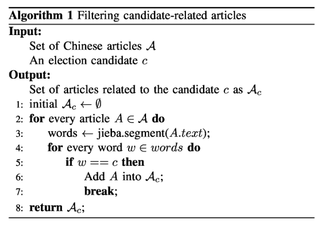
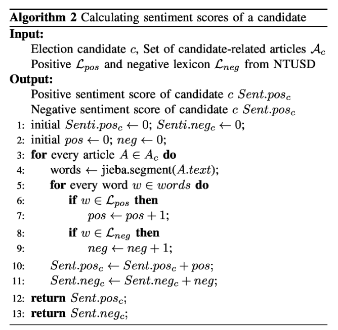

# 在社会论坛上提高人群智慧选举预测的准确性

@songxn

* 应用
  - 选举预测
* 数据
  - 社交媒体
* 方法
  - 文本情感分析

## 摘要

近年来，随着在线社会服务的快速发展，人们能够发表并在互联网上分享他们的日常生活以及公共问题的意见，活动和感受。通过在线社会服务中越来越多的数据，研究人员探索了解人类如何从数据中展示其政治倾向的方法。在本文中，我们通过利用社交媒体中众人智慧的力量，专注于提高选举预测的准确性。除了以前提出的方法，我们进行中文情绪分析，并在社交网络中使用同等评级记录来建立更好的预测模型。为了验证我们的提案，我们通过2014年台湾地方选举来验证我们的方法。在过去三个月的竞选活动中，我们使用从台湾最大的论坛收集的数据。从结果来看，我们的提案在预测选举的最终投票获胜者以及最终投票份额方面优于以往的方法。

## 主要内容

### 1、贡献

1. a volume-based approach by Tumasjan  
   基于量的方法。基于数量的方法表明，包含候选人身份的推文数量可能意味着选举结果中的实际投票份额。
2. a sentiment-based methodology by O'Connor et al  
   基于情感的方法。基于情感的方法使用情感字典来确定每个推文的感情极性，并计算每个候选人的情绪分数作为民意调查的指标。

**以上两种方法的缺陷：**

推文只考虑文本主体，因此仅考虑了发布的作者的态度；收集推文期间，用户可以在期间发布多篇文章，但他们只能在选举中投票一次。

**本文改进：**

1. 我们分析社交网站之间的点对点评级行为。我们根据相关文章的评级记录量化候选人的公众接受度。
2. 我们对选举预测的不同指标进行时间分析。从结果来看，我们发现公众接受分数对于监督公众意见是有益的。
3. 结合公众接受分数，情绪分数和数量，我们开发预测模型来预测选举结果。从评估来看，我们的混合方法优于以前的方法。

### 2、模型构建

利用社交网站中评论者和作者的力量。我们使用点对点评级机制作为量化公众接受候选人的另一个指标。我们还结合了三个指标，包括点对点评级，情绪评分和候选人提及量，以构建一个预测选举结果的新模型。

#### 数据：（Twitter）

为了研究每篇文章的语义，初步工作是将句子分成一系列单词。然而，由于中国人没有英语或其他西方语言的空白分隔符，为了研究中文文章的语义，第一步是将句子分成单词。在本文中，我们使用jieba1，一个开源的中文分词工具，将每篇文章的句子分成单词。

由于在线用户的语料库可能与正式着作不同，我们通过以下步骤迭代地构建一个1000字的常用Web词典：

1. 我们通过jieba对用户生成的内容进行分段，并检索每篇文章的中文单词列表。
2. 我们从分割结果中删除停用词并计算每个单词的频率。
3. 我们选择前2,000个经常分段的单词，并根据语义手动检查单词是否被良好分割。、

通过将我们的字典与默认字典相结合，我们再次使用jieba词典来执行分割任务，以便从句子中获得更准确的分割结果。

**量分析：（指数1）**

候选人的数量指标是指提及该候选人的文章数量。属于特定候选者的文章如算法1中所述被识别。我们统计包含候选人姓名的文章。算法1如下：

**情绪分数：（指数2）**

为了调查每篇文章的情绪，我们选择了国立台湾大学开发的主要情感词典NTUSD作为情感语料库。  
我们根据正面和负面情绪词的频率计算每个候选人的情绪分数，如算法2：

**公众接受分数：（指数3）**

公众接受分数从每篇文章的评级记录中计算。对于每个候选人，我们将候选相关文章p的正面和负面评级的数量总结为pos.ratingp和neg.ratingp。我们得出候选人c的公众接受度得分如下：

$$ PA_c = \sum_{p \in c} \text{pos.rating}_p - \text{neg.rating}_p $$

**混合选举预测计算方法：**

我们将量，情绪分数，公众接受度分数以及每两个因素之间的所有相互作用纳入我们的预测模型。因此，候选p的预测投票份额（VS）可表示如下：

$$ VS_p = (\text{Volumne}_p + \text{Sentiment}_p + \text{Public.Acceptance}_p)^2 $$
