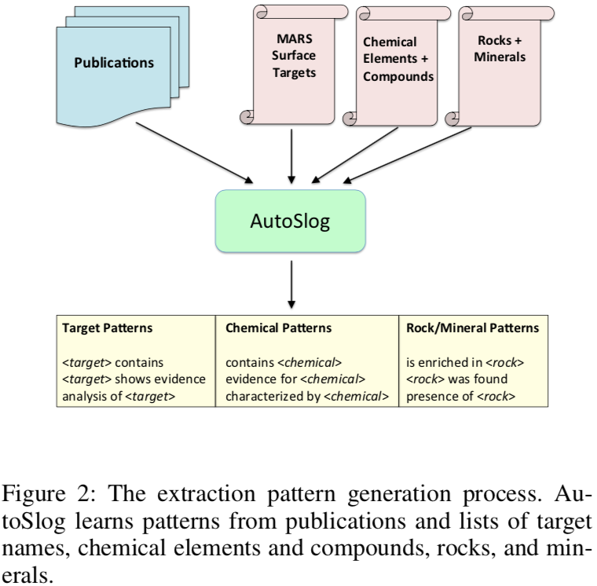

# 从行星科学文献中提取信息建立火星目标百科全书

* 应用
  - 从文献中提取目标信息
* 数据
  - 行星科学出版物
  - ChemCam 科学小组手动编写的火星目标列表
* 方法
  - Tika
  - Sundance
  - AutoSlog

## 摘要

跟进新发现是任何科学领域的挑战。在行星科学中，火星表面的新观测目标每天都被识别和命名，频繁地会有新的出版物发布新的发现和结论，为这些目标提供了频繁的更新。我们正在构建一个系统，该系统使用信息提取和检索方法挖掘稳定增长的关于火星表面目标的行星科学出版物，并自动构建关于每个目标的已知内容的简明摘要。火星目标百科全书（Mars Target Encyclopedia, MTE）将提供一个中心化的、不断更新的资源，供行星科学家和感兴趣的公众使用。我们描述了我们如何使用 Tika，Sundance 和 AutoSlog 来提取和总结信息、该领域相关的一些挑战，以及我们发展这个系统的计划。

## 工具

* [Apache Tika](https://github.com/apache/tika) 是一个用于从多种格式文件中提取元数据与结构化文本的工具。本文用 Tika 从文献 PDF 中提取文字内容；
* Sundance 是 the University of Utah 开发的信息抽取引擎，没直接使用；
* AutoSlog 是在 Sundance 之上开发的，用于在弱监督下自动学习并产生句子模式。

## 方法

Sundance 的字典和数据可以进行定制，根据领域特点本文做的定制包括：

1. 列出不一定表示句子结尾的词语缩写，如 Mt.，wt.；
2. 领域相关的名词、术语及缩写。

根据 ChemCam 的目标、化学元素、矿物质的名词列表使用 AutoSlog 抽取如图所示的句式

然后手动合并到一起，就是一个目标的百科条目了。

## 难点与办法

1. 火星目标通常用地球上已存在的位置、人名，或其它已有名词命名，难以搜索。好在有 ChemCam 维护的名词列表；
2. 但这列表还可以扩充，下一步作者打算用 Basilisk semantic lexicon bootstrapping algorithm 对这初始列表进行扩充；
3. 准确度。至少在 MTE 应用里信息是宁缺毋滥的，这需要人工审核产生的条目；
4. 一致性。不同时期甚至同一时间的文章的论断可能相左，而且可能一般人看不出来但对具有领域知识的人来说很明显，这需要专家审核；
5. 共指。不同文章甚至同一文章里可能对同一个东西有不同的指代，暂时没办法解决；
6. 在对观测结果进行解释时，论断未尽是确凿的，有时只能是推测。目前已有一些方法去检测这种猜测语句，但具体文章没说。
