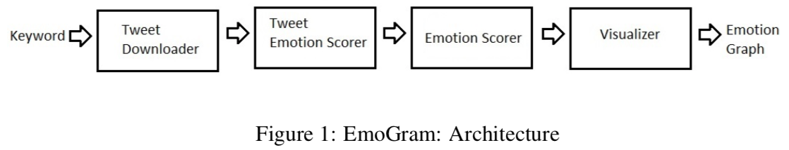
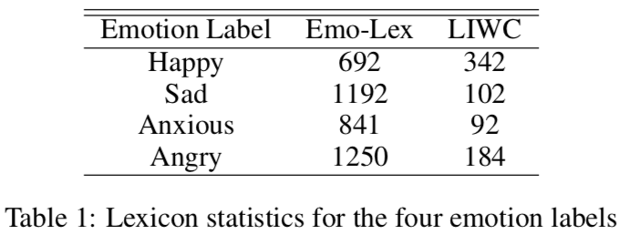
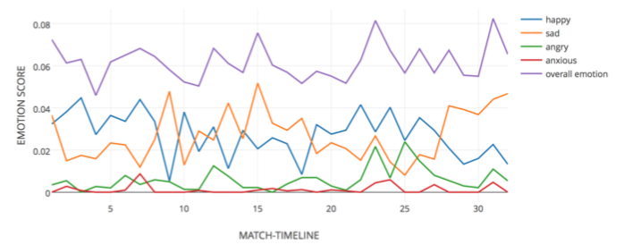
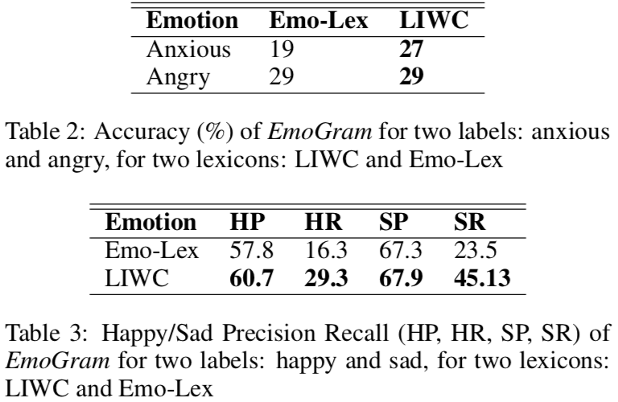
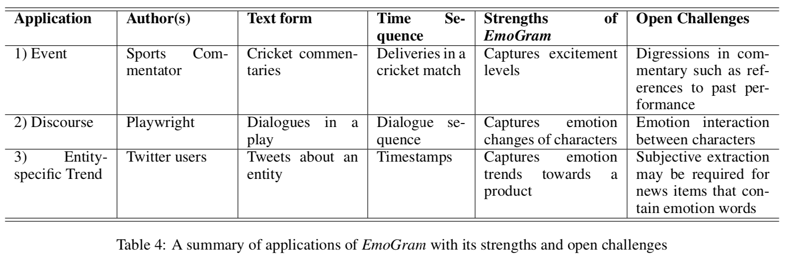

# EmoGram：基于时间序列的开源情感跟踪器及其创新应用

* 应用
  - 情绪分析
* 数据
  - Twitter
  - 情绪词典
* 方法

## 摘要

在本文中，我们提出了一个开源情绪跟踪器及其创新应用。我们的跟踪器 EmoGram 跟踪一系列文本单元的情绪变化，通用于文本单元（推文、讲话中的句子等）与时间序列（推文的时间戳、讲话的文本性质等）。通过以下应用我们演示了系统的实用性：板球比赛实况、戏剧的对白，以及推特上 2015 年印度 Maggi（一款方便面）事件的争论。这些应用都可以使用同一个系统，这就是 EmoGram 的优点。

### EmoGram 的架构



按论文中的地址并没找到代码：[https://github.com/adityajo/emogram ](https://github.com/adityajo/emogram)

### Downloader

使用 [Twitter4J API](http://www.twitter4j.org) 获取 Twitter 的实时数据。按论文内容看，这 API 可按关键词查用户或查主题。

但该域名已失效。

### Tweet Emotion Scorer.

EmoGram 使用了 Emo-Lex 和 LIWC 两个词典，其中包含四个情绪标签：(Happy, Sad, Anxious, Angry)。以下是相应词语的数量：




Tweet 中看到以下词就加上标记：

1. 否定词，如 not；
2. 含否定意味的连词，如 but；
3. 抑制词，如 stop。


根据 Tweet 标记与词典中各情绪标签下词语出现的数量进行计分，算法如下：

```
情绪分数 = Tweet 带标记 ? {
  Angry   : 0,
  Anxious : 0,
  Happy   : Sad 词数,
  Sad     : Happy 词数,
} : {
  Angry   : Angry 词数,
  Anxious : Anxious 词数,
  Happy   : Happy 词数,
  Sad     : Sad 词数,
}
```

### Emotion Scorer

统计一定时间窗口内所有 Tweets 在各个情绪标签上的分数的平均分数作为该用户或主题的情绪分析结果。

### Visualizer

按时间作出各类情绪分数的线图。比如这是三个应用中板球比赛的图：



## EmoGram 对单条 Tweet 的分类能力



数据是以四个情绪标签作为 hashtag 从 API 搜来，即分别用 #angry, #anxious, #happy, 和 #sad 搜索 Twitter 数据。

## EmoGram 的三个应用


