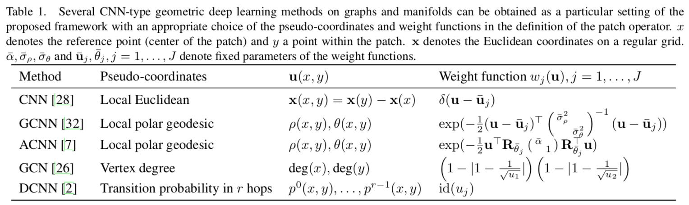
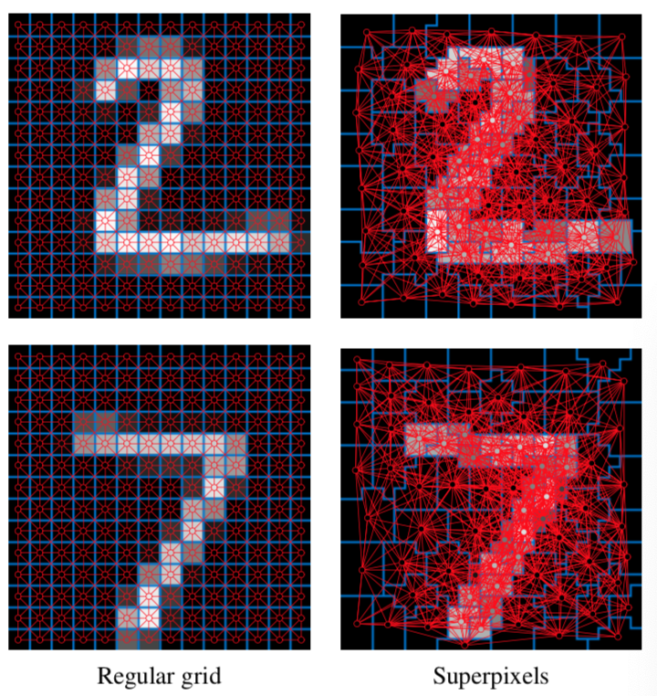
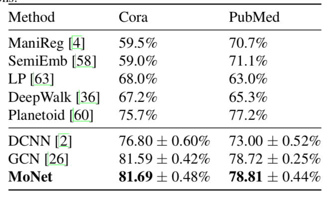
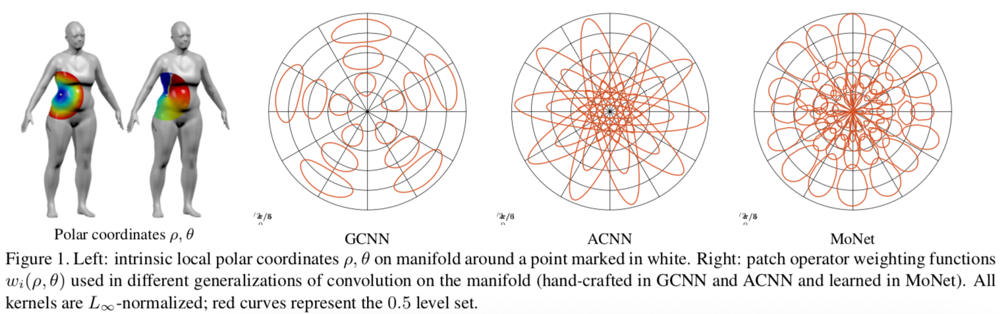

# 使用混合模型的卷积神经网络做图与流形的几何深度学习

## 模型

$$D_j(x)f = \sum\limits_{y \in N(x)} w_j(u(x, y))f(y), j=1, \cdots, J$$

$$(f * g)(x) = \sum\limits_{j=1}^{J} g_jD_j(x)f$$

* 其中 u(x, y) 是相对位置/伪坐标，这个设定使得方法适用于流形
* w 将其映射到一个权重上，这样可以在不同位置共享参数

便于理解，可以认为是定义了如下形式的卷积运算：
$$f * g = g (Wu) f$$

不少已有模型都可看作这个框架的特例

u(x, y) in CNN:

| (-1, -1) | (0, -1) | (1, -1) |
|----------|---------|---------|
| (-1, 0)  | x       | (1, 0)  |
| (-1, 1)  | (0, 1)  | (1, 1)  |

GCN:
$$f * g = \theta (I_n + D^{-\frac{1}{2}}AD^{-\frac{1}{2}})f$$

DCNN:
$$H^{(k)} = f(W^{(k)} \odot (D^{-1}A)^k X$$

论文中使用的可学习的权重函数： a Gauusian Mixture Model (GMM)
$$w_j(u) = \exp (-\frac{1}{2} (u-\mu_j)^T \Sigma_j^{-1} (u - mu_j))$$
其中 $Sigma_j$ 是 d x d 的协方差矩阵且限制为对角的（也就是假设各分量独立），$mu_j$ 是 d 维的均值向量。这样共 2dj 个参数需要学习。

## 实验

### 图片分类

一是使用 LeNet，二是将图片转为图使用 CheNet 和 MoNet

LeNet 最好，MoNet 稍差。

### 图链接预测

### 流形上的学习

