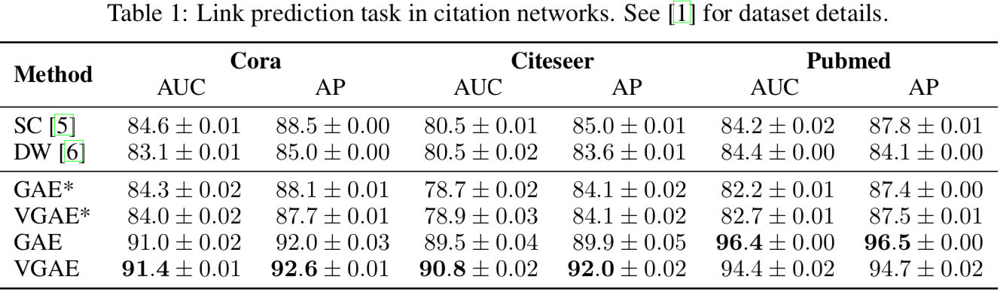
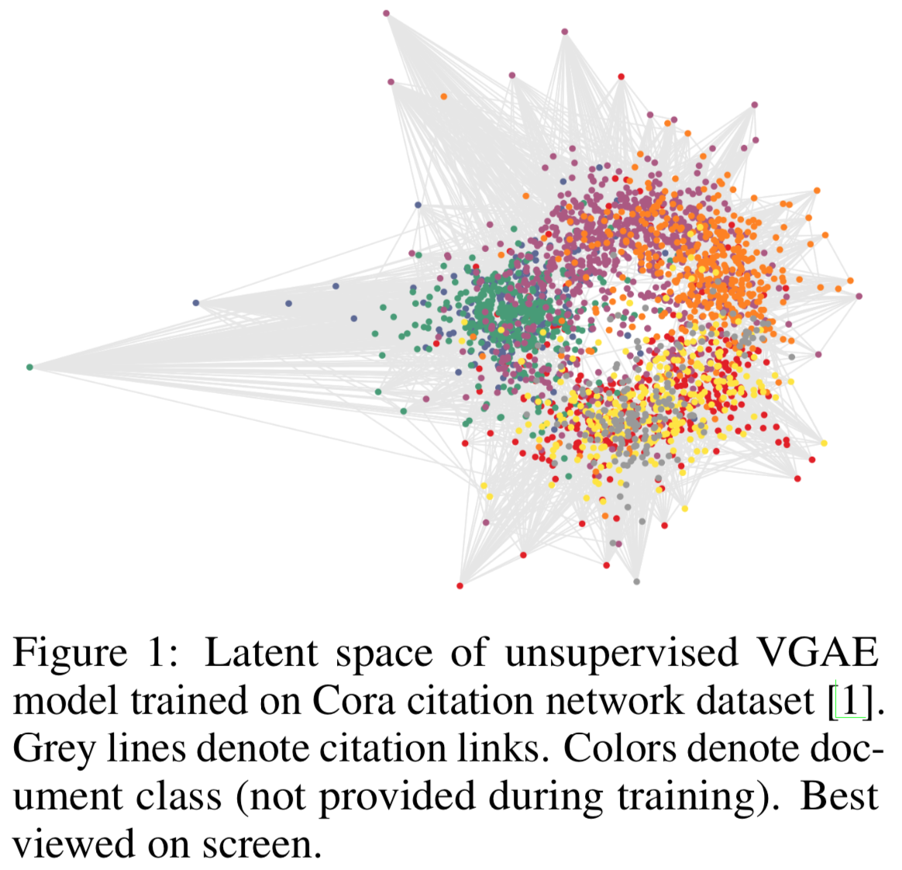

# 图变分自编码器

*图变分自编码器（Variational Graph Auto-Encoder, VGAE）* 是图版本的[变分自编码器（Variational Auto-Encoder, VAE）](/wiki/probabilistic-density-estimation.html)：

* 推断网络：视特征矩阵 X 和邻接矩阵 A（但对角元为 1）为可观测变量，每个节点的隐变量 Z 在条件 X, A 下服从正态分布，其参数 $\mu$ 和 $\sigma$ 通过两个共享第一层的两层 GCN(X, A) 得到。
* 生成网络：$p(A_{ij} = 1 | z_i, z_j) = \sigma(z_i^Tz_j)$，其中 $\sigma(\cdot)$ 是 sigmoid 函数
* Z 的先验分布取为标准正态分布

同时提出了一个确定性的模型 *图自编码器（Graph Auto-Encoder, GAE）* ：Z = GCN(X, A), $A = \sigma(ZZ^T)$

实验结果表明 VGAE 和 GAE 能较好地结合节点特征预测无向图上的链接：

其中 SC 指 Spectral Clustering，DW 指 DeepWalk，这两者都没用到节点特征 X。  
所以对应地有 GAE* 和 VGAE* 两个方法，将 X 置为单位矩阵以去掉特征。

但从在 Cora 数据集上学到的隐状态 Z 来看，生成网络采用内积和先验分布取标签正态分布这两点不太搭配，因为内积使得点远离原点，不服从正态分布。

> 真大佬啊，论文正文只有两页，打出来就一张纸。
