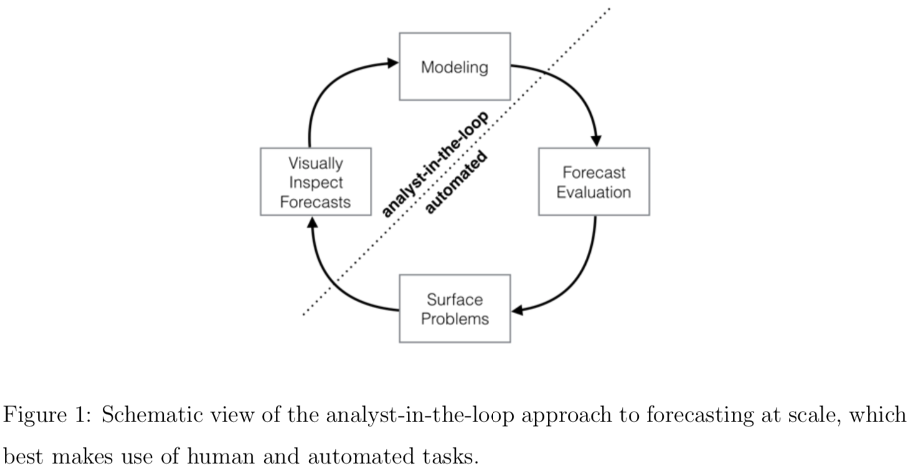

# 大规模预测

* 应用
  - 商业时序数据预测
* 数据
  - 任意时序数据
* 方法
  - 时间序列分解模型
  - MCMC 建模

## 摘要

预测是一项常见的数据科学任务，可帮助组织进行容量规划、目标设定和异常检测。尽管它具有重要性，但是在产生可靠和高质量的预测方面存在严重的挑战 —— 特别是时间序列多种多样，具有时间序列建模专业知识的分析员又相对较少时。为了应对这些挑战，我们描述了一种实用的“大规模”预测方法，将可配置模型与性能分析闭环结合起来。我们提出了一个带有可解释参数的模块化回归模型，分析员可以通过对时间序列的领域知识直观地调整这些参数。我们描述了性能分析，以比较和评估预测程序，并自动标记人工审查和调整的预测。帮助分析员最有效地利用其专业知识的工具可实现对业务时间序列的可靠、实用的预测。

## 概要

先知模型是 Facebook 开源的用于商业时序数据的预测框架，特点在于易用和适应性广。项目开源在 [Github](https://github.com/facebook/prophet)，并搭配有此篇论文。

**商业预测中两个普遍的问题：**

1. 全自动模型通常难以调参，且过于复杂导致不兼容一些有用的假设；
2. 分析者通常由领域专家担任，他们一般缺少时序数据预测知识方面的训练。

**“大规模”的三个含义：**

1. 能让没接受过时序数据预测相关训练的人也可以上手；
2. 适应多种多样的预测问题；
3. 自动完成模型评估与对比，分析员只需要通过模型提供的反馈进行调整。

**商业时序数据的特征：**

* 周期性影响明显
* 趋势可能改变
* 存在异常点
* 节假日的影响不可忽视

### 模型

时间序列 y(t) 被分解为非周期变化趋势、周期性变化趋势、节假日变化和剩余误差项
$$ y(t) = g(t) + s(t) + h(t) + \epsilon_t $$

#### 非周期变化趋势 g(t)

**带饱和容量的逻辑回归**

$$ g(t) = \frac{C(t)}{1 + \exp{(-k(t) (t - m(t))}} $$

其中 C(t) 为饱和容量，是该模型预测值的上限，k(t) 是增长率，m(t) 是曲线的中间点。

**线性回归**

$$ g(t) = k(t) t + m(t) $$

**突变点**

不论趋势是线性还是非线性，都可能存在改变趋势的突变点。
突变点可以由分析员根据已知的事件时间进行设置。默认情况下，模型假设突变点之间距离满足 Poisson 分布，突变后趋势变化量满足 Laplace 分布。

#### 周期性变化趋势 s(t)

时间序列的周期性变化被模拟为 Fourier 级数
$$ s(t) = \sum^N_{n=1}( a_n\cos(\frac{2\pi nt}P) + b_n\sin(\frac{2\pi nt}P) ) $$

其中 $a_n$, $b_n$ 为待估计参数。  
P 为周期，比较以年为周期时 P=365.25 并建议 N = 10；以星期为周期时 P = 7 并建议 N = 3。

#### 节假日变化 h(t)

除了法定节假日也可以自定义节假日，每个节假日的影响力视为独立参数的满足正态分布的变量。

#### 剩余误差项

$$ \epsilon_t \sim N(0, \delta) $$
