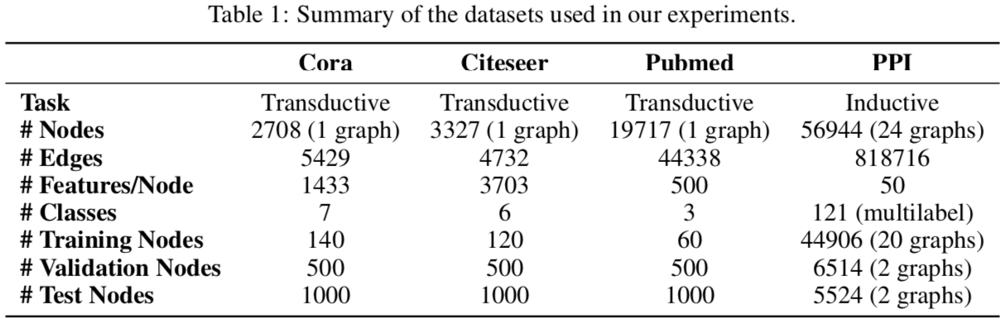

# 图注意力网络

GAT 不像之前的网络如 GCN 般在卷积层里固定了每条边的权重（作为卷积核的参数），而是引入自注意力机制用节点的表示计算节点之间的相关性作为边的权重。在尤其是 Inductive Learning 的任务上远超已有方法。

## 模型

对原文公式作了些变换：

* 打分函数：$s_{ij} = \sigma (v^T [h_i; h_j])$，其中 $\sigma$ 作者用的 LeakyReLU
* 权重：$e_{ij} = \text{softmax}(s_{ij})$
* 当前层表示的加权和为下一层的表示（用了 K 个头）：$h_i = W \oplus_{k=1}^K \sigma (\sum\limits_{j \in N_i} e_{ij;k}^T h_j)$

另外，为了保持结构信息，只有相邻的节点之间会计算权重，换言之不相邻的节点之间分数为 0。这样就能还原邻接矩阵。

单头 GAT 层的时间复杂度与 GCN 一样是 O(|V|FF' + |E|F')，其中 |V| 和 |E| 是节点与边的数量，F 和 F' 是输入和输出的特征维度。

## 实验效果

实验用的数据集

### Transductive Learning

对 Cora、Citeseer 和 Pubmed 做节点分类，效果也算好（SotA），但不突出。

### Inductive Learning

使用 PPI 数据集，难点在于测试数据完全没在训练数据中出现过。GAT 体现了优越性。

* GraphSAGE* 是 GraphSAGE 架构下的最好结果，由三层 GraphSAGE-LSTM 组成。
* Const-GAT 设置各边权重相等，按[作者说法](https://github.com/PetarV-/GAT/issues/9)是为了分别评估注意力机制和其它设计对结果的影响，这样看来最有效的地方在于对多头结果的变换上？
