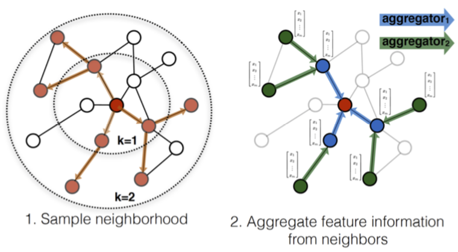
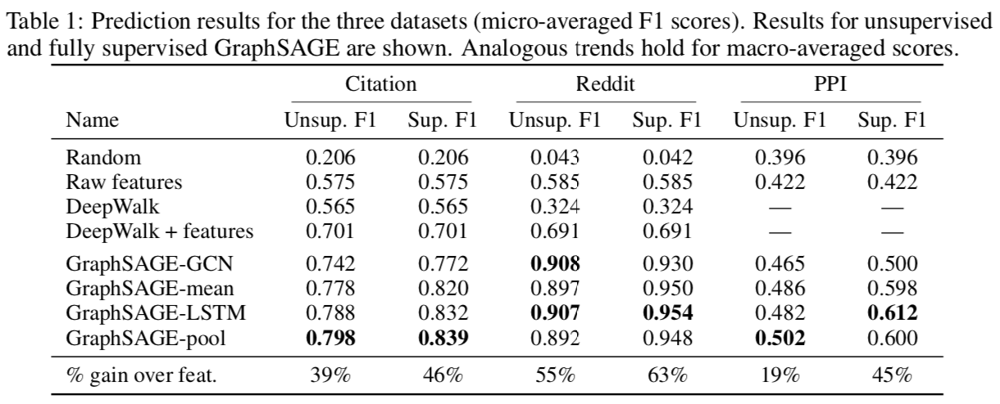
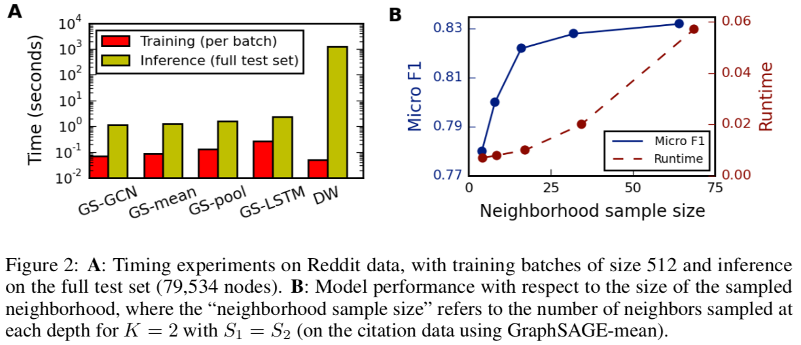

# 大型动态图中的归纳式表示学习

通过采样加速了大规模图中的应用，归纳式的学习使得模型不依赖全部节点的信息，从而适应工业中常见的动态图。

## 采样

GraphSAGE: Graph SAmple and aggreGatE

Best Practice: $K=2, S_1 \cdot S_2 \le 500$

## 模型

$$h_v^{(k)} = \text{NORM}(\sigma (W^{(k)} \cdot (h_v^{(k-1)} \oplus f_k(\\{ h_u^{(k-1)}, \forall u \in S_{N(v)} \\}))))$$

* NORM：$h_v^{(k)} = h_v^{(k)} / \\|h_v^{(k)}\\|_2$

* Aggregator: $f_k$
  * Mean：无法训练
  * GCN $$h_v^{(k)} = \sigma(W \cdot \text{MEAN}(\\{ h_v^{(k-1)} \\} \cup \\{ h_u^{(k-1)}, \forall u \in N(v) \\}))$$
  * LSTM：效果好，性能差，且不具对称性
  * Pooling：效果好 $$f_k = \text{pooling}(\\{\sigma(W_p \cdot h_u^{(k)} + b), \forall u \in N(v) \\})$$

* 损失函数（用于无监督任务） $$J_G(z_u) = -\log(\sigma(z_u^T z_v)) - Q \cdot E_{v_n \sim P_n(v)} \log(\sigma(-z_u^T z_{v_n}))$$
  * 使相近节点有相似表示，不相近的节点差异大
  * $z_u$ 是节点局部特征的表示（比如节点的度以及文档摘要的词向量），不是隐状态也不一定是节点单独的表示
  * $P_n$ 是逆样

## 实验

* Citation: 在引用数据之上预测论文的分类
* Reddit：预测帖子所属的版块
* PPI (Protein-Protein Interaction): 在不同人体组织的 PPI 图中分类 Protein Roles

LSTM 与 Pooling 效果都比较好

LSTM 比较慢；两层采样每一层在 20 多时效果最好

## PinSAGE
