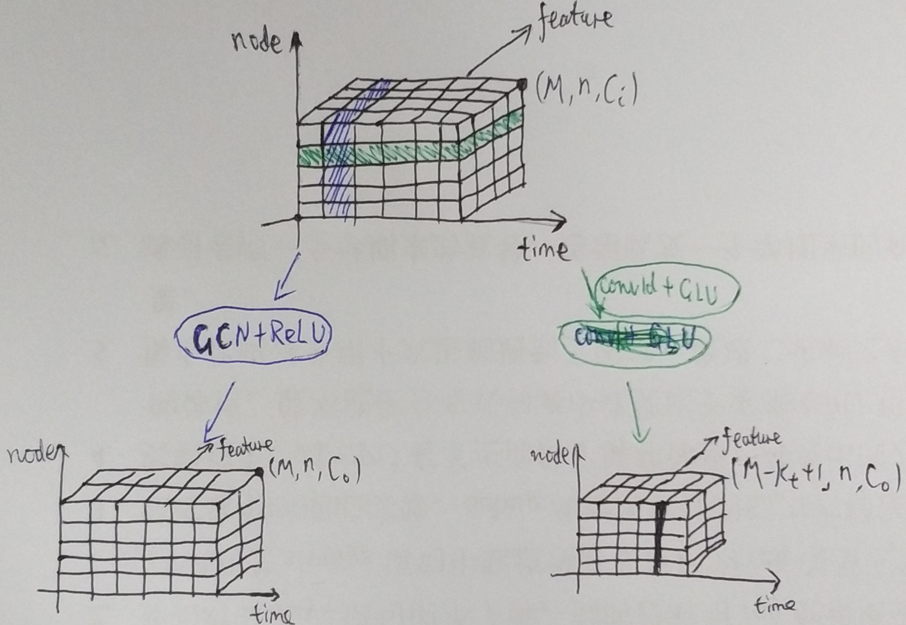
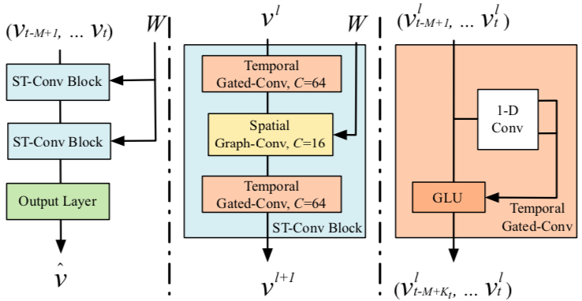
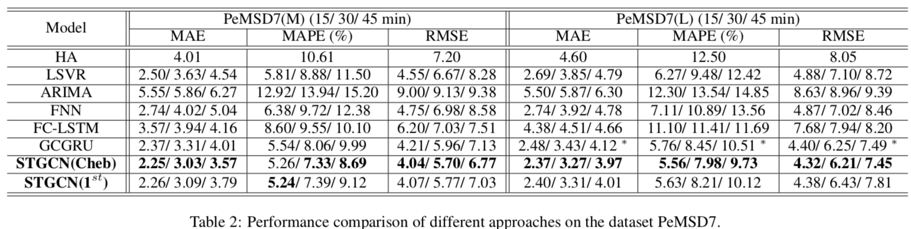
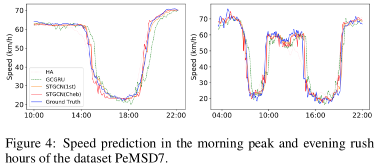
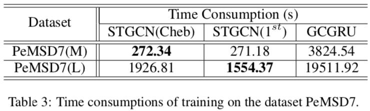

# 时空图卷积网络：用于交通预测的深度学习框架

## 交通预测

图结构的交通时序数据：对时间 t 有图 $G_t = (V_t, E, W)$，其中 $V_t$ 是点集，在不同时刻有不同的值，E 是边集，W 是权重矩阵。

交通预测是指在已知之前 M 个交通观测的情况下，预测未来 H 个时间步后最可能的交通指标。

即已知 W，由 $v = (v_{t-M+1}, \cdots, v_t)$ 估计 $v_{t+H}$。

## 已有方法

在本文之前，对交通流的中长期（间隔超过 30 分钟）预测方法：

* 动态建模。如微分方程
  * 计算量大
  * 严重依赖于专家建模，不恰当的假设与简化都会影响模型效果
* 数据驱动
  * 经典统计。如 ARIMA
    * 忽略了时空上的关联
  * 机器学习

由于交通流高度的非线性与复杂性，传统方法难以满足中长期预测任务的需求，它们通常也忽略了空间上的关联性。

## 时空图卷积网络（Spatio-Temporal Graph Convolutional Networks, STGCN）

### 空间图卷积与门控时序卷积

* 空间图卷积
  * 就是逐时间帧做图卷积
  * 作者分别用了 ChebNet 及其一阶近似（也就是 GCN）做图卷积
  * 激活层 ReLU(x) = max(0, x)

* 门控时序卷积
  * 就是逐节点做一维卷积
  * 每个通道的卷积核大小为 $K_t \times 2C_o$，无 padding，因此变换后时间帧会减少
  * 激活层 GLU([x, y]) = $x \otimes \sigma(y)$

### 整体架构

* ST-Conv Block 由两个门控时序卷积夹一个空间图卷积构成
* 每个 ST-Conv Block 后都有一层 Layer Normalization $$y = \frac{x - E[x]}{\sqrt{D[x] + \epsilon}} \cdot \gamma + \beta$$
* Output Layer 是一个全连接层，输出目标时刻的隐状态
* Temporal Gated-Conv 中有一条直连边，原文提到用了 residual connection，但卷积后形状已经变了，按理应该没法直连

## 实验设置

### 数据

* 用了两个真实的数据集：
  1. 北京东四环 BJER4 
  2. 加州公路系统 PeMSD7
     * 从中随机抽了大、小两个规模的子集，名为 PeMSD7(L) 和 PeMSD7(M)
* 仅使用工作日的数据
* 用观测站之间的距离构造权重矩阵：距离越近，两者边的权重越大（低于一定值则设为 0，认为不相连）

### 误差度量

* Mean Absolute Errors, MAE
* Mean Absolute Percentage Errors, MAPE
* Root Mean Squared Errors, RMSE

### 基线

* HA：历史均值
* LSVR：线性回归
* ARIMA：时间序列模型
* FNN：前向神经网络
* FC-LSTM：全连接的 LSTM
* GCGRU：看名字应是时间轴上使用了 GRU，其它方面与 STGCN 类似

### 模型设置

* STGCN(Cheb)：图卷积使用 3 阶 ChebNet 的 STGCN
* STGCN(1st)：图卷积使用 GCN 的 STGCN

## 实验结果

### 误差对比

BJER4 的结果类似，这里就不放了。

* GCGRU 的部分结果带 *，是因为训练时内存占用过高（RNN 的问题），Batch Size 减小了一半，与其它实验设置有所不同。
* STGCN 充分利用了空间信息
  * 这使得 STGCN 相比通常利用不上空间信息的传统方法（比如表现最差的 ARIMA）表现要更好
  * 另一方面，PeMSD7 的传感器网络比起 BJER4 要更复杂，空间信息更多，因此 STGCN 的效果在 PeMSD7 上比 BJER4 更显著

### 高峰预测

部分方法对早晚高峰的预测情况

GCGRU 因为基于 RNN（GRU），历史数据影响较大，对于预测任务有更高的时滞。

### 速度对比

* RNN无法并行，比较耗时，这也是作者在时间轴上使用 CNN 的主要原因
* GCN 在大数据集时比 ChebNet 更快，同时效果相当
