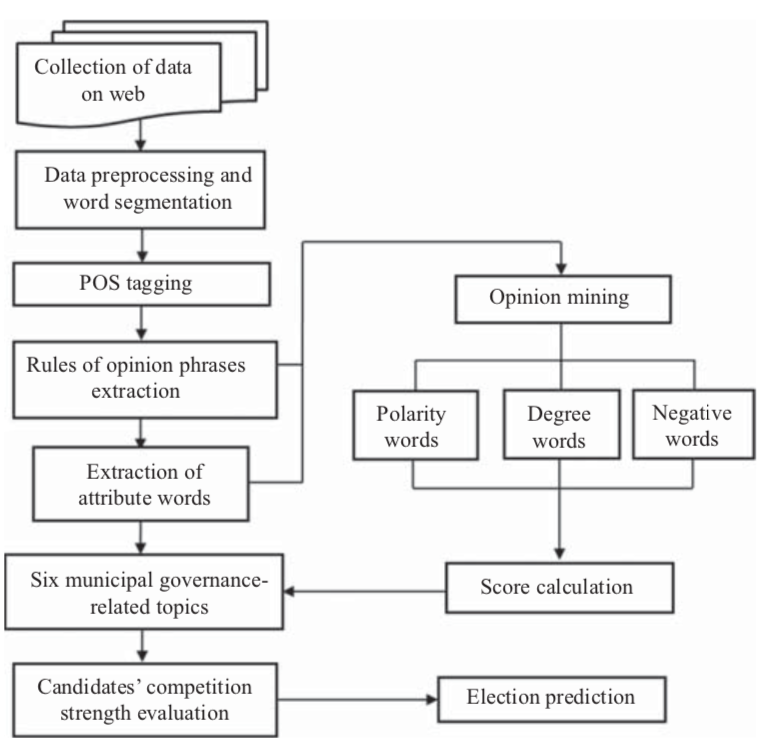
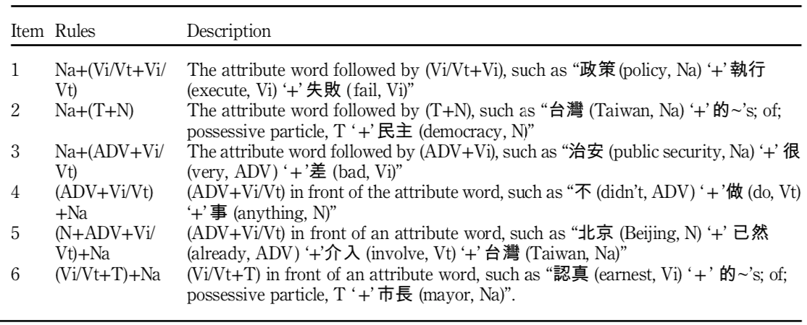

# 挖掘网络数据预测台湾市长选举

@liangyh

* 应用
  - 选举预测
* 数据
  - 社交媒体
* 方法
  - 意见短语抽取
  - 相关性分析

## 摘要

选举前民调的预测是政治家和选民都关心的问题。2014年举行的台湾九合一选举以令人瞠目结舌的结果收场，显然传统民调效果不佳。作为对这个问题的补救，本文的目的是利用社交媒体上发布的评论来分析民众对台中市市长候选人胡志强和林嘉龙的看法。

## 主要内容

在对收集到的评论进行分词和词性标注之后，作者构建了用于识别与属性词相关联的意见词的意见短语提取规则。接下来，作者将属性词分类为六个与市政治理相关的主题，并计算每个候选者的意见得分。最后，本研究使用对应分析将候选人的意见信息转换为图形化显示，以便于解释选民的意见。之后作者发现，候选人背景和交通基础设施是影响选举预测的两个最关键因素。

具体流程为：在从网络上收集数据后，对语料库进行分词，并使用中央研究院开发的中文知识信息处理(CKIP)组对每个单词的词性(POS)进行标记。之后手动选择属性词，然后将其归类为六个对公众投票意向有影响的市政治理相关主题。接下来，作者建立了用于识别与属性词相关的相应平民意见的意见短语提取规则，并设计了一个评分机制，将每个主题中的评论转换为分数。

以关键词为中心的评论提取规则，其中na代表关键词：

作者提出的六个与市政治理相关的主题为：

* 候选人的背景（CB）
* 交通基础设施（TI）
* 人民生活和公共安全（LP）
* 社会福利政策（SW）
* 艺术和文化（AC）
* 和当地经济和工业建筑（LC）

分数计算公式为：
$$ S_{ik} = \sum P(t_{ijk}) \times D(t_{ijk}) \times N(t_{ijk}) \times F(t_{ijk}) $$
P代表所占比例，D为1～6代表情感程度，N为正负1代表词性，F代表属性次 $ t_{ijk} $的数量。

### 创新点

针对推特数据的筛选规则进行的详细的设定，提出的意见短语抽取规则，并与选举预测流程结合起来。
