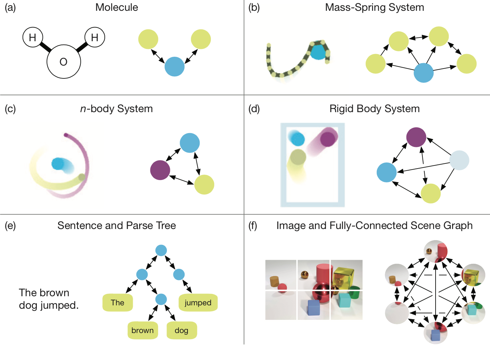
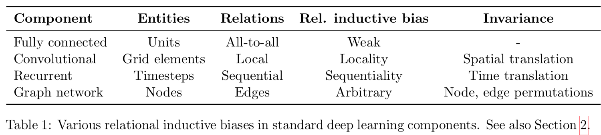
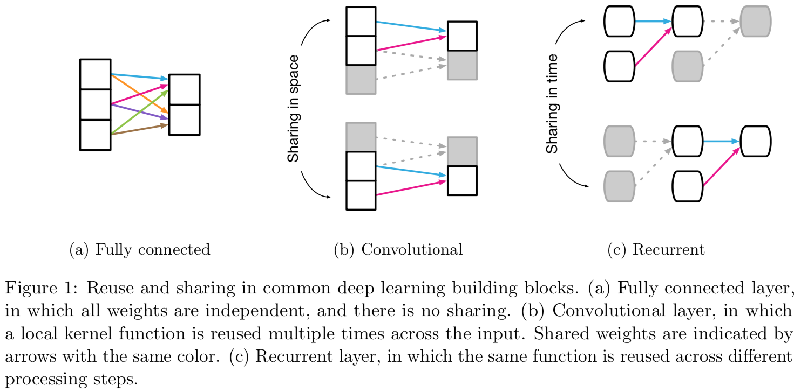
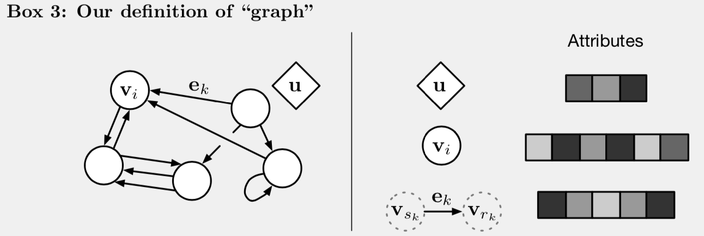
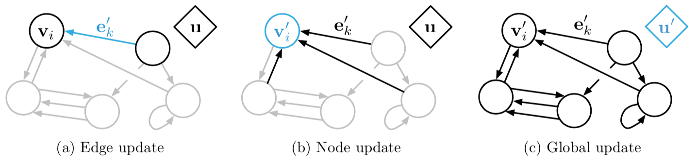
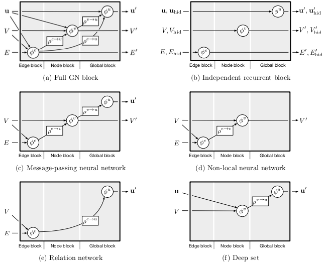
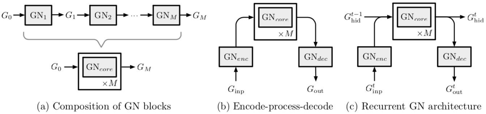

# 关系归纳偏置、深度学习与图网络

@luoy

## 摘要

人工智能最近经历了一场复兴，在视觉、语言、控制和决策等关键领域取得了重大进展。一部分原因是廉价的数据和计算资源符合了深度学习的天然优势。然而，在不同压力下发展起来的人类智力，其许多决定性特征对于目前的方法而言仍是触不可及的。特别是，超越经验的泛化能力——人类智力从幼年开始发展的标志——仍然是现代人工智能面临的巨大挑战。

本论文包含部分新研究、部分回顾和部分统一结论。我们认为组合泛化是人工智能实现与人类相似能力的首要任务，而结构化表示和计算是实现这一目标的关键。正如生物学把自然与人工培育相结合，我们摒弃“手动设计特征”与“端到端”学习二选一的错误选择，而是倡导一种利用它们互补优势的方法。我们探索在深度学习架构中使用关系归纳偏置如何有助于学习实体、关系以及构成它们的规则。我们为具有强烈关系归纳偏置的 AI 工具包提出了一个新的构造块——图网络（Graph Network），它泛化并扩展了各种对图进行操作的神经网络方法，并为操作结构化知识和产生结构化行为提供了直接的界面。我们讨论图网络如何支持关系推理和组合泛化，为更复杂的、可解释的和灵活的推理模式奠定基础。

## 图的表示

* 实体：有其属性
* 关系：有其属性，并受全局环境影响
* 规则：实体与关系到实体与关系的映射

### 关系归纳偏置 Relational Inductive Bias

**关系推理 Relational Reasoning**

关系推理就是使用规则对实体与关系的结构表示作变换

**归纳偏置 Inductive Bias**

归纳偏置指学习算法无关数据的对解法的偏好，如算法架构、正则项、Bayesian 模型中的先验分布。  
归纳偏置通常以模型灵活性换样本完整性与搜索性能，体现了算法对于生成过程与搜索空间的假设。

**关系归纳偏置** 指学习过程中限制实体关系与实体互动的归纳偏置。

深度学习中的关系归纳偏置广泛存在于其架构设计中。
不但层与层的组合方式，全连接层、卷积层等基本部件本身也都带有关系归纳偏置

P.S. 深度学习中的规则通常是权重 w 与偏置 b

### 集合与图的计算

图中可以用关系表示实体间的顺序，但现实有很多顺序无关的问题，通常深度学习在处理此类问题时需要指数级的冗余样本。

### 深度学习中的非关系型归纳偏置

* Activation Non-linearities
* Weight Decay
* Dropout
* Batch and Layer Normalization
* Data Augmentation
* Training Curricula
* Optimization Algorithms

## 图网络

推荐文章

* 早期图神经网络的权威综述  
  Scarselli, F., Gori, M., Tsoi, A. C., Hagenbuchner, M., and Monfardini, G. (2009a). Computational capabilities of graph neural networks. IEEE Transactions on Neural Networks, 20(1):81–102.
* 非欧数据上的深度学习、图神经网络、图卷积网络、谱方法  
  Bronstein, M. M., Bruna, J., LeCun, Y., Szlam, A., and Vandergheynst, P. (2017). Geometric deep learning: going beyond euclidean data. IEEE Signal Processing Magazine, 34(4):18–42.

推荐文章

* 消息传递神经网络（MPNN）。通过图模型中的消息传递归约了多种图神经网络与图卷积网络方法  
  Gilmer, J., Schoenholz, S. S., Riley, P. F., Vinyals, O., and Dahl, G. E. (2017). Neural message passing for quantum chemistry. arXiv preprint arXiv:1704.01212.
* 非局部神经网络（NLNN）。通过类似机器视觉中捕获信号长距依赖的方式归约了多种“自注意力”机制的方法。  
  Wang, X., Girshick, R., Gupta, A., and He, K. (2018c). Non-local neural networks. In Proceedings of the Conference on Computer Vision and Pattern Recognition (CVPR).

### 图网络块（Graph Network block）

**图的定义 G = (u, V, E)**

**GN block 的更新**

GN block 是一个“图到图”的模块。

更新顺序可调整。

| 更新函数 $\phi$                             | 聚合函数 $\rho$                               |
|---------------------------------------------|-----------------------------------------------|
| $ e_k' = \phi^e(e_k, v_{r_k}, v_{s_k}, u) $ | $ \bar{e}_i' = \rho^{e \rightarrow v}(E_i') $ |
| $ v_k' = \phi^v(\bar{e}_i', v_i, u) $       | $ \bar{e}' = \rho^{e \rightarrow u}(E') $     |
| $ u' = \phi^u(\bar{e}', \bar{v}', u) $      | $ \bar{v}' = \rho^{v \rightarrow u}(V') $     |

更新顺序不同时，需要的聚合函数也不同。

**图网络的关系归纳偏置**

1. 可任意表示实体间的关系，包括实体间的交互与隔离；
2. 实体与关系用集合表示，具有排列不变性（Permutation Invariance）；
3. 共享更新函数与聚合函数。

### 图网络架构的设计准则###

**表示的灵活性**

实体的属性、关系的属性以及全局的属性都可表示为张量作为 GN block 的输出对接到 MLP/CNN/RNN 等常用深度学习组件上。

**块内结构可配置**

实体、关系、全局属性皆可裁剪，更新函数、聚合函数可任意配置。

**可组合的多块架构**

## 代码实现

https://github.com/deepmind/graph_nets

## 三个问题

1. 图哪里来？图片和文字如何有效表示为图？
2. 如何自适应地修改图的结构？
3. 更多可解释性的分析与可视化。
