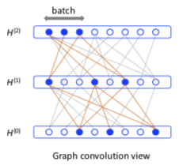

# FastGCN：通过重要性采样快速训练图卷积网络

1. 通过对层采样，加速训练 GCN
2. 通过重要性采样，降低估计的方差
3. 对训练集与测试集的分离更好：训练时，不会用到涉及测试集的边

## 方法

FastGCN 有如下假设：

* 图：一个无限图中的子图
* 节点：一组独立同分布的样本
* 损失函数与卷积层：节点表示函数的积分（期望）

在这种假设下一个 M 层的GCN（l 为损失函数）：

$$H^{(l+1)} = \sigma(\hat A H^{(l)} W^{(l)})$$
$$L = \frac1n \sum\limits_{i=1}^{n} l(H^{(M)}(i, :))$$

可以表示为期望：

$$h^{(l+1)}(v) = \sigma(E_p[\hat A(v, u) h^{(l)}(u) W^{(l)}])$$
$$L = E_p[l(h^{(M)}(v))]$$

于是在除最后一层的每一层均匀采样进行估计：

$$H^{(l+1)}(v, :) = \sigma(\frac{n}{t_l} \sum\limits_{j=1}^{t_l} \hat A(v, u_j^{(l)}) H^{(l)}(u_j^{(l)}, :) W^{(l)})$$
$$L = \frac1{t_M} \sum\limits_{i=1}^{t_M} l(H^{(M)}(u_i^{(M)}, :))$$
$$\triangledown \tilde H^{(l+1)}(v, :) = \frac{n}{t_l} \sum\limits_{j=1}^{t_l} \hat A(v, u_j^{(l)}) \triangledown (H^{(l)}(u^{(l)}_j, :) W^{(l)})$$

其中 $t_l$ 表示第 l 层的样本数，n 为全部节点数。

为了减小方差，引入重要性采样（Importance Sampling）：

$$h^{(l+1)}(v) = \sigma(E_q[\hat A(v, u) h^{(l)}(u) W^{(l)} \cdot \frac{p(u)}{q(u)}])$$

理论上使方差最小的 q 为

$$q^* \propto \sqrt{E_v[\hat A(v, u)^2]} \cdot |h^{(l)}(u) W^{(l)}| \cdot p(u)$$

但其中 $W^{(l)}$ 每次迭代都会变，与 $h^{(l)}$ 的矩阵乘法也比较耗时。

所以作者将其简化为

$$\hat q \propto \sqrt{E_v[\hat A(v, u)^2]} = ||\hat A(:, u) ||^2$$

也就是节点以正比于 $\hat A$ 矩阵中所在列 2 范数的概率被采样，计算简单且这个分布与层无关。

但作者没能证明这个估计的有效性，只能通过实验说明有效。

## 实验

### 首层 Precompute

回顾 GCN 的公式：

$$H^{(l+1)} = \sigma(\hat A H^{(l)} W^{(l)})$$

在输入 $H^{(0)}$ 给定后，整个训练过程中 $\hat A H^{(l)}$ 是个常量，所以这一个矩阵乘法可以省下来。

如图是在 Pubmed 数据集上使用 Precompute 后的结果：准确率（F1）保持，训练时间（秒）明显减少。

其实这算是对 GCN 的改进，只是 FastGCN 都是采样估计，运算少，这部分改进的作用就明显起来了。

### 均匀采样与重要性采样的对比

从上到下依次是 Cora, Pubmed 和 Reddit 数据集。

IS 的结果总是更准一些，作者说是因为这方法的方差确实更小。  
我觉得更直观地看是因为节点以正比于度的概率被采样，与上层节点有关联的概率更高，因此上层节点更能学到东西。

### 与 GraphSAGE 和 GCN 的对比

有个 NA 是因为 Reddit 数据集太大，原始的 GCN 作者没法测，所以上面改了个分批版，等于无采样的 FastGCN

* 准确率表现相近
* 速度方面
  * 三个数据集一个比一个大、稠密，所以 GraphSAGE 要在 Reddit 上才能体现出对 GCN 的优势
  * 在 Pubmed 和 Reddit 数据集上 FastGCN 对 GCN 有数量级的提升（注意时间轴是对数轴）

## 总结

* 对比 GraphSAGE 是在节点的领域中采样，FastGCN 在层上采样。所以就速度来说，GraphSAGE 对 GCN 是“线性”的改进，FastGCN 是数量级的改进。
* FastGCN 有这样一个缺陷：如果图大而稀疏（这才是现实），相邻层的样本很可能没有关联，导致无法学习。
