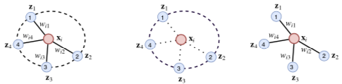
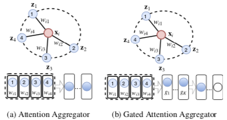
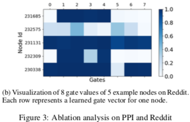
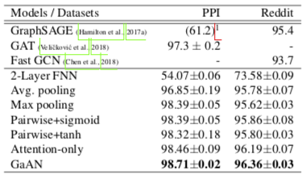
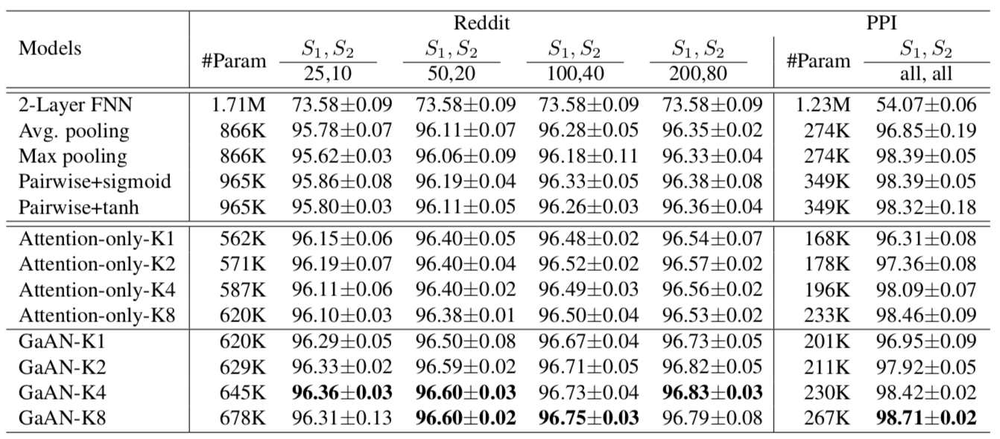
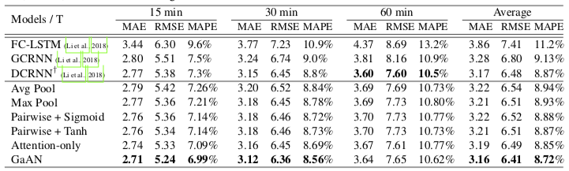

# GaAN: 用于大型图与时空图的门控注意力网络

## 三种类型 Graph Aggregator 的对比

如图依次是 Attention Aggregator、Pooling Aggregator 和 Pairwise Sum Aggregator

* 实线边表示中心节点对邻居节点汇聚来的信息加以不同权重
* 虚线圆表示邻居节点相互之间会影响汇聚出的信息的权重
* Attention Aggregator 是后两者的结合：边对应打分，圆对应 Softmax

## Attention Aggregator 的例子

比如一个使用多头键值注意力的 Attention Aggregator：

* x -> q
* $N_x$ -> K, V （其中 V 的生成用了 LeakyReLU）
* 加权和：$\text{H} = V \text{softmax}(K^T q)$
* 多头组合：$y(x) = F([x, h_1, \cdots, h_k])$（F 代表一个全连接层）

对比同属于 Attention Aggregator 的 [GAT](../2017-graph-attention-networks)：

* GAT 使用普通的注意力而非键值注意力
* GAT 的打分函数是拼接后用全连接层而非点积模型

## Gated Attention Network

GaAN 相对一般 Attention Aggregator 的改进在于给各头加权（Gated）：

* 加权多头：$y(x) = F([x, g_1 h_1, \cdots, g_h h_k])$
* $g(x) = \text{sigmoid}(F_1([x, \max(\\{F_2(z)| z \in N_x\\}), \text{mean}(N_x)]))$

权重 g 因中心节点 x 而异，所以也可以看作一个注意力。  
里面后两部分分别为最大池化和平均池化，所以作者文章中说用到了卷积层。

如图是几个不同节点头权重的可视化

但在 Inductive 的节点分类任务上其实没比别人好多少

细看一下，甚至比不上一些参数量更少的 Attention-Only 模型

## Graph GRU

作者还提出了一个做交通预测的架构：Graph GRU

* 整体是个 GRU 模型，内部计算使用图的 Graph Aggregator（可以不是 GaAN）
* 更新门 U 和重置门 R 都是 (X 聚合 X) + (X 聚合 H) 再激活的结果，其中 X 是该时间各节点的输入，H 是该时间各节点的隐状态

对比的另外三个方法没看原文，看这篇文章里应该与 Graph GRU 的原理相似，都是整体一个 RNN，内部再套其它模型：

1. FC-LSTM：LSTM 里套 FC
2. GCRNN：LSTM 里套 ChebNet（GCN 的 Spectal-based 原型）
3. DCRNN：GRU 里套 DGC（把边归一化为转移概率的 GCN）
4. Graph GRU：GRU 里套本文总结的那些 Graph Aggregator

使用洛杉矶高速路网的数据进行测试，误差表现平平：

