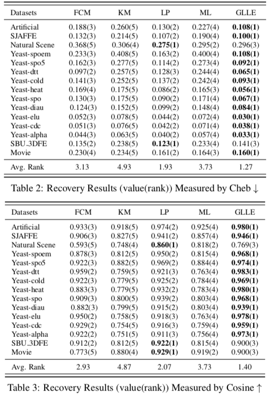

# 用于标签分布学习的标签强化

## 背景

通常的分类问题中，训练数据的标签是一个标签集合，称逻辑标签（Logic Labels）。
但实际上一个数据应该被标记为什么标签应该是一个更软性的概率，在各标签的概率向量称该数据的标签分布（Label Distribution）。

基于标签分布的分类训练效果会比基于逻辑标签更好，但标签分布的获取成本更高。
因此有了标签强化（Label Enhancement），研究将实际数据集中的逻辑标签修复为标签分布。

## 已有的标签强化方法

* 基于 fuzzy clustering (FCM)  
有点像 k-means，迭代计算出 p 个 cluster 中心，计算每个节点与各 cluster 的相似分，按标签平均
* 基于 kernel method (KM)
* 基于 label propagation (LP)  
节点两两之间用特征算相似度 $e^{-\frac{\\|x_i - x_j\\|^2}{2}}$ 构造出矩阵 A（但对角元素为 0），以为权重传播标签
* 基于 manifold learning (ML)  
构造 knn 图，对每个中心节点，设其特征为周围节点特征的归一化的线性组合，则其标签分布为周围节点标签分布的相同组合

## 本文提出的 Graph Laplacian Label Enhancement (GLLE)

设特征为 X，逻辑标签为 L，有非线性变换将 $\varphi(x)$ 映射到 $\Phi$，标签分布 $D = W \Phi$。

目标是最小化 $L(W) + \lambda \Omega (W)$

前者是损失函数，设为 $L(W) = \\|D - L\\|^2$

后者是正则项，基于平滑假设（特征相似的节点有相似的标签分布）设为 $\Omega (W) = \sum\limits_{i, j} a_{ij}\\|d_i - d_j\\|^2$

其中 $a_{ij}$ 是构造出 knn 图后计算的两相邻节点间的相似度（算法同前 LP）。

## 实验

将生成的和一些已有的带标签分布的数据集中的标签分布处理为逻辑标签，运行 GLLE 算法还原为标签分布，计算与原标签分布的相似度或距离作为评估。

