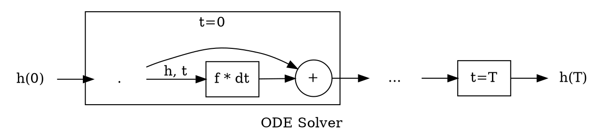
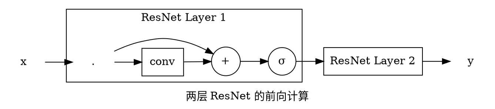
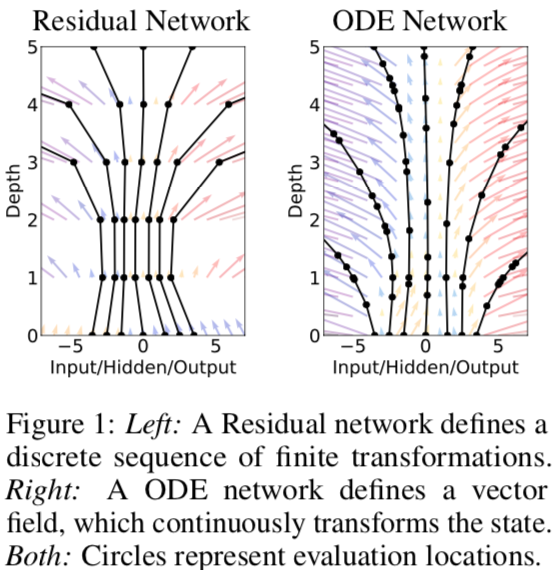
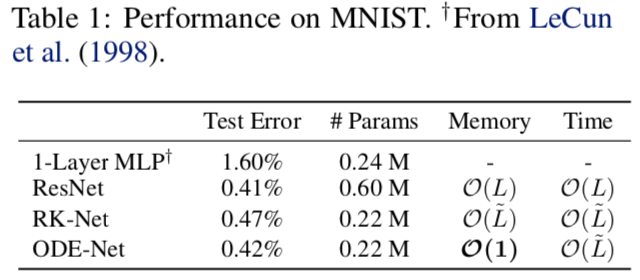
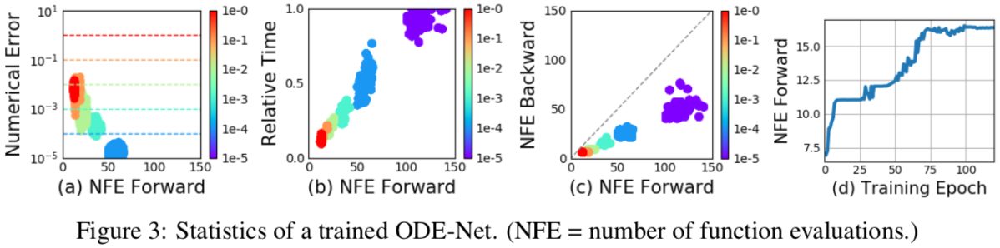
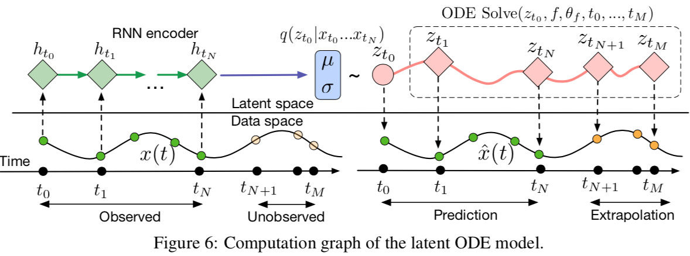

# 神经常微分方程

> * Hinton 创建的向量学院
> * 2018 NIPS 最佳论文奖

## 常微分方程（Ordinary Differential Equation, ODE）及其数值解

本文研究以下带初值 h(0) 的 ODE
$$\frac{dh(t)}{dt} = f(t, h(t))$$


对 ODE 积分有
$$h(t) = h(s) + \int_s^t f(x, h(x)) dx$$
由积分中值定理
$$h(t) = h(s) + (t - s) \cdot f(x, h(x)), x \in [s, t]$$


写成递推式
$$h(t + \Delta t) = h(t) + \Delta t \cdot f(x, h(x))$$
如果能估计出各步的 $f(x, h(x))$，由 h(0) 开始就可以逐步推出 h(T)


此外，如果步长为负则得到反向的递推公式
$$h(t - \Delta t) = h(t) - \Delta t \cdot f(x, h(x))$$
可由 h(T) 逐步推出 h(0)

## ODE Solver 举例


各种 ODE Solver 对 $f(x, h(x))$ 进行了不同的估计：

1. Euler 法：$f(x, h(x)) \approx f(s, h(s))$
2. 中点法（RK2）：$f(x, h(x)) \approx \frac{1}{2} \cdot (f(s, h(s)) + f(t, h(s) + (t - s) \cdot f(s, h(s))))$

此外还有 Runge-Kutta (RK4) 和 Adams-Bashforth 等。


以 Euler 法为例，当步长 $\Delta t$ 较小时，可以用
$$h(t + \Delta t) \approx h(t) + \Delta t \cdot f(t, h(t))$$
从 h(t) 的初值开始一步步估算出终值。


伪码如下（步长不必固定）：

```python
for dt in dts:
    h += dt * f(t, h)
    t += dt
```

## NeuralODE


注意到残差网络、RNN 网络的 decoder、归一化流的模型与 Euler 法有相同的形式：
$$h_{t+1} = h_{t} + f(h_t \theta_t)$$






假设这些离散的网络层（$\Delta t=1$）之间还存在无穷多的层，使步长 $\Delta t$ 可以无穷小以致 t 连续，则模型可写成 ODE 的形式：
$$\frac{dh(t)}{dt} = f(h(t), t, \theta)$$
输入层是这个 ODE 的初值 h(0)，输出层就是解 h(t) 在 t=T 时的值 h(T)。  
而本身的模型就是这个带初值常微分方程定义的连续网络的离散化。





建模为 ODE 的好处：

1. 少量参数就可以建模复杂的动力系统
2. 网络深度是自适应的，通过数值误差的阈值进行控制，可在精度与速度之间权衡
3. 中间任意连续时刻的隐状态都是可知的


## 参数学习：伴随法（Adjoint Method）


用普通的误差反向传播也可以学习模型参数，但当中间的时间步很多时，需要保存大量的中间梯度，造成内存问题，数值误差的影响也不受控。

于是作者通过伴随法的应用，绕过 ODE Solver 得到了误差对参数的梯度，并且达到了常数级的空间复杂度。


定义伴随状态（Adjoint State）
$$a_g(t) = \frac{\partial{L}}{\partial{g(t)}}$$


由链式法则
$$ a_g(t) = \frac{\partial{L}}{\partial{g(t + \epsilon)}} \cdot \frac{\partial{g(t + \epsilon)}}{\partial{g(t)}} = a_g(t + \epsilon) \cdot \frac{\partial{g(t + \epsilon)}}{\partial{g(t)}}$$


有
$$\begin{aligned}
\frac{da_g(t)}{dt}
&= \lim\limits_{\epsilon -> 0^+} \frac{a_g(t+\epsilon) - a_g(t)}{\epsilon} \\\\
&= \lim\limits_{\epsilon -> 0^+} a_g(t+\epsilon) \cdot \frac{\frac{\partial{g(t) - g(t+\epsilon)}}{\partial{g(t)}} }{\epsilon} \\\\
&= - a_g(t) \cdot \frac{\partial{g'(t)}}{\partial{g(t)}}
\end{aligned}$$


令 $g(t) = (h(t), \theta, t)^T$ 代入
$$\begin{aligned}
\frac{da_g(t)}{dt}
&= - (a_h(t), a_\theta(t), a_t(t)) \cdot \begin{pmatrix}
\frac{\partial{h'(t)}}{\partial{h(t)}} & \frac{\partial{h'(t)}}{\partial{\theta}} & \frac{\partial{h'(t)}}{\partial{t}} \\\\
0 & 0 & 0 \\\\
0 & 0 & 0
\end{pmatrix} \\\\
&= -( a_h(t) \cdot \frac{\partial{h'(t)}}{\partial{h(t)}}, a_h(t) \cdot \frac{\partial{h'(t)}}{\partial{\theta}}, a_h(t) \cdot \frac{\partial{h'(t)}}{\partial{t}} )
\end{aligned}$$


于是得到了三个 ODE（原文构造了一个增广矩阵按一个 ODE 一起算，这里便于说明拆成了三个 ODE）
$$\begin{cases}
\frac{da_h(t)}{dt} = - a_h(t) \cdot \frac{\partial{f(h(t), t, \theta)}}{\partial{h(t)}} \\\\
\frac{da_\theta(t)}{dt} = - a_h(t) \cdot \frac{\partial{f(h(t), t, \theta)}}{\partial{\theta}} \\\\
\frac{da_t(t)}{dt} = - a_h(t) \cdot \frac{\partial{f(h(t), t, \theta)}}{\partial{t}}
\end{cases}$$

对应的最终时刻的值

1. $a_h(T) = \frac{\partial{L}}{\partial{h(T)}} $ 可由损失函数的定义计算出
2. 作者说“setting $a_\theta(T) = 0$”没说为什么，我猜是因为优化问题最终就是要让损失函数相对参数的梯度为0
3. $a_t(T) = \frac{\partial{L}}{\partial{t}} |_T = \frac{\partial{L}}{\partial{h}} \cdot \frac{\partial{h}}{\partial{t}} |_T = a_t(T) \cdot f(h(T), T, \theta)$

于是反向递推可得到损失函数相对于初始时刻的状态、模型参数和时间 t 的梯度 $a_h(0), a_\theta(0), a_t(0)$。

以优化$\theta$为例，记$\alpha = \frac{\partial{L}}{\partial{h(t_N)}}$，$\beta$为学习率，因为
$$\frac{\partial{L}}{\partial{\theta(t_0)}} = \frac{\partial{L}}{\partial{\theta(t_N)}} - \int_{t_N}^{t_0} \alpha \cdot \frac{\partial{f(\theta)}}{\partial{\theta(t)}} dt$$
其中第一项按前面设置是0，$\alpha \cdot \frac{\partial{f(\theta)}}{\partial{\theta(t)}}$可以在使用`f(*args).backward(alpha)`后通过`theta.grad`得到，而且很多时候神经网络里的参数都是可以让输出值随便线性调整的（最后一层不是非线性），所以时间间隔具体是多少也不重要，省略了也可以。


## 监督学习





* 用更少参数达到了 ResNet 相似的准确度
* 达到了常数级的空间复杂度
  * RK-Net 是用 Runge-Kutta 前向估算 ODE，但优化时仍用的 BP 算法，所以内存还是高
* 时间复杂度都跟网络深度一致，但 ODE-Net 的深度是自适应的，无法直接比较（但后面实验表明 ODE-Net 更快）





1. a 表明 ODE 的数值解的误差阈值与计算量成反比，而计算量与运行时间成正比（b），所以可以训练时减小误差阈值以提高精度，测试时放松阈值以提升速度；
2. 反向计算梯度时计算量比前向计算还少一半，作者认为是反向传播时评估节点可能更少


## 连续型归一化流

## 生成时间序列模型




## 参考资料

* [作者代码](https://github.com/rtqichen/torchdiffeq)
* [他人解读的 PPT](https://docs.google.com/presentation/d/e/2PACX-1vQSh--YqRiXKjkydmoawYOk5e09eCCJvwzrmCLltMIdxDX7r20XEdZUmY6Y-wb1435EtdKYJMR5kKaT/pub?start=false&loop=false&delayms=3000&slide=id.g5284a8f4fd_0_106)
* [他人复现代码](https://github.com/kmkolasinski/deep-learning-notes/tree/master/seminars/2019-03-Neural-Ordinary-Differential-Equations)
* [机器之心的解读](https://mp.weixin.qq.com/s/ZEIsyV-0aTvYn6K8GyANPA)
