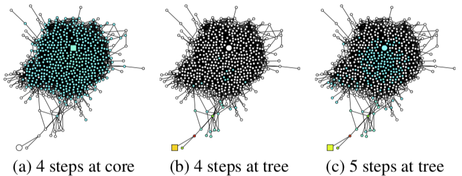
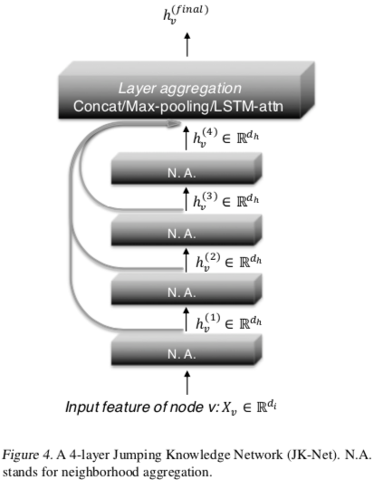

# 使用 Jumping Knowledge Networks 的图表示学习

当前基于深度学习的图表示学习方法大多遵循一种邻域聚合（或消息传递）的模式。

这篇论文研究了这种模式的性质和不足，并因此提出一种可对已有方法进行改进、使其更加适用不同图结构的架构，也就是 Jumping Knowledge Networks (JK-Nets)

## 节点的影响力分布

即使是在同一个图网络中，不同节点也可能有不同的局部结构特征，例如：

* 生物网络或引用网络中，大部分节点的连接都很少，同时还存在少数 hub 型节点有大量邻接节点
* 社交网络中
  * 有很多连接的 hub 型（或称 core 型）节点，如名人、明星
  * 其中节点互相连接，形成高聚集的结构（tree 型），如社区

下图展示了在同一个图中，从不同节点（方块）开始，随机游走一定步数后可能到达的节点（蓝色）：

比起在一定范围内打转的 tree 型，同样走 4 步，core 型节点的邻域几乎包含了整个图。

所以不同局部结构的节点对于要学习的信息来源的距离要求是不一样的：

* core 型节点只需要很小的聚合深度（或传播步数），否则邻域太大，学习起来噪声太多
* tree 型节点需要较大的聚合深度（或传播步数），否则邻域太小，可学习的信息少

## Jumping Knowledge Networks (JK-Nets)

作者因此提出如上图的架构，简单来说就是将基础 GNNs 模型的每一层表示再聚合一下，因此可以加深 GNNs 效果也不降（像 GCNs 通常认为两层效果最好，再多会“过平滑”）。

不同层的聚合方式：

1. 简单注意力：每层一个可学习的权重，把每层表示按权重加起来作为聚合结果
2. 拼接后降维
3. 最大池化。作者证明了这种聚合方式能学到正确的影响力分布
4. LSTM 注意力。各层表示经过一个双向 LSTM，将双向表示拼接后降维再 Softmax 得到注意力。这样各个节点会有不同的注意力分布（不像上面方法都是全局共享，我认为更符合论文的 Motivation），但复杂度太高在简单的图上表现并不好。

## 实验

作者在一些常见的图网络上和 GCN, GraphSAGE, GAT 做了对比，用了最多 6 层图卷积层，效果略有提升。聚合方法选择上，Cora, Citeseer, Reddit 中拼接效果最好，PPI 中 LSTM 注意力最好。

## 理论研究

基于 Inductive 版本（$D^{-1/2}AD^{-1/2}$ 改为 $D^{-1}A$）的 GCN 定义节点 u 对节点 v 的影响力函数 I(v, u) 为 u 的输入 $x_u$ 对 v 的输出 $y_v$ 的 Jacobi 矩阵的 L1 范数（即元素绝对值的和）：
$$I(v, u) = ||E_{u}[\frac{\partial{y_v}}{\partial{x_u}}]||_1$$

节点 u 对邻域内其它节点的影响函数进行归一化后可定义为节点 u 的影响力分布 I(u)。

基于以上节点间影响力函数和节点影响力分布的定义，作者证明了以下结论：

1. k 层 GCN 中一个节点的影响力分布与从它开始随机游走 k 步的分布在期望上是相等的
2. 使用最大池化聚合各层时，k 层 JK Net 中任一点对的影响力函数，在期望上等于这两点间的 0 ~ k 步到达概率的线性组合（系数与各层表示有关）
