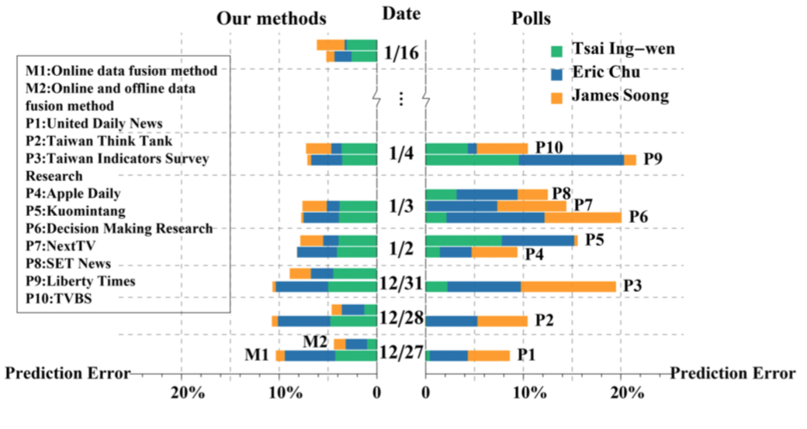
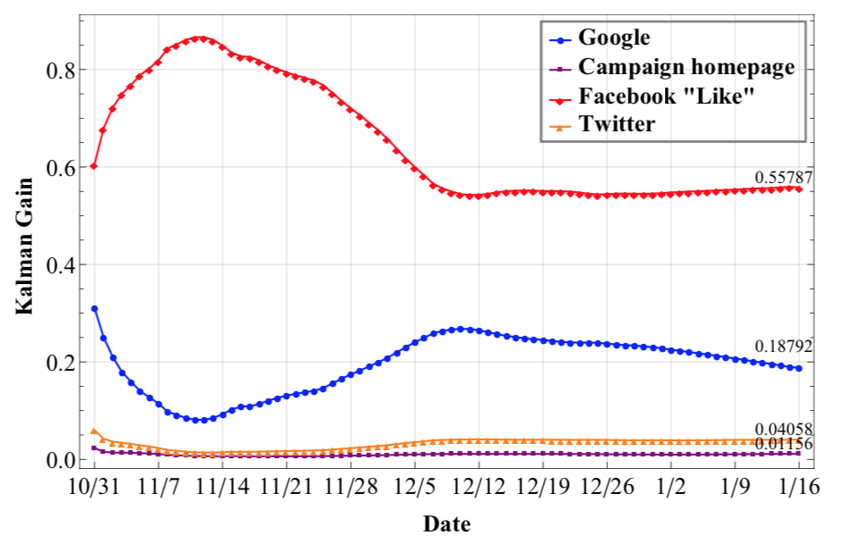
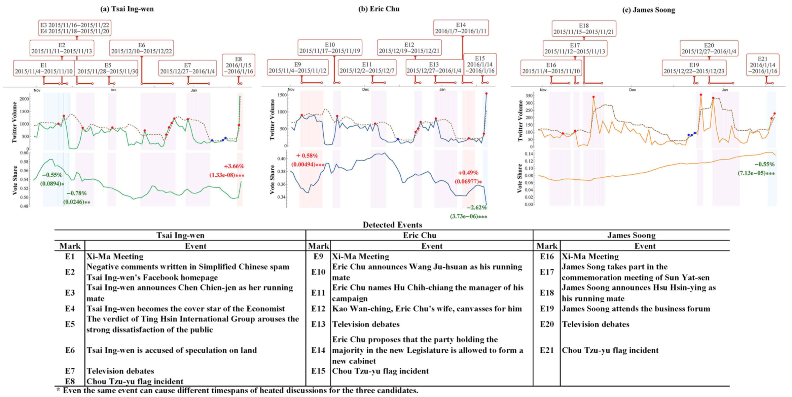

# 通过线上数据预测 2016 年台湾选举

## 引言

介绍了当前社交媒体在公共事件、电影票房、股市、地震报道的预测方面的研究，指出当前方法的问题在于信息源单一且统计方法简单，本文要提出一种可以融合多种数据的健壮的预测方法。

介绍了台湾选举的情况。

## 数据与方法

一方面，采集多种线上数据，用 Kalman Filter 融合起来做预测。
另一方面，通过推文数据量的置信区间与文本的关键词演变侦测到事件，根据前面的预测结果来评估事件的影响，增强模型的可解释性。

### Kalman Filter

1. Facebook Like. 候选人 Facebook 上每天发的 post 平均获赞数
2. Facebook Comment. 候选人 Facebook 上每天发的 post 平均留言数
3. Twitter. 在 Twitter 上搜索候选人名字（简体、繁体都搜）得到的结果数
4. 搜索引擎。在 Google Trends 上搜候选人名字（简体、繁体都搜）得到的指数

以上指标都除以三个候选人的指标总和（就是归一化），并且每天更新后取最近 m 天的平均值（平滑）作为当日的信号（Signal）。  
四种信号拼接起来，作为当日的观测值 x（民意是个隐马尔可夫链）。

然后隐状态 s 到观测值 x 是用的 Kalman Filter，这个知识点还不懂，以后补。[^TODO: Kalman Filter]

### Event Detection Methods

2015 年 10 月的数据显示，他们取到的 80% 的 Twitter 内容都是新闻，因为台湾大多新闻媒体都用 Twitter。  
所以就用来做事件侦测的数据源了。

事件侦测的步骤：

1. 感知事件。对当日推文数做 t 检验（假设过去一段时间每天的推文数服从一个方差未知的正态分布），如果超出置信区间，就是有事发生了（假设一天只有一个事件）；
2. 估算时窗。每日推文汇总到一起，算出 TF-IDF 值最高的 30 个词，如果相邻两天的 30 个词有重叠，就认为事件还在持续，以此在前后五天的窗口内确定上一步感知的事件的起止日期（这一步过滤掉时窗仅一天的事件）；
3. 评估影响。从金融领域找了个 Event Study Model，涉及 Kalman Filter

## 效果与结论

### 1. 我们模型使用线上数据的预测效果比线下民调更准

| 预测提前时间 | 误差  |
|--------------|-------|
| 一天         | 2.59% |
| 一星期       | 4.58% |
| 一个月       | 5.87% |

如果将线下民调也合并到信号中，得到的结果只在刚开始更好，到后期并没优势。如图：

中间竖向是时间轴，水平虚线一格为一天，右边是民调的绝对误差。  
左边是我们 Data Fusion Method 的绝对误差：有两条，上面一条（M2）合并了民调数据，下面一条（M1）仅使用前面提出的四种线上数据。

### 2. 线上数据趋于收敛，Facebook Like 效果最佳

[^TODO: Kalman Gain]

### 3. 大多有影响力的事件都跟两岸关系强相关

