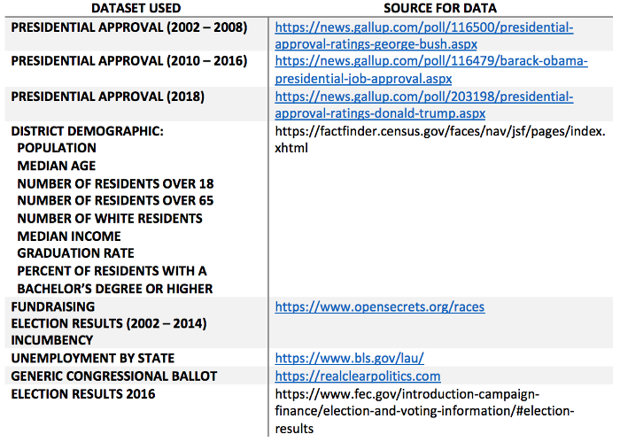
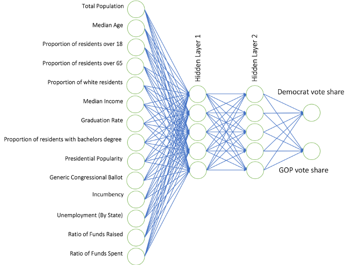
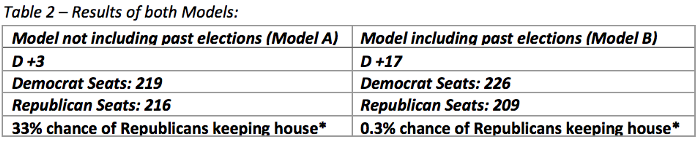

# 用神经网络预测2018中期选举

@caoj

* 应用
  - 选举预测
* 数据
  - 人口普查
* 方法
  - 前馈神经网络

## 摘要

本文中，研究人员使用Python从网上爬取历史数据，并采用神经网络分析这些数据，然后搭建了一个预测模型，用来预测2018年各个地区众议院的中期选举结果。提供给模型的信息主要是每个地区的人口普查数据、历史选举结果和公开的金融数据。研究人员搭建了两种不同的模型，虽然都是用来预测民主胜利的，但是不同的是，两种模型是否使用了之前国会的选举结果。当包含该数据时，民主党占据17个席位的优势；如果不包含，则只有3个席位的优势。

## 主要内容

建立下列14组输入数据的前馈神经网络：

表一中的数据集，是从广大的对大选结果有影响的因素中，选出的具有代表性的一些数据集。来自人口普查局的数据是手动归档的。2002-2014年的竞选经费，选举结果和任期数据，都是通过python网络爬虫程序在2018年9月爬到的，爬虫程序中使用了Beautiful Soup包。这些数据存储在一个Excel电子表格中（https://docs.google.com/spreadsheets/d/1oqODh1eXi80oltRlFolRgdx5nkdhsf1fFGONOLHpFPM/edit?usp=sharing）。

最终的神经网络模版，拥有14个输入节点，两组隐藏层，每组隐藏层有5个神经元，每个单一输出结点，给出预期的共和党和民主党的投票占有率，如下：

 
在仅使用2000-2014年的数据训练神经网络，而要求网络预测2016年大选结果的过程中，通过不断减小损失函数，使得神经网络在不断进化。为了持续减小神经网络的损失函数，当损失函数因过拟合而开始增加时，训练必须停止。在多次测试和错误之后，使用2016和2014的选举结果作为测试集，研究人员发现正是2000年选举结果的加入，使得模型的准确率下降。因此，研究人员仅使用了2002-2016年的数据来预测2018年的选举结果。

第二个模型包含之前议会的选举结果，尽管这个模型没有显著改善验证集上的损失，但是该模型确实给民主党带来了更多胜利的可能。由于测试表明在训练集上的差异没有明显的差异，这两者的结果如下：原始模型标记为“模型A”，而更新模型则包括前一次选举的结果，标记为“模型B”。

该模型中使用了的一个概念是，重新初始化神经网络并运行多次是为了给每个单独的区域创建统计数据。对于最终的预测，神经网络被重新初始化并运行了10000次。由于权值在每次运行的时候都会被随机初始化，所以每个生成网络的预测结果是不同的。采用这种方法，研究人员找到了每个地区的样本均值和标准差。

在这个过程中，虽然寻找无偏样本均值是成功的，但是由权重初始化问题，导致计算方差是小于实际方差的。对于该较低的标准差预测值，一个可能的解释是，该模型原始的权重生成没有足够的随机性，因而不能够解释实际选举结果的多变性。为了解释该多变性，研究人员将模型计算出的每个地区的标准差，乘一个系数2，使其与每个地区变化的观测值是一致的。
两种模型的预测结果如下表所示，这些数据是从结果的概率分布中得到的，这些结果是以种族为独立事件作为假设的。由于选举是有相互关系的，概率密度分布比预测值更宽，而且这些数字可能更接近50%。
 

在解读这些结果前，应该指明，在国家层面，模型预测出的席位分布的多变性，是有瑕疵的。模型计算每个地区的结果是独立的，接着在计算分布时，把每个地区当作一个独立变量。实际上，在模型范围之外的有很多变量是难以融合进神经网络的，但是能显著地拓宽席位的概率分布。为了纠正这一不准确的假设，研究人员需要纳入一个与相似地区相关的因子。除非在过程中增加一个可能的偏移，否则，这一影响的结果是不能由神经网络决定的。虽然模型中的扩展量因此有缺陷，但平均结果并不受此缺陷的影响，并且仍然可以得出有意义的预测。

进一步分析这些数据，由于模型的性质，特别是在地区层级，该模型预测任何给定结果的原因变得困难。主要的阻碍因素是，神经网络只是一个大量权重和偏移组合，因此试图去理解神经网络的每次迭代对一组数据的作用是不可行的。然而，阻碍这个过程的更大原因是，该模型不是由一个，而是由成千上万个较小的模型组成的，这些小模型每个区域的结果平均计算得出的。因此，为了正确分析每个给定地区的结果，研究人员需要解剖的不是一个，而是成千上万个神经网络。然而，这并不意味着，对模型预测结果不能进行一般化的抽象。两种模型对11月的选举结果给出了不同的预测。尽管预测结果都是民主党会领先于共和党，但是领先的优势是不相同的。模型A的预测结果是，民主党的优势较小，而模型B的预测结果是，民主党的优势较大。由于模型B加入了之前的选举结果，这可以表明，模型B已经分析出，现任政党的模式会在中期选举时表现地更糟糕。这种差异也表明，其他非人口因素有助于民主党获得更多的领先优势。
