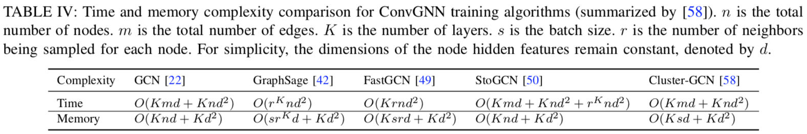

# 图神经网络全面综述

This survey considers GNNs as all deep learning aproaches for graph data.

## Notations

## 本文调研的 RecGNN 和 ConvGNN 模型一览

## Recurrent Graph Neural Networks, RecGNNs

再现：各节点持续与邻居节点通过消息传递（Message Passing）更新状态，直到稳定。  
各层使用相同的再现函数。

1. Graph Neural Network (GNN)
   * $h_v^{(t)} = \sum\limits_{u \in N(v)} f_\theta(x_v, x^e_{(v, u)}, x_u, h_u^{(t-1)})$
   * $f_\theta$ 须使两点映射后距离更近，才能保证收敛。如果 $f_\theta$ 是神经网络，则要有对 Jacobian matrix 的正则项。 
   * Graph Echo State Network (GraphESN) 改进了训练性能

2. Gated Graph Neural Network (GGNN)
   * $h_v^{(t)} = \text{GRU}(h_v^{(t-1)}, \sum\limits_{u \in N(v)} W_\theta h_u^{(t-1)})$
   * Gated Recurrent Unit (GRU)

3. Stochastic Steady-state Embedding (SSE)
   * $h_v^{(t)} = (1 - \alpha)h_v^{(t-1)} + \alpha W_{\theta_1} \sigma (W_{\theta_2} [x_v, \sum\limits_{u \in N(v)} [h_u^{(t-1)}, x_u]])$
   * 随机采样小批量节点异步更新状态与计算梯度，因此可扩展到大规模图中
   * 但没证明收敛性

## Convolutional Graph Neural Networks, ConvGNNs

卷积：各节点聚合自身与邻居的状态得到新的状态。  
各卷积层可以不同。最后堆叠多个卷积层的结果，从中抽取出表示。

### Spectral-based ConvGNNs

卷积：滤波去噪。

将无向图的邻接矩阵 A 按行、列标准化得 Laplacian Matrix：
$$L = I - D^{-\frac{1}{2}}AD^{-\frac{1}{2}}$$
因为对称性，L 有标准正交的特征向量矩阵 U 使得 $L = U \Lambda U^T$，其中 $\Lambda = \text{diag}(\lambda)$。

在此基础上定义信号 x 与滤波器 g（都是 n 维向量）的卷积运算为
$$x * g = U\cdot\text{diag}(g)\cdot U^Tx = U(U^Tx \odot g) = F^{-1}(F(x) \odot g)$$
其中 $F(x) = U^Tx$ 是图上的傅立叶变换（Graph Fourier Transform）。

也就是说，x 与 g 的卷积是将 x 变换到 U 为基的线性空间中，与 g 逐位相乘后再变换回原空间。
（相关内容见 Linear Algebra ：对称矩阵与对角矩阵相似、相似变换）

Spectral-based 方法主要就是学习这个滤波器 $g = g_\theta$，不同方法对其引入了不同的归纳偏置（Inductive Biases）。

1. Spectral CNN
   * $H_j^{(l)} = \sigma(\sum\limits_{i=1}^{d_{l-1}} H_i^{(l-1)} * g_{i,j;\theta}^{(l)}), j = 1, 2, \cdots, d_k$
   * $H^{(0)} = X$，$H_i$ 是 H 的第 i 列，代表一个 channel
   * 或记为 $H^{(l)} = \sigma(H^{(l-1)} * W_\theta^{(l)})$，其中 H 为向量、W 为矩阵，但它们的元素都为 n 维向量，元素相乘为卷积

2. Chebyshev Spectral CNN (ChebNet)
   * 将特征值压缩到 [-1, 1]：$\tilde{\Lambda} = 2 \Lambda / \lambda_{\max} - I$
   * 用 $\Lambda$ 的 K 次多项式逼近 $g_\theta$ 并表示为 Chebyshev Polynomials $T_n(x) = \cos(n \arccos x)$ 的加权和：$$\begin{cases}
g_\theta = \sum\limits_{i=0}^{K} \theta_i T_i(\tilde{\Lambda}) \\\\
T_i(x) = 2xT_{i-1}(x) - T_{i-2}(x) \\\\
T_0(x) = 1, T_1(x) = x
\end{cases}$$
  * 于是 $$x * g_\theta = U (\sum\limits_{i=0}^{K} \theta_i T_i(\tilde{\Lambda})) U^T x = \sum\limits_{i=0}^{K} \theta_i T_i(2L / \lambda_{\max} - I) x$$
  * 可独立于图的尺度提取局部特征 [^TODO: 不太理解，可能跟切比雪夫多项式的特性有关，比如不同 i 代表不同的尺度]
  * CayleyNet 引入 Cayley Polynomials 定义 $$x * g = c_0 x + 2 \text{Re}{\sum\limits_{j=1}^{r} c_j(hL - iI)^j(hL + iI)^{-j}x}$$ ChebNet 算它的一个特殊情况

3. Graph Convolutional Network (GCN)
   * ChebNet 中令 $K = 1, \lambda_{\max} = 2, \theta_0 = -\theta_1$ 就得 GCN $$x * g_\theta = \theta(I + D^{-\frac{1}{2}} A D^{-\frac{1}{2}})x \approx \theta((D + I)^{-\frac{1}{2}} (A + I) (D + I)^{-\frac{1}{2}})x = \theta(\tilde{D}^{-\frac12} \tilde{A} \tilde{D}^{-\frac12})x$$ 其中近似部分是为了通过平滑解决数值稳定性问题
   * 相邻层隐状态之间的 channel 全连接，写为 $$H^{(l+1)} = \sigma (\tilde{D}^{-\frac12} \tilde{A} \tilde{D}^{-\frac12} H^{(l)} W_\theta^{(l)})$$
   * 因为 $\tilde{D}^{-\frac12} \tilde{A} \tilde{D}^{-\frac12}$ 只在图中有边的对应位置有值，所以这个卷积操作又可以看作是在聚合相邻节点的信息，故 GCN 同时也算 Spatial-based 的方法

4. Adaptive Graph Convolutional Network (AGCN)
   * 邻接矩阵中的值不只是 0 和 1，而是经一个可学习的距离函数由两节点的特征得到的输出值
5. Dual Graph Convolutional Network (DGCN)
   * 在图中随机游走后生成衡量节点共现程度的 PPMI 矩阵（见 Information Theory）记为 B，也做卷积后与 GCN 的卷积混合 $$H^{(l+1)} = \sigma (\tilde{D}^{-\frac12} \tilde{A} \tilde{D}^{-\frac12} H^{(l)} W_{\theta_1}^{(l)} + BH^{(l)}W_{\theta_2}^{(l)})$$ [^TODO: 不太清楚是每一层都混合还是到最后一层再混合，综述没说清楚，要看原论文。但倾向是前者]
   * 因为 A 带了局部的信息，B 带了全局的信息，所以最终的表示不需要堆叠起多层结果来得到

Spectrul-based 方法的缺点

1. 邻接矩阵的轻微变化会改变特征值与特征向量，使得整个表示受影响
2. 学到的滤波器因此严重依赖于邻接矩阵，难以运用到其它结构的图中
3. 特征值分解得到 U 的复杂度为 O($n^3$)，效率低而且不能小批量训练

### Spatial-based ConvGNNs

卷积：传播信息。

1. Neural Network for Graphs (NN4G)
   * 聚合自身属性和周围节点的各层堆叠隐状态 $$H^{(k)} = \sigma(XW^{(k)} + \sum\limits_{i=1}^{k-1} AH^{(k-1)}\Theta^{(k)})$$
   * Contextual Graph Markov Model (CGMM): NN4G fork with probabilistic interpretability
2. Diffusion Convolutional Neural Network (DCNN)
   * $H^{(k)} = \sigma(W^{(k)} \otimes P^k X)$，其中 $P = D^{-1}A$ 是转移概率矩阵
   * 输出各层 H 的拼接
   * Difussion Graph Convolution (DGC): $H = \sum\limits_{k=0}^{K} \sigma(P^k X W^{(k)})$
   * PGC-DGCNN 认为转移矩阵衰减太快，所以定义 $S^{(j)}_{u,v}$ = bool(u, v 有长为 j 的最短路径)，隐状态为 $\sigma((\sum_l S^{(j)}_{i,l})^{-1} S^{(j)} H^{(k-1)} W^{(j,k)}), j = 0, \cdots, r$ 的拼接
3. Partition Graph Convolution (PGC)
   * 泛化了 PGC-DGCNN 中分组的思想，将邻接节点按一定原则分为 Q 组分别做不激活的 GCN 后加起来，作为新的状态

4. Message Passing Neural Network (MPNN)
   * 应该说是一种（消息传递的）框架
   * $h_v^{(k)} = U_k (h_v^{(k-1)}, \sum\limits_{u \in N(v)} M_k (h_v^{(k-1)}, h_u^{(k-1)}, x_{vu}^e))$
5. Graph Isomorphism Network (GIN)
   * 基于 MPNN 的网络无法通过学到的表示分辨不同的结构
   * $h_v^{(k)} = \text{MLP}((1 + \epsilon^{(k)}) h_v^{(k-1)} + \sum\limits_{u \in N(v)} h_u^{(k-1)})$
6. [GraphSage](../2017-inductive-representation-learning-on-large-graphs/)
   * 通常的网络在上规模后效率都成问题，GraphSage 只采样部分邻居节点，是一个工业可用的模型

7. Graph Attention Network (GAT)
   * 使用注意力网络为节点之间的连接分配权重，在节点分类任务上效果远超 GraphSage 
   * 用了多头注意力，但权重相等
   * Gated Attention Network (GAAN) 又加了个自注意力给每个头加权
8. [Mixture Model Network (MoNet)](../2016-geometric-deep-learning-on-graphs-and-manifolds-using-mixture-model-cnns/)
   * 把 GNN 的方法用到了流形的深度学习上，将流形中的点视为图的节点，用相对坐标来决定边的权重
9. PATCHY-SAN
   * 每个节点都按一定规则为邻居排序、之后截取前 q 个保持边，这样把图结构转换为网格结构
10. Large-scale Graph Convolutional Network (LGCN)
    * 对各节点所有邻居的每一种特征进行特征内的排序，保持前 q 个值，形成的特征矩阵作为中心节点的表示来源

在训练效率的提升方面（GCN 是基线）：

1. GraphSage 内存较省，但时空复杂度都随 r、K 指数级上升
2. Fast Learning with Graph Convolutional Network (FastGCN)
   * 每层只采样固定数量的节点
   * 将卷积层视为在概率度量上的嵌入函数的积分形式[^TODO: 不懂，需要看原论文]，因此训练中用到蒙特卡罗估计和变分
   * Huang et al. 又提出一种逐层采样方法，提升了 FastGCN 的准确率

3. Stochastic Training of Graph Convolutional Networks (StoGCN)
   * 通过节点的历史表示极大地减小了感知域，即使每个节点只采样两个邻居也能有好的表现
   * 在这几个方法里时间复杂度最高，内存瓶颈也没解决
4. Cluster-GCN 通过图聚类算法在图中采样出子图，并在子图上做卷积
   * 内存最低

## Graph Autoencoders, GAE

### Network Embedding

重建图的结构信息，如邻接矩阵或 PPMI 矩阵

1. Deep Neural Network for Graph (DNGR)
   * 通过多层感知机重建 PPMI 矩阵
2. Structural Deep Network Embedding (SDNE)
   * 第一个损失函数最小化节点的嵌入及其邻居的嵌入的距离
   * 第二个损失函数最小化节点表示及其重建表示之间的距离
3. Graph Autoencoder (GAE)
   * 用图卷积层同时考虑邻接矩阵与节点特征
   * 重建邻接矩阵 $\hat A_{v,u} = \text{dec}(z_v, z_u) = \sigma (z_v^T z_u)$，其中 z 是节点的嵌入
   * GraphSage 中对于无监督任务（就是做嵌入）也是用的与逆采样的交叉熵

4. Variational Graph Autoencoder (VGAE)
   * 自编码器能力过强通常会过拟合，所以 VGAE 优化 ELBO
5. Adversarially Regularized Variational Graph Autoencoder (ARVGA)
   * 引入 GAN 的训练方式
6. Deep Recursive Network Embedding (DRNE)
   * 上面都是基于链接预测来做嵌入，但图中链接通常都是稀疏的。所以这方法随机采节点的邻居训练一个 LSTM，把图的训练转化为对序列的训练，来回避链接稀疏的问题
7. Network Representations with Adversarially Regularized Autoencoders (NetRa)

### graph generation

学习图的生成分布，支持逐步生成节点/边，或一次性生成全图。

逐步生成：

1. DeepGMG
2. GraphRNN

一次生成：

1. GraphVAE
2. RGVAE
3. MolGAN
4. NetGAN

## Spatial-Temporal Graph Neural Networks, STGNN

时空图是指节点特征随时间变化的图，通常用来预测节点或图在未来的标签或特征，例如导航时预测速度。

RNN-based 的方法通常是在 RNN 后接 GCN，即
$$H^{(t)} = \sigma (\text{Gconv}(X^{(t)}, A; W) + \text{Gconv}(H^{(t-1)}, A; U) + b)$$
比如：

* Graph Convolutional Recurrent Network (GCRN) 是 LSTM + ChebNet
* Diffusion Convolutional Recurrent Neural Network (DCRNN) 是 GRU + DGC
  * 不过另外还用了个编解码器架构预测 K 步后节点的值
* Structural-RNN 则是 edge-RNN 后接 node-RNN

CNN-based 的方法能并行、内存更低、梯度更稳定，如图

Graph WaveNet 提出既然有了各节点在不同时刻的值，就可以据此学到节点间的关系，即 $A = \text{SoftMax}(\text{ReLU}(E_1E_2^T))$，其中 E 是节点的表示。这样就不需要图本身的邻接矩阵。

GaAn 和 ASTGCN 又引入了注意力机制。

## 其它

论文中还介绍了关于图网络的框架，以及一些测试数据集。不过目前，个人推荐框架用 [DGL](https://docs.dgl.ai/)，数据用 [OGB](https://ogb.stanford.edu/)。
