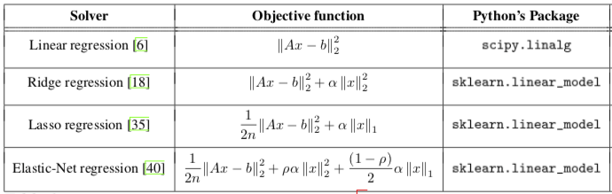
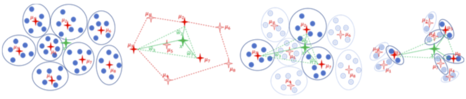
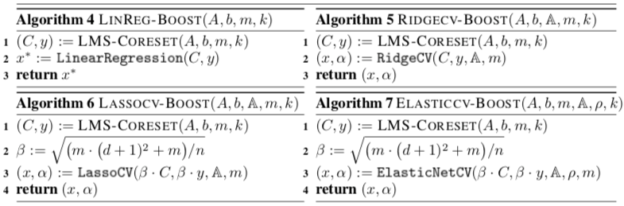

# Fast and Accurate Least-Mean-Squares Solvers

* NeurIPS 2019 杰出论文奖
* 分治算法（divide-and-conquer）
* 对 scikit-learn 中的算法，普遍加速数十上百倍
* 不会带来精度的损失，且能提升数值稳定性
* 可用于流数据与分布式并行计算（？）

## 价值

$$ \min \limits_{x \in X} f(|| Ax - b ||_2) + g(x) $$
其中 A: n x d, x: d, b: n

$$ S^TS = A^TA $$
其中 S: ($d^2$ + 1) x d

$$ (C | y)^T (C | y) = (A | b)^T (A | b) $$
其中 (C | y): ($(d + 1)^2$ + 1) x (d + 1)

$$ ||Ax - b|| = ||(A | b)(x | -1)^T|| = \sqrt{(x | -1) (A | b)^T (A | b) (x | -1)^T} $$
$$ ||Cx - y|| = || (C | y)(x | -1)^T || = \sqrt{(x | -1) (C | y)^T (C | y) (x | -1)^T} $$

## Caratheodory 定理 (1907)

包含 n 个 d 维点的凸集中，任一点 x 可表示为另 d + 1 个点 {$x_i, i = 1, \dots, d+1$}的凸组合，即 $$ x = \sum \limits_{i=1}^{d+1} \lambda_i x_i $$，其中 $$ \lambda_i \ge 0, \sum \limits_{i=1}^{d+1} \lambda_i = 1$$

算法时间复杂度：O(min{$n^2 d^2, n d^3$}) => O(nd)

## Fast-Cartheodory-Set

1. Divide. P = {$P_1, P_2, \dots, P_k$}. O(n)
2. Sketch. S = {$S_1, S_2, \dots, S_k$}. O(nd)
3. Coreset. S 求核心集得 B. t(k, d)
4. Map. 映射回 P 以保持精度，$ C = \cup_{S_i \in B} P_i $.
5. Recur. 递归调用。

时间复杂度：$O(nd + t(k, d) \cdot \log_{k/d} n)$

* 工程上易用
* 适用于所有 $l_2$ 范数的运算
* [https://github.com/ibramjub/Fast-and-Accurate-Least-Mean-Squares-Solvers][code]

[code]: <https://github.com/ibramjub/Fast-and-Accurate-Least-Mean-Squares-Solvers> "代码"
