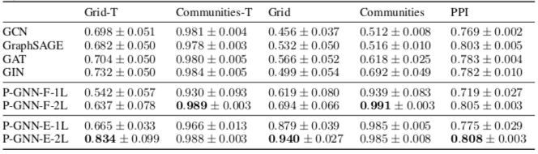

# 位置感知图神经网络

## 背景

现在的 GNN 方法学到的节点表示依赖于所在邻域的结构，无法捕获更广范围的图的结构。  
导致图中两点如果有相同的局部结构，就会学到相同的表示，从表示上无法区分开。

## 问题定义

* q-结构感知（structure-aware）：节点表示由距离 q 以内的节点的表示聚合而来
* 位置感知（position-aware）：两个节点在图中的最短距离能由其表示计算出来
* 推论：当且仅当图中不存在 q 步同构的节点对时，q-结构感知表示是位置感知的
* GNN 的问题在于学到的是结构感知的表示而不一定是位置感知的表示

## 模型

1. 每次前传时，随机选多个锚点集（anchor-sets）S
2. 对每一点 v 与每一组锚 $S_i$，计算 {$F(v, u) | u \in S_i$}，并聚合为向量 M(v, $S_i$)
3. v 的各 M(v, $S_i$) 聚合为下一个隐状态 h(v)
4. v 的各 M(v, $S_i$) 按行拼接为矩阵 M(v)，降维为位置感知表示 z(v)

M(v) 降维为 z(v) 是右乘了一个列向量，相当于 M(v) 的任一行经相同的线性组合成为 z(v) 的一维，所以 z(v) 的每一维对应与一个（且仅一个）锚点集的信息。因此：

1. 图中即使有相同邻域结构的节点，在分别与锚点集计算后结果都会不同（类似使用多个卫星进行定位），所以 z(v) 是包含了位置信息的表示
2. 如果堆叠 P-GNN，随着下一层锚点集的改变，z(v) 也会失去意义，所以 z(v) 不能往下层传，但另外聚合的 h(v) 可以

### 实现细节

* $F(v, u) = \frac{1}{1 + d_q(v, u)} [h_v; h_u]$，其中 $d_q(v, u)$ 是 v, u 之间的最短路径，超过 q 则视为 $\infty$
* 两处聚合都用的 mean

### 关于锚点集的生成

作者在论文中引用了 Bourgain Theorem 来指导锚点集的生成，表明以该定理的证明方式生成 $O(\log^2 n)$ 个锚点集，点 v 与各个锚点集中点的最短距离组成一个映象向量 f(v)，则映射前后两点的距离满足 $\frac{1}{\alpha} d(u, v) \le d'(f(u), f(v)) \le d(u, v)$，其中 $\alpha$ 称为 distortion，属于 O(log n)。

作者因为两处聚合都用的拼接与 mean，只能说是这个定理的一个变形而非实现（严格符合定理应该是取一个 min），但可以因此看出作者是想在变换时尽量保持节点的距离信息。

## 与常规 GNN 的关系

* 常规 GNN 通常可以看作 P-GNN 的特例
* GCN 可以看作每个点作为一个锚点集，F 中使用 $d_1$
* GraphSAGE 可以看作每个点使用了不同的锚点集
* 但每节点的计算复杂度比常规 GNN 高多了：$O(n^2 \log^2 n)$ vs $O(n + e)$

## 实验

* 在 Grid, Communities, PPI 三个数据集上做 Transductive 的链接预测实验
* 在 Communities, Email, Protein 三个数据集上做 Inductive 的节点配对实验
* 衡量指标是 ROC AUC

其中 *-T 给节点加入了 one-hot 的特征向量。

