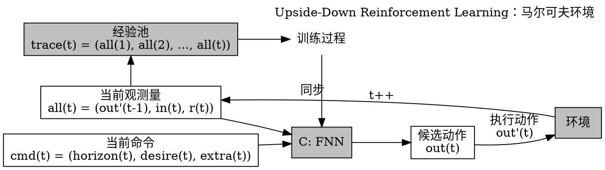
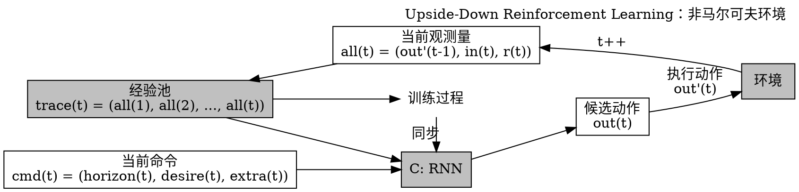
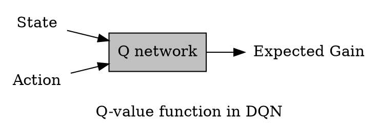
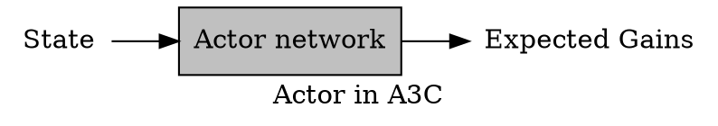

# 颠倒强化学习：不要预测回报，直接得到动作

## 主要贡献

* 颠倒强化学习（Upside-Down Reinforcement Learning, UDRL）框架引入了 desired rewards，并使用监督学习（Supervised Learning, SL）的方法解决强化学习（Reinforcement Learning, RL）问题
* 提出对策略网络进行压缩的方法
* 提出 Imitate-Imitator 框架

## 符号解释

* 状态 $in(t) \in R^m$
* 收益（或成本）$r(t) \in R^n$
* 候选动作 out(t)
* 实际动作 out'(t)
* 目标（或命令），包括三部分
  * 目标时限 $horizon(t) \in R^p$
  * 目标收益 $desire(t) \in R^n$
  * 附加目标 $extra(t) \in R^q$
* 观测量 all(t) = (out'(t - 1), in(t), r(t))
* 轨迹 trace(t) = (all(1), all(2), ..., all(t))

## 算法

1. 控制过程
2. 训练过程

### 1. 控制过程

1. 从训练过程复制 C 的参数；
2. 根据当前时间更新命令：cmd(t) = (horizon(t), desire(t), extra(t))
3. 获取当前时刻的观测量：all(t) = (out'(t-1), in(t), r(t))
4. 代入 C，得到当前时刻的候选动作：out(t) = C(all(t), cmd(t)
5. 确定实际要执行的动作 out'(t)，如 softmax, argmax 或在探索模式下随机选择
6. 在环境中执行 out'(t)，得到 in(t+1) 和 r(t+1)
7. 保存 all(t+1) = (out'(t), in(t+1), r(t+1) 到 trace(t+1) = (all(1), all(2), ..., all(t), all(t+1))

### 2. 训练过程

已有轨迹 trace(t) = (all(1), all(2), ..., all(t))，对任一时间段 $\{(k, j): 1 \le k \le j \le t - 1\}$，令
$$horizon(k) = j - k$$
$$desire(k) = \sum\limits_{t=k}^{j} E[r(t + 1)]$$
得到该时间段对应的输入-输出对：$(all(k), cmd(k)) \rightarrow out'(k)$

于是可使用监督学习的方法如随机梯度下降训练 C 的参数。

## 非马尔可夫环境

在不保证马尔可夫性的环境中，合适的控制动作可能不只与当前观测量相关，而与整个轨迹都相关。  
于是用 RNN 作为 C，用当前截断轨迹作为输入，以得到一个合适的隐状态，取代当前观测量：

> 训练时同样用整个截断轨迹作为输入

## 特性

* RL 的值函数方法要遍历计算每个动作的期望收益，不适合高维动作空间；但 UDRL 没这限制。
* horizon 的表示灵活，例如只用一位表示是否是终结状态；
* RL 通常使用 $\lambda$-折扣累计回报：$G_{\lambda}(t_0) = \sum\limits_{t=0}^{+\infty} \lambda^t r_{t_0+t}$，一个原因是暗含了无限时间线的条件，需要引入折扣因子使累计回报有穷。UDRL 没有这个限制，desire 的方式比较灵活；

* RL 选收益期望最大的动作，因此得到的是确定性的策略；UDRL 使用最小二乘法（MSE）逼近经验，学到的是动作的最大似然分布，可以采样；
* RL 学习单步的经验，UDRL 则能从一条轨迹中学到平方级的经验，有机会学到前后的因果关系；
* 可以用在线的方式学习全部经验，更高效的方式是对经验池（Replay Buffer）限容，只留下高回报的轨迹（只学习高回报经验）；

### extra(t) 的使用举例

* More Than: 将 extra(t) 中某一固定位设为 1 ，并使用比经验更少的目标收益进行训练，就能学到目标为“在目标时限内得到至少这么多的目标收益”的动作。这也能衍生出更多的训练数据。
* 目标状态：将 in(j+1) 编码入 extra(k) 中，可以学习在任务结束时额外达到某个状态。
* 使用 RNN 作为 C 时甚至可以将历史状态编码入 extra(k) 以学习更多的额外目标。

## 实现细节与实验效果

作者的团队将实现细节与实验结果发表在了另一篇论文中：《[用颠倒强化学习训练智能体](/papers/2019-training-agents-using-upside-down-reinforcement-learning/)》。

## 策略网络的压缩

任务固定时，经验池中只放入成功达成目标的回合轨迹，然后以当前时刻之前的截断轨迹作为输入，当前动作作为输出，训练 C。  
目标命令被简化掉了。

## Imitate-Imitator 框架

1. 将人类的一系列动作轨迹（或文本/语音描述）作为任务内容；
2. 机器人按任务内容执行一系列动作轨迹 $H^i$，如果正确就退出算法；
3. 否则人类对其进行模仿（或描述）产生轨迹 $V^i$；
4. 用 $V^i$ 作为输入、$H^i$ 作为输出，训练 RNN；
5. 转到步骤 2.

## 感想

### 并没有颠覆什么

这篇文章中提到的 RL 方法可能主要还是以 DQN 为参照，DQN 是用神经网络近似 Q 函数，输入状态与动作，输出期望回报，然后对当前状态与每个动作，各计算一个期望回报，选择最大的。即

但实际上在 A3C 中，就将网络结构改进为直接去近似策略，即输入当前状态，输出所有动作的期望回报数组，其中最大分量的位置对应的就是最优动作。

从这一点上来说，作者提出的 UDRL 在结构上的唯一改变就是增加了目标（horizon, desire, extra）作为输入，这能增强结果网络对于不同目标的适应性，但也因此增加了训练量。文中所谓平方级的可利用经验能否弥补输入维度增加所需要的更多数据量还不好说。

甚至最后作者自己也提出了压缩网络，跟 A3C 这个网络设计似乎没有区别。

### 实质上是个逆强化学习（Inverse Reinforcement Learning, IRL）方法

从另一篇论文的实验结果来看，UDRL 对于满足马尔可夫性的环境的效果并不如经典 RL 好，但是在非马尔可夫环境或者将原环境的马尔可夫性破坏后效果实现了反超。这说明 UDRL 解决的是逆强化学习问题，即回报不能即时获得的情况。

经典的 IRL 方法是根据轨迹反推出最可能的回报函数，进而转化为 RL 问题。本文用 SL 的方法，直接让 C 逼近目标轨迹。具体好不好，等再学些 IRL 再回来编辑。

### 八卦

文章唯一作者是 LSTM 之父，全篇没图、没实验，只简要但全面地介绍了这个 Idea、性质以及应用。
然后由团队里其他人实现主体内容并发表了另一篇论文。

### 可学习的地方

经典模型中有很多是基于马尔可夫性的，这里引入 RNN 解决非马尔可夫性的办法似乎很有效。
