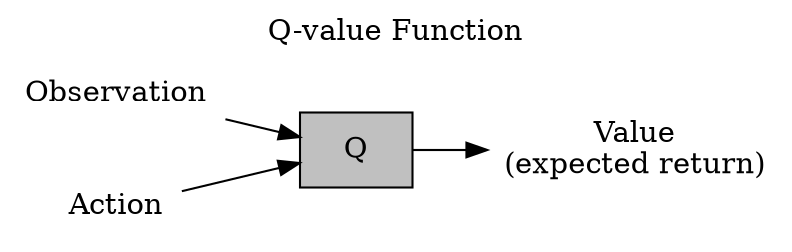
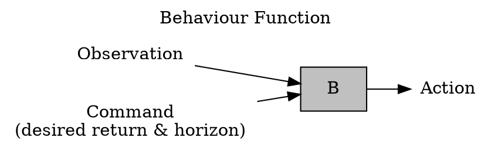
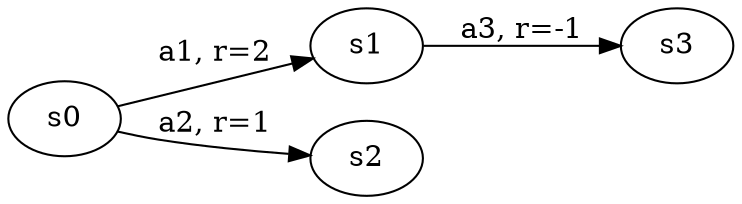
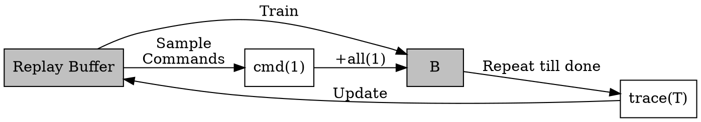
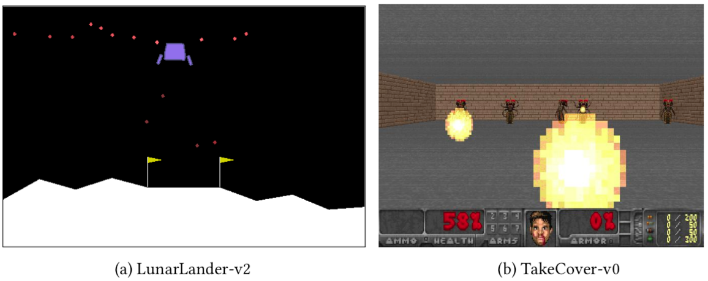
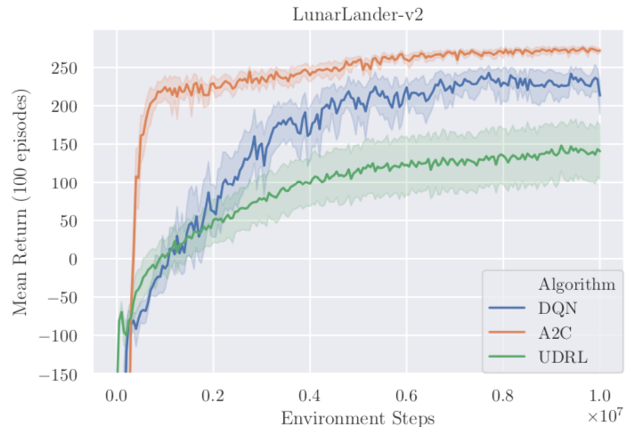
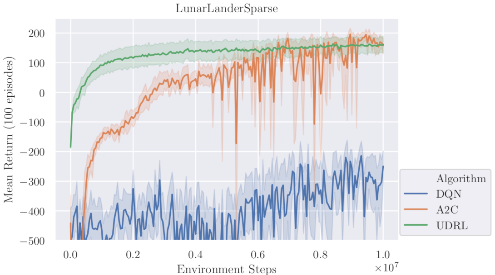
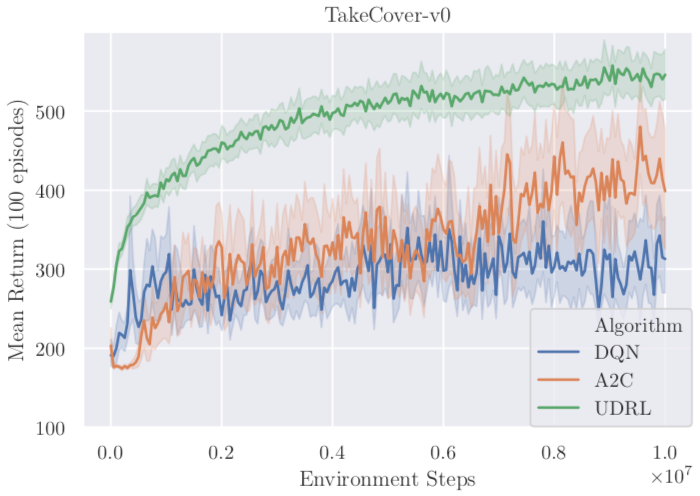

# 用颠倒强化学习训练智能体

这篇文章主要是颠倒强化学习（Upside-Down Reinforcement Learning, UDRL）的实现细节和实验效果。  
详细的理论见另一篇论文：《[颠倒强化学习：不要预测回报，直接得到动作](/papers/2019-reinforcement-learning-upside-down-don-t-predict-rewards-just-map-them-to-actions/)》。

## 当前强化学习的三个方向

### 1. 值函数

在当前状态 Observation 下，对所有可能的 Action 取值，代入 Q 函数估算期望回报 $v = Q(o, a)$，取其中最大化期望回报的动作：$\mathop{\arg\max}\limits_{a \in A} Q(o, a)$

其中 Q 函数又称动作值函数，常用的还有状态值函数 V(o) 和 优势函数 A(o, a)。

本文实验基准之一就是基于 Q 函数的 DQN。

### 2. 策略梯度

将策略函数作为优化点，以期望回报为目标函数，做梯度上升，使策略越来越优。  
通常与值函数结合，即 Actor-Critic 算法。

本文实验基准之一就是基于 AC 算法的 A2C（Advantage Actor-Critic，同步版 A3C）。

### 3. 进化

如之前介绍过的论文《[权重无关神经网络](/papers/2019-weight-agnostic-neural-networks/)》 就使用进化的方式做架构搜索。

## 4. 行为函数

在当前状态 Observation 下，将期望的时间与回报 Command 代入 B 函数，得到动作 Action：$a = B(o, c)$

与前面值函数方法相比好像旋转了下，所以作者把这套方法叫颠倒强化学习（Upside-Down Reinforcement Learning, UDRL）。

比如下面这样一个马尔可夫决策过程（Markov Decision Process, MDP）：

可用 B 函数表达如下（前三列都是输入，Action 是输出）：

| State | Desired Return | Desired Horizon | Action |
|-------|----------------|-----------------|--------|
| s0    | 2              | 1               | a1     |
| s0    | 1              | 1               | a2     |
| s0    | 1              | 2               | a1     |
| s1    | -1             | 1               | a3     |

## UDRL 算法

* Replay Buffer 中只保留固定数目的最高回报轨迹，这样网络能逼近出高回报的策略；
* 训练过程就是使 B 函数逼近 Replay Buffer。详见我[另一篇论文的笔记](/papers/2019-reinforcement-learning-upside-down-don-t-predict-rewards-just-map-them-to-actions/#2-训练过程)，本论文原文中也有；
* 命令采样是从 Replay Buffer 中抽一组最高回报的轨迹，取 horizon(1) = 平均时长 ，desire(1) = 平均回报 + $\gamma \cdot$ 回报标准差，其中 $\gamma \sim U(0, 1)$；
* 对采样出的每一个命令 cmd(1)，与初始状态 all(1) 一起输入 B 得到动作并更新 cmd(t) 和 all(t)，一直重复直至该回合结束，得到一条轨迹，加入到 Replay Buffer。

## 实验效果

1. [Gym RL Library](https://github.com/openai/gym) 中的 LunarLander-v2。控制飞船在月球表面降落，每一步都可以得到当前所有状态的值和该步回报。典型的马尔可夫环境；  
   

2. LunarLanderSparse。将 LunarLander-v2 的回报改为累积到最终才得到，中间过程无回报。非马尔可夫过程。  
   

3. [ViZDoom](https://github.com/mwydmuch/ViZDoom) 中的 TakeCover-v0。第一人称射击游戏，存在不可见状态。非马尔可夫环境。  
   

结论：

1. 在马尔可夫环境中，经典的 RL 方法表现更好；
2. 在非马尔可夫环境中，UDRL 表现更好；
3. 回报的结构对结果影响很大。UDRL 在 Sparse 结构中的表现反而比调整前更好。

后面还有一个目标收益与实际收益相关性研究的图表，但数据样本看起来并不多，在 LunarLanderSparse 上训练的两个智能体还呈现了不同的特点，作者自己也说不清为什么。所以不解读了。
