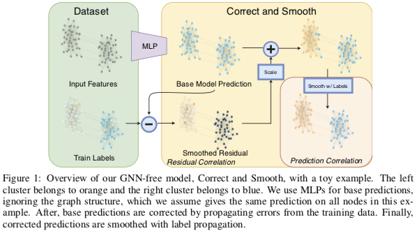
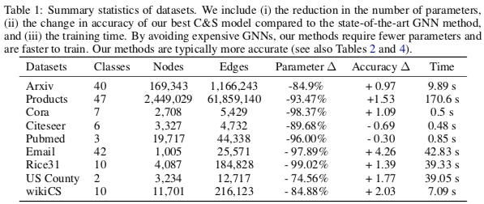

# 标签传播与简单模型结合可超越图神经网络

1. 对于 transductive 的节点分类任务，基于扩散的算法也很有用，但不被重视
   * 一个经验：[ogbn-arxiv 数据集](https://ogb.stanford.edu/docs/leader_nodeprop/#ogbn-arxiv)中，只是简单地将节点分类为领域中最多的类就能有 61% 的准确率。
2. 相邻节点上的分类与预测残差是正相关的

## Correct and Smooth (C&S)

1. Base Predict: 用一个非 GNN 的简单模型（如基于节点特征或嵌入的 MLP）对节点分类
2. Correc: 用 GNN 的方法建模真实结果与上一步结果的残差
3. Smooth: 用 Label Propagation (2015) 算法对上一步的结果进行平滑

## Label Propagation

记正规化后的邻接矩阵 $S = D^{-1/2} A D^{-1/2}$，节点的结果矩阵（每个节点一行）为 Y，LP 算法通过迭代
$$Y = (1 - \alpha) Y + \alpha S Y$$
将训练集上的结果传播到全图，直至收敛。

收敛解 $\hat Y$ 会使
$$\text{tr}(\hat Y^T (I - S) \hat Y) + (\frac1\alpha - 1) ||\hat Y - Y ||^2$$
最小化。前一部分的最小化保证估计是平滑的，后一部分保证估计结果与实际结果尽量近。

## Correct 的实现细节

C&S 流程中，除了 Smooth 环节明确用 LP，另外两个部分的算法都可以替换。

在本文中，Correct 环节同样是使用 LP 算法，将训练集上的残差传播到全图上
$$E = (1 - \alpha) E + \alpha S E$$

但在迭代过程中，残差会越来越小
$$||(1 - \alpha) E + \alpha S E||_2 \le (1 - \alpha) ||E||_2 + \alpha ||S||_2 ||E||_2 = ||E||_2$$
所以需要进行修正

1. Autoscale. 给训练集以外的残差估计乘以一个系数，使其绝对均值与训练集相等
2. Scaled Fixed Diffusion (FDiff-scale). 换一种扩散算法：$E = D^{-1}AE$ 同时不改变训练集上的残差（其中 $D^{-1}A$ 可以想象为转移矩阵）

## 实验结果

参数量很低甚至不需要学习参数就能有很好的表现，学习起来也很快。  
分类效果在多个数据集上都超过了 SotA，目前在 [OGB 的节点分类任务榜](https://ogb.stanford.edu/docs/leader_nodeprop/) 上多个任务都排名靠前。

