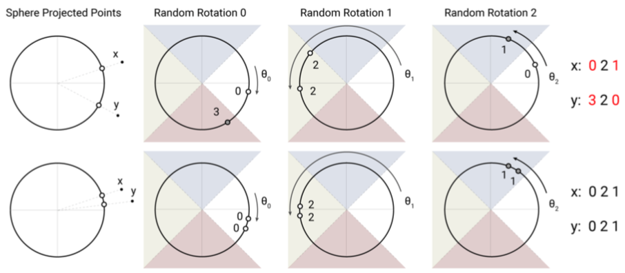

# Reformer：高效的 Transformer

Reformer 是对 Transformer 的性能的改进，主要改动有三点：

1. 引入 LSH 改进注意力模块，将复杂度由 $O(L^2)$ 降为 $O(L \log L)$，其中 L 是序列长度
2. 引入可逆残差层改进残差层，用计算量换取内存量
3. 对前馈层的输入分块，改并行为串行节省内存

## 局部敏感哈希（Locality-Sensitive Hashing, LSH）

先随机生成一个矩阵 R，通过 $h(x) = \arg\max [xR; -xR]$ 得到哈希值，这样能高概率地使相近的 x 哈希到同一个桶中

* 这方法是已有的，叫 cross-polytope LSH（但并不是原文引用的《[实用且最优的角距离局部敏感哈希算法](../2015-practical-and-optimal-lsh-for-angular-distance/)》里提出来的）
* 这方法的距离度量是 angular distance，即 x 都在一个球面上
* 因为是 argmax，所以 R 的大小不重要，可看作一个旋转
* argmax 操作将空间平分成了 2b 个区域

所以直观地看，就是距离远的 x 和 y（上）经过随机旋转很容易被转到不同区域，但如果两者较近（下），就更容易保持在同一区域。

## 局部敏感哈希注意力

作者将 LSH 应用到注意力机制中，得到 LSHA

稀疏性：softmax 的结果取决于最大的那一批元素，所以注意力权重主要依赖于最相关的那部分。反映到注意力矩阵中就是它的（软）稀疏性。如图 a 有点的就是相关性高的。

哈希分桶：为了不做遍历，通过 LSH 找出与 q 最相关的那部分 k 来计算 softmax 作为权重的一个逼近。  
但这存在一个问题就是 k、q 在桶里分布不均，分批计算（否则就是遍历了）时就会很麻烦，甚至可能有 q 没 k 无法计算注意力或者有 k 没 q 浪费信息。如图 b 是将 k、q 按所属桶排序后的注意力矩阵。

整形：为了解决分配不均的问题，令 k = q / |q|，这样前面那个关于角的 LSH 就会使 h(k) = h(q)。如图 c 中，行列都变成了 q，一个桶对应一个上三角形。

* 后面对常规的 Transformer 做了 K = Q 的实验，证明不影响效果
* K = Q 带来另一个问题就是通常会更注意自身，可以加一个 mask 屏蔽掉

分块计算：令块大小 m = 2l / b，其中 l 是序列长度（图中为 5），b 是桶数量（图中为 3），在块中计算权重，为了平滑实际是在当前块与前一个块的并中计算。如图 d 被分成几个长宽 2:1 的块。

从另一个角度回顾上述过程：

## 其它

因为只关心 LSH，所以后面没细看。而且并不理解 RevNet 为什么能改进内存量：反向传播时需要存储的是梯度，并不是函数值。更详细的解读可看[知乎：Reformer 详解](https://zhuanlan.zhihu.com/p/105123890)。
