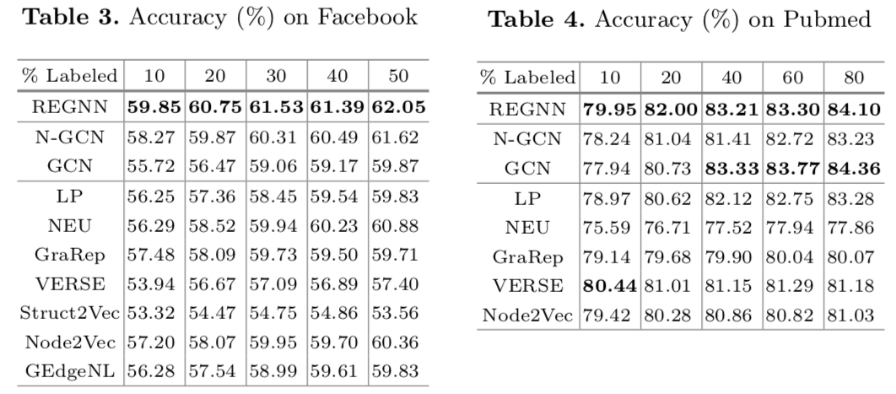

# 图神经网络上的注意力标签传播

标题直译过来应该是“用于图神经网络上的标签传播的角色等价注意力”，但文章开头定义的包括“角色等价”一系列等价概念并没什么实质的意义，所以按我自己理解简化了标题。

文章提出模型 Role Equivalence GNN (REGNN) = N-GCN + Role Equivalence Attention + FastGCN

* 首先用了 N-GCN 的思路，对不同阶邻接图分别用 GCN，把最后结果合并起来
* 之后又进行了一次邻域信息的加权平均，权重（也就是 Role Equivalence Attention）正比于 $e^{\beta \cos (x, y)}$，其中 cos 是余弦相似度
* 此外，还使用了 [FastGCN](../2018-fastgcn-fast-learning-with-graph-convolutional-networks-via-importance-sampling) 的采样方法提升效率

作者在介绍 REGNN 时输入不是通常的节点特征，而是训练标签，所以推测最后做的实验也是不考虑节点特征的（我自己复现 GCN 在 60% 的 Pubmed 上大概 87% 的节点分类准确率，对比论文结果，应该是没用节点特征）

