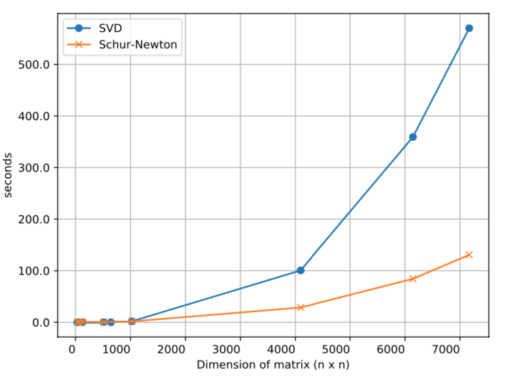

# 实用二阶优化

一阶梯度优化
$$W_{t+1} = W_t - \eta \triangledown f(W_t)$$

二阶梯度优化
$$W_{t+1} = W_t - \eta \triangledown^2 f(W_t)^{-1} \triangledown f(W_t)$$

通常不用二阶微分而用二阶统计，如 AdaGrad
$$W_{t+1} = W_t - \frac{\eta}{\sqrt{\sum \limits_{i=0}^t \triangledown f(W_t)^2}} \triangledown f(W_t)$$

但计算、内存、通信代价还是高。

## Shampoo (2018)

$$L_t = L_{t-1} + \triangledown f(W_t) \triangledown f(W_t)^T, L_0 = 0$$
$$R_t = R_{t-1} + \triangledown f(W_t)^T \triangledown f(W_t), R_0 = 0$$
$$W_{t+1} = W_t - \eta L_t^{-1/4} \triangledown f(W_t)_t R_t^{-1/4}$$

## Challenges and Limitations

1. 现有设备面向一阶优化算法，算力与内存低；
2. Shampoo 需要立方级的计算，如何分摊？
3. 另外需要平方级的空间，在大型网络的应用中必须分片计算，如何避免过于影响精度？
4. 硬件加速普遍只支持 8/16 位的精度，但 Shampoo 改需要双精度；
5. API 层面如 TensorFlow 支持不好

## 计算瓶颈

$L_T^{-1/4}$ 是最大瓶颈

在 Shampoo 的原论文中计算 p 次根是用 SVD（p 须是 2 的幂）分而治之：

$$A = Q \Sigma Q^T = (Q \sqrt{\Sigma}) (Q \sqrt{\Sigma})^T$$

Q 是正交矩阵，$\Sigma$ 是对角矩阵

这里使用 Schur-Newton 算法（2006）

<!-- .element style="width: 50%" -->

效果对比

## Other Contributions

学习率使用 AdaGrad 的思想，使之自适应

## 整体效果

