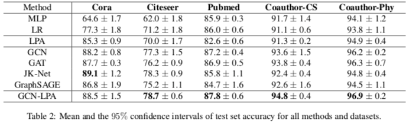

# 统一图卷积神经网络与标签传播

这篇文章分析了图卷积网络（Graph Convolutional Networks, GCN）和标签传播算法（Label Propagation Algorithm, LPA）的理论关系，证明能提升 LPA 效果的边权重也能改善 GCN，进而提出 GCN-LPA 模型，将 LPA 作为 GCN 的正则项，在节点分类任务上达到了 SotA。

## GCN 和 LPA 的重构关系

作者首先指出两者在概念上的相似：

* LPA 传播标签，最终中心节点的标签是周围节点标签的加权平均（Label Smoothing）；
* GCN 传播特征，最终中心节点的特征是周围节点特征的加权平均（Feature Smoothing）。

作者用的 Smoothing 也可以理解为 Reconstruction，即周围节点可一定程度重构中心节点。

然后证明了 Label Smoothing 和 Feature Smoothing 之间的关系（定理一）：

设特征到标签的映射 M: x -> y 可微且满足 L-Lipschitz 条件。则（$\\|\cdot\\|$ 为 2 范数）
$$
x_i = \frac1{d_{ii}} \sum\limits_{j \in N(i)} a_{ij} x_j + \epsilon_i
\Rightarrow
|y_i - \frac1{d_{ii}} \sum\limits_{j \in N(i)} a_{ij} y_j|
\le L\\|\epsilon\\| + o(\max\limits_{j \in N(i)} (\\|x_j - x_i\\|))
$$

即 Feature Smoothing 理论上可保证 Label Smoothing。也就是说，可以学习一组边权重，使中心节点的特征与周围节点的特征在这组权重的加权平均下尽量相近，之后用这组权重求周围节点的标签的加权平均作为中心节点的标签的估计。

但实际数据中这样估计出来的标签误差的理论上界可能很大：

1. M 可能不够平滑 => L 大
2. 一阶邻域中可能并不含足以逼近中心节点的信息 => $\\|\epsilon_i\\|_2$ 大

## GCN 和 LPA 的影响力关系

为了去除对 M 的限制（可微、Lipschitz 条件），作者延续 [JK-Nets](../2018-representation-learning-on-graphs-with-jumping-knowledge-networks) 的成果，从影响力出发分析 GCN 和 LPA 的关系。

对 k 层 GCN 定义节点 u 对节点 v 的 Feature Influence 为
$$I_f(v, u; k) = \frac1Z \\|E_u[\frac{\partial{y_v}}{\partial{x_u}}]\\|_1$$
其中 Z 为 u 的所有邻居节点对其 Feature Influence 之和。

对 k 步 LPA 定义节点 u 对节点 v 的 Label Influence
$$I_l(v, u; k) = \frac{\partial{y_v}}{\partial{x_u}}$$

在上述定义中， $x_u$ 为节点 u 处的输入，$y_v$ 为节点 y 处的输出。所谓输入输出在 GCN 中指特征，在 LPA 中指标签。

于是有以下结果（定理二）：
$$E_u[I_l(v, u; k)] = \sum\limits_{j=1}^{k} \beta^j I_f(v, u; j)$$
其中 $\beta$ 是图中未标签节点所占比例

这一结果表明，节点之间的两种影响力是正相关的。从后文来看，这一定理的价值在于需要 Feature Influence 时可以换作 Label Influence，后者不需要操作高维度的 Jacobi 矩阵，会更实用。

## 同类影响力增强

作者认为，好的表示应该满足相同标签的节点表示尽量近，而不同标签的节点表示尽量远。

在这个标准下，如果强化相同分类的节点之间连接的权重，GCN 学到的表示就会更好。

（这一判断使用作者放最后的定理四可证：定义全局距离 D 为节点表示两两之差的 2 范数按边权重的加权和，则每层 GCN 后，D 不变或变小。）

* 具体来说，可以给每条边一个可学习的权重，优化权重提升同类节点间 Feature Influence 的总和。
* 由定理二，优化目标可近似为同类节点间 Label Influence 的总和。
* 随后作者又证明了定理三：任一 c 类节点 u，它的同类节点对它的 Label Influence 之和正比于它在 LPA 之后被正确分类为 c 的概率。

因此最终，将边权重的优化目标转换为优化 LPA 的预测效果。

## GCN-LPA 的提出

直接使用上一节的分析可以得到分两步的优化算法：

1. 给图中每条边赋予一个可学习的权重 A，运行 LPA，损失函数为 $L_{lpa}(A)$，用 BP 算法优化 A
2. 将上一步最优的 A 作为邻接矩阵，运行 GCN，损失函数为 $L_{gcn}(W)$，用 BP 算法优化 GCN 中的权重矩阵 W

作者整合了这两个步骤，将 LPA 的优化作为 GCN 的正则项，提出了 GCN-LPA：

令邻接矩阵 A 的非零元素可学习，运行 GCN，损失函数为 $L_{gcn}(W, A) + \lambda L_{lpa}(A)$

## 节点分类实验

## 一些感想

看文章中的实现细节，以及我在 [ResLPA](https://github.com/cf020031308/ResLPA) 中的复现经验，GCN-LPA 的超参比较多，需要较重的调参工作。

类似的还有 [C&S Pipeline](../2020-combining-label-propagation-and-simple-models-out-performs-graph-neural-networks) ，感觉一个模型只要弄得复杂些，超参就多，那么经过繁重的手动调参工作，总有一些参数组合可以达到 SotA。这样的问题一是不同数据集都要人工调太麻烦了，不好应用；二是这相当于人为过拟合数据集，对其它基准有失公平。

另一方面，这篇文章提出的模型简单易实现，但模型之前的问题分析、模型之后的性质分析做得相当深入，可能这才是做研究的正确方式：即以研究问题和理论创新为中心，提出模型是为了辅助证明理论的有效和实用。而不是像现在很多计算机方向的论文，分析问题后提出模型，模型有效就行。
