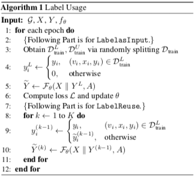
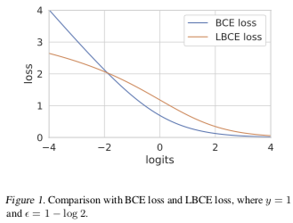

# 图神经网络中半监督分类的一些涨点技巧

这篇文章总结了三个广泛用于图神经网络节点分类任务的涨点技巧，例如在 [OGB 榜单](https://ogb.stanford.edu/docs/leader_nodeprop/)中可见到不少模型使用了 Label Reuse。

## 0. DropEdge

是另一篇文章中提出的，类似神经网络中的 Dropout，将图网络中的边随机去掉一些，以避免过拟合和过度平滑。在这篇文章里只引用了一下这个方法。

## 1. Label Usage

主流的基于深度学习的研究都是端到端的模式，标签信息只用来计算损失函数，目前已有一些方法将标签信息也利用起来作为模型输入的一部分，以获得更好的结果。如 C&S。

这些方法通常是结合 GNN 和 LPA（标签传播算法），但 LPA 基于相邻相似的假设，不一定是最优的。

这篇文章总结的 Label Usage 包含两部分：

1. **Lable as Input**. 将训练数据中的标签分出一部分来（one-hot 向量），与特征拼接作为输入（没有标签信息的地方全 0，这些位置下面还要用到）。剩下的没有输入标签的仍作为训练数据；
2. **Label Reuse**. 用上一步训练好的模型迭代若干步，在每一次迭代中，将输出的预测软标签赋给最初没有标签信息的位置（论文是这些位置全部放预测软标签，看 `ogbn-arxiv` 的有些实现中有监督数据的位置还是用真实硬标签）。

* Label as Input 阶段可以看作学习一个模型，能根据其它节点的特征和标签、中心节点的特征，来预测中心节点的标签，这比传统端到端的模式有更多的可利用信息（其它节点的标签）。
* Label Reuse 阶段类似 LPA，通过一定的迭代步数不断更新标签的预测值，但不受限于 LPA 相邻相似的假设。

## 2. Logarithmic Cross Entropy

对数交叉熵 LCE 定义为交叉熵加 $\epsilon$ 的对数：
$$L_\text{LCE} = \log(\epsilon + L_\text{CE})$$

二分类且当 $\epsilon = 1 - \log 2$ 时有 $\frac{d^2}{dz^2} L_\text{LCE} |_{z=0} = 0$，其中 z 是预测的 logits，z = 0 就是预测的分界（decision border），因此此时损失函数的导数达到最大。如下图：

所以使用 LCE 替代 CE 分类效果可能更好，另外从图中可以看出，LCE 对于异常值也更健壮。

## 3. Linear: GCN 和 GAT 的架构改进

原版的 GCN 是这样：
$$ X^{(k+1)} = \sigma(\tilde D ^{-\frac12} \tilde A \tilde D ^{-\frac12} X^{(k)} W^{(k)})$$

为了克服过度平滑问题，在其中加了个线性变换，以更多地保留中心节点的信息。
$$ X^{(k+1)} = \sigma(\tilde D^{-\frac12} \tilde A \tilde D^{-\frac12} X^{(k)} W_0^{(k)} + X^{(k)}W_1^{(k)})$$

GAT 也一样的，算 $\tilde A$ 时邻接矩阵换成注意力加权的矩阵即可。
